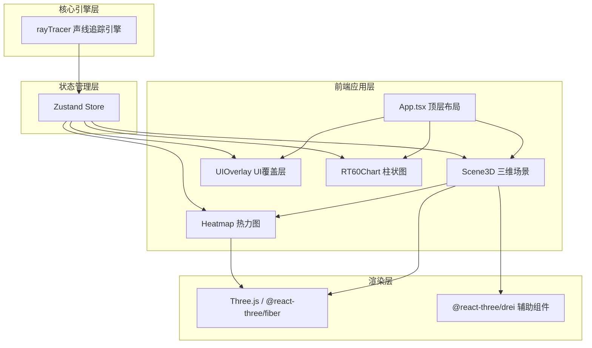

## 1. 架构设计



## 2. 技术描述

- **前端框架**：React 18 + TypeScript
- **构建工具**：Vite + @vitejs/plugin-react
- **3D渲染**：Three.js + @react-three/fiber + @react-three/drei
- **状态管理**：Zustand
- **物理引擎**：@dimforge/rapier3d-compat（碰撞检测备选方案）
- **性能监控**：stats.js

### 核心技术选型理由
1. **@react-three/fiber**：React声明式Three.js，组件化开发三维场景
2. **Zustand**：轻量级状态管理，支持跨组件共享三维场景数据
3. **Raycaster**：Three.js内置射线检测，用于声线追踪碰撞计算
4. **BufferGeometry**：高性能热力图渲染，逐顶点着色

## 3. 项目文件结构

```
src/
├── main.tsx              # React入口，挂载App组件
├── App.tsx               # 顶层布局组件
├── store/
│   └── useSceneStore.ts  # Zustand状态管理
├── components/
│   ├── Scene3D.tsx       # 三维场景容器
│   ├── UIOverlay.tsx     # UI覆盖层（工具栏+信息面板）
│   ├── Heatmap.tsx       # 热力图组件
│   ├── RT60Chart.tsx     # RT60柱状图组件
│   ├── SoundSource.tsx   # 声源组件
│   ├── Receiver.tsx      # 接收点组件
│   ├── GeometryObject.tsx # 几何物体组件
│   └── RayPath.tsx       # 声线路径组件
├── engine/
│   └── rayTracer.ts      # 声线追踪引擎（纯计算模块）
├── types/
│   └── index.ts          # 类型定义
├── utils/
│   └── materials.ts      # 材质配置与吸声系数
└── styles/
    └── global.css        # 全局样式
```

## 4. 数据模型

### 4.1 几何体数据模型

```typescript
interface GeometryObject {
  id: string;
  type: 'wall' | 'cylinder' | 'wedge';
  position: { x: number; y: number; z: number };
  rotation: { x: number; y: number; z: number };
  size: { x: number; y: number; z: number };
  material: MaterialType;
}

type MaterialType = 'wood' | 'marble' | 'glass' | 'acoustic';

interface MaterialConfig {
  name: string;
  color: string;
  absorption: {
    low: number;    // 125Hz 吸声系数
    mid: number;    // 500Hz 吸声系数
    high: number;   // 2000Hz 吸声系数
  };
}
```

### 4.2 声线路径数据模型

```typescript
interface RayPath {
  id: string;
  points: Vector3[];      // 路径点数组
  totalLength: number;    // 总长度
  energyLoss: number;     // 能量损失百分比
  reflections: number;    // 反射次数
  isValid: boolean;       // 是否到达接收点
  receiverIndex?: number; // 到达的接收点索引
}
```

### 4.3 RT60数据模型

```typescript
interface RT60Data {
  low: number;     // 125Hz RT60值（秒）
  mid: number;     // 500Hz RT60值（秒）
  high: number;    // 2000Hz RT60值（秒）
}
```

### 4.4 热力图数据模型

```typescript
interface HeatmapData {
  gridSize: number;      // 网格大小（12x12）
  cellSize: number;      // 格子大小（0.5单位）
  values: number[][];    // 声压级值二维数组
}
```

## 5. 状态管理设计

### Zustand Store 状态结构

```typescript
interface SceneState {
  // 场景几何体
  geometries: GeometryObject[];
  selectedId: string | null;
  
  // 声源与接收点
  sourcePosition: Vector3;
  receiverPositions: Vector3[];
  
  // 模拟状态
  isSimulating: boolean;
  rayPaths: RayPath[];
  rt60Data: RT60Data;
  heatmapData: HeatmapData;
  
  // 操作
  addGeometry: (geo: Omit<GeometryObject, 'id'>) => void;
  removeGeometry: (id: string) => void;
  updateGeometry: (id: string, updates: Partial<GeometryObject>) => void;
  selectGeometry: (id: string | null) => void;
  setSourcePosition: (pos: Vector3) => void;
  simulateRays: () => void;
  resetScene: () => void;
}
```

## 6. 核心算法设计

### 6.1 声线追踪算法

1. **射线生成**：使用斐波那契球面采样生成128条均匀分布的射线方向
2. **反射检测**：使用Three.js Raycaster与场景物体进行相交检测
3. **反射计算**：基于法线计算镜面反射方向，能量按吸声系数衰减
4. **终止条件**：达到最大反射次数（5次）或能量低于阈值
5. **有效路径筛选**：检测射线是否进入接收点球体范围

### 6.2 RT60计算（Eyring-Norris公式）

```
RT60 = 0.161 * V / (A + 4m * V)
其中：
- V: 房间体积
- A: 总吸声量 = Σ(Si * αi)
- m: 空气吸收系数（与频率相关）
```

### 6.3 热力图计算

1. 在地面网格每个格点位置计算直达声能量
2. 叠加主要反射声能量贡献
3. 使用距离衰减公式：声压级 ∝ 1/r²
4. 归一化到0-1范围用于颜色映射

## 7. 性能优化策略

1. **几何体优化**：使用BufferGeometry减少draw call
2. **热力图优化**：逐顶点着色，避免每帧重建几何体
3. **射线检测优化**：使用包围盒加速碰撞检测
4. **状态管理优化**：Zustand选择器避免不必要重渲染
5. **动画优化**：使用requestAnimationFrame和lerp插值

## 8. 依赖包清单

- react@^18.2.0
- react-dom@^18.2.0
- vite@^5.0.0
- @vitejs/plugin-react@^4.2.0
- typescript@^5.3.0
- @types/react@^18.2.0
- @types/react-dom@^18.2.0
- three@^0.160.0
- @react-three/fiber@^8.15.0
- @react-three/drei@^9.92.0
- zustand@^4.4.0
- @dimforge/rapier3d-compat@^0.12.0
- stats.js@^0.17.0
