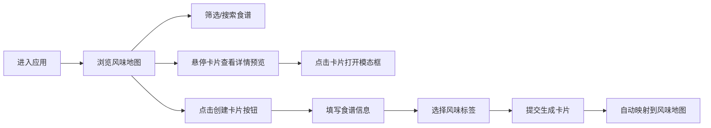

## 1. 产品概述

手绘风格食谱卡片交换与风味地图标注应用，让用户创建和分享拿手菜食谱，通过风味维度可视化展示食谱特征。
- 面向美食爱好者、家庭厨师，提供直观的食谱浏览与创作体验
- 通过风味地图的创新交互方式，让用户从味觉维度发现和探索食谱

## 2. 核心功能

### 2.1 用户角色

| 角色 | 注册方式 | 核心权限 |
|------|----------|----------|
| 普通用户 | 无需注册（本地应用） | 创建、浏览、筛选、搜索食谱卡片 |

### 2.2 功能模块

1. **食谱卡片模块**：食谱卡片渲染、创建编辑、悬停交互、模态详情展示
2. **风味地图模块**：二维风味地图网格渲染、卡片位置计算、防重叠布局
3. **筛选搜索模块**：标签筛选面板、搜索输入框、条件组合过滤

### 2.3 页面详情

| 页面名称 | 模块名称 | 功能描述 |
|----------|----------|----------|
| 主页面 | 顶部导航栏 | 应用名称展示、用户头像、创建卡片按钮 |
| 主页面 | 筛选面板 | 标签勾选筛选、搜索输入框 |
| 主页面 | 风味地图 | 二维坐标网格、食谱卡片布局展示 |
| 主页面 | 食谱卡片 | 悬停放大、详情预览、点赞评分 |
| 主页面 | 卡片创建面板 | 食谱名称、食材、烹饪方式、风味标签表单 |
| 主页面 | 详情模态框 | 完整食谱内容展示、放大动画 |

## 3. 核心流程

用户进入应用后，浏览风味地图上的食谱卡片。可通过左侧筛选面板按标签过滤，或通过搜索框按名称搜索。点击卡片查看完整食谱详情。点击顶部"创建卡片"按钮打开创建面板，填写食谱信息并选择风味标签，提交后新卡片自动映射到风味地图上。

## 4. 用户界面设计

### 4.1 设计风格
- **主色调**：浅米黄 #FEFAF0 背景，棕色 #8B6F47 导航栏，淡米黄 #F5E6C8 地图背景
- **辅助色**：浅棕色 #D2B48C 网格线条，各风味标签对应专属配色（麻辣红橙、清淡浅绿等）
- **按钮样式**：圆角胶囊按钮，手绘虚线边框装饰
- **字体**：Caveat 手写体用于标题和食谱名称，系统无衬线字体用于正文
- **布局风格**：左侧筛选面板 + 右侧风味地图的双栏布局，顶部导航栏
- **视觉风格**：手绘日记风格，虚线边框、轻微旋转角度、纸张质感

### 4.2 页面设计概览

| 页面名称 | 模块名称 | UI元素 |
|----------|----------|--------|
| 主页面 | 顶部导航栏 | 60px高棕色背景，左侧手写体Logo，右侧头像+创建按钮 |
| 主页面 | 筛选面板 | 260px宽白色卡片，虚线边框，圆角12px，胶囊标签 |
| 主页面 | 风味地图 | 浅米黄背景，手绘坐标轴和网格线，卡片浮动布局 |
| 主页面 | 食谱卡片 | 渐变背景配色，手写体名称，手绘SVG食材图标，评分点赞 |
| 主页面 | 创建面板 | 表单输入，多选标签，提交按钮 |
| 主页面 | 详情模态框 | 半透明深色遮罩，居中卡片，zoom-in动画 |

### 4.3 响应式
- Desktop-first设计
- 窄屏（<768px）时左侧筛选面板折叠为汉堡菜单
- 风味地图区域自适应剩余宽度，保持60fps流畅动画
