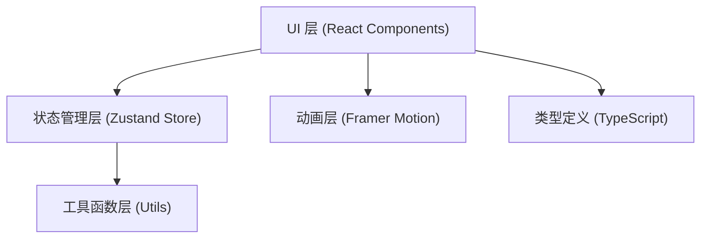
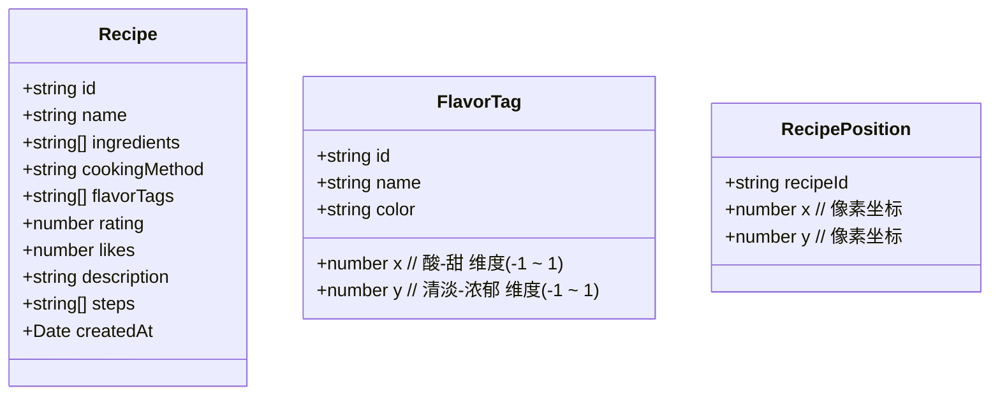

## 1. 架构设计



## 2. 技术描述

- **前端框架**：React 18 + TypeScript（严格模式）
- **构建工具**：Vite + @vitejs/plugin-react
- **状态管理**：Zustand
- **动画库**：Framer Motion
- **字体**：Google Fonts Caveat（手写体）
- **样式方案**：CSS Modules + CSS Variables
- **图标**：手绘风格 SVG 内联图标

## 3. 目录结构

```
├── package.json
├── index.html
├── vite.config.js
├── tsconfig.json
└── src/
    ├── module1/
    │   ├── types.ts          # 食谱和风味标签类型定义
    │   ├── RecipeCard.tsx    # 食谱卡片组件
    │   └── FoodMap.tsx       # 风味地图组件
    ├── module2/
    │   ├── FilterPanel.tsx   # 筛选面板组件
    │   └── SearchBar.tsx     # 搜索输入框组件
    ├── store/
    │   └── useRecipeStore.ts # Zustand 状态管理
    ├── utils/
    │   ├── flavorUtils.ts    # 风味坐标计算工具
    │   └── layoutUtils.ts    # 卡片布局防重叠工具
    ├── components/
    │   ├── Navbar.tsx        # 顶部导航栏
    │   ├── CreateRecipeForm.tsx # 创建食谱表单
    │   └── RecipeModal.tsx   # 详情模态框
    ├── assets/
    │   └── icons/            # 手绘风格 SVG 图标
    ├── App.tsx
    ├── main.tsx
    └── styles/
        └── global.css        # 全局样式与 CSS 变量
```

## 4. 状态管理

### 4.1 Zustand Store 定义

```typescript
interface RecipeStore {
  recipes: Recipe[];
  selectedTags: string[];
  searchText: string;
  hoveredRecipeId: string | null;
  selectedRecipeId: string | null;
  isCreateModalOpen: boolean;
  
  addRecipe: (recipe: Omit<Recipe, 'id'>) => void;
  toggleTag: (tag: string) => void;
  setSearchText: (text: string) => void;
  setHoveredRecipe: (id: string | null) => void;
  selectRecipe: (id: string | null) => void;
  toggleCreateModal: () => void;
  getFilteredRecipes: () => Recipe[];
}
```

## 5. 数据模型

### 5.1 类型定义



### 5.2 风味标签坐标预设

| 标签名 | X轴(酸→甜) | Y轴(清淡→浓郁) | 颜色 |
|--------|-----------|---------------|------|
| 酸爽 | -0.8 | 0.2 | #FFD93D |
| 甜腻 | 0.8 | 0.5 | #FF6B9D |
| 麻辣 | -0.3 | 0.9 | #FF6B35 |
| 咸鲜 | 0.1 | 0.6 | #6BCB77 |
| 清淡 | 0.0 | -0.7 | #A8E6CF |

## 6. 核心算法

### 6.1 风味坐标计算
卡片位置 = 所选标签坐标的加权平均，映射到地图像素坐标

### 6.2 防重叠布局
检测卡片间距离 < 200px 时，沿碰撞法线方向微调位置，使用迭代松弛算法

## 7. 性能优化
- 使用 React.memo 避免卡片不必要重渲染
- Framer Motion 使用 transform 而非 layout 动画
- 搜索防抖延迟 300ms
- 地图区域使用 CSS will-change 提示浏览器优化
