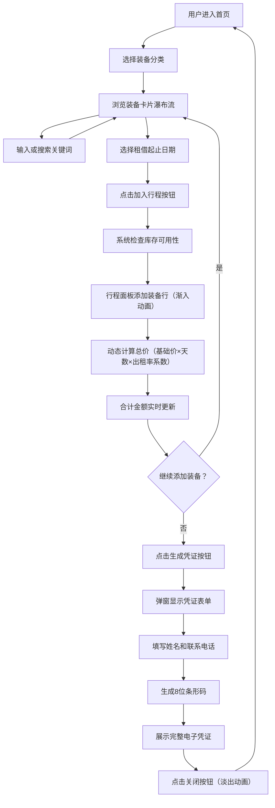

## 1. 产品概述

户外装备租借与行程匹配平台，为户外爱好者提供一站式装备租借服务，用户可在线浏览各类户外装备，按需选择租借日期和数量，系统自动检查库存可用性并根据装备磨损程度和使用频次动态调整价格，最终生成带条形码的电子租借凭证。

- 目标用户：户外爱好者、露营徒步爱好者、攀岩水上运动爱好者
- 核心价值：简化装备租借流程，动态定价优化资源利用，电子凭证便捷高效

## 2. 核心功能

### 2.1 用户角色

| 角色 | 注册方式 | 核心权限 |
|------|----------|----------|
| 普通用户 | 无需注册（演示版本） | 浏览装备、添加行程、生成凭证 |

### 2.2 功能模块

1. **装备浏览区**：分类标签、瀑布流卡片网格、搜索筛选、骨架屏加载
2. **装备卡片**：渐变色占位图、名称价格展示、日期选择器、加入行程按钮
3. **行程面板**：装备汇总表、动态价格计算、合计金额、生成凭证
4. **凭证弹窗**：用户信息填写、装备清单、租借时间、总金额、条形码展示

### 2.3 页面详情

| 页面名称 | 模块名称 | 功能描述 |
|----------|----------|----------|
| 主页面 | 顶部导航栏 | 深绿背景白色文字，高度54px，品牌标识展示 |
| 主页面 | 搜索框 | 左上角搜索，宽300px，圆角21px，聚焦边框变深绿 |
| 主页面 | 分类标签 | 5个类别（露营/徒步/攀岩/水上/冬季），圆角20px，选中态深绿白字 |
| 主页面 | 装备卡片网格 | 瀑布流布局，卡片280x340px，圆角16px，悬停阴影加深 |
| 主页面 | 日期选择器 | 双日期输入框合并长条，浅绿背景，圆角8px |
| 主页面 | 加入行程按钮 | 深绿背景白字，圆角8px，悬停变深带过渡 |
| 主页面 | 行程面板 | 固定右侧，宽340px，白底带边框，圆角16px |
| 主页面 | 动态价格表格 | 每行显示装备名/天数/总价，添加渐入移除淡出 |
| 主页面 | 合计金额 | 深绿粗体22px |
| 主页面 | 生成凭证按钮 | 48px高，全宽，圆角10px |
| 凭证弹窗 | 电子凭证 | 560x400px，圆角20px，居中遮罩半透明 |
| 凭证弹窗 | 条形码 | 8位数字字母，两侧带*，下方显示数字串 |
| 凭证弹窗 | 关闭按钮 | 灰色圆16px，悬停变深 |

## 3. 核心流程

用户浏览首页 → 选择装备分类 → 浏览装备卡片 → 选择租借日期 → 点击"加入行程" → 行程面板实时更新（动态计算价格） → 继续添加或点击"生成凭证" → 填写姓名电话 → 弹窗展示电子凭证含条形码 → 关闭弹窗返回主界面

## 4. 用户界面设计

### 4.1 设计风格

- **主色调**：深绿 #2E5A28（品牌色、按钮、选中态），浅米色 #F4F1E1（页面背景）
- **辅助色**：浅绿 #E2EAD8（日期选择器），浅灰 #E8E4D7（搜索框），浅棕渐变 #C8B89A → #E8DCC4（卡片占位图），边框色 #D6CFB8
- **文字色**：白色（导航/按钮），深绿（标题/金额），浅灰 #B0A896（占位/辅助）
- **按钮风格**：圆角矩形，深绿白字，悬停变 #1E3E1A，0.2s ease 过渡
- **字体**：无衬线字体系统，清晰易读
- **布局风格**：桌面端左右分栏（1120px主区 + 340px固定面板），移动端单列
- **图标风格**：简约线性图标（放大镜、关闭等）

### 4.2 页面设计概述

| 页面名称 | 模块名称 | UI元素 |
|----------|----------|----------|
| 主页面 | 顶部导航栏 | 高度54px，深绿背景，白色品牌文字，固定顶部 |
| 主页面 | 搜索框 | 300×42px，浅灰背景，圆角21px，内有放大镜图标 |
| 主页面 | 分类标签栏 | 5个标签横向排列，圆角20px，默认浅灰，选中深绿白字 |
| 主页面 | 装备卡片网格 | 瀑布流，卡片间距均匀，逐卡延迟0.1s淡入加载 |
| 主页面 | 单张装备卡片 | 280×340px，白底圆角16px，顶部占位图+中部信息+底部操作 |
| 主页面 | 行程面板 | 固定右侧距顶80px，340px宽，白底边框圆角16px，内滚动 |
| 主页面 | 骨架屏 | 6个灰色圆角矩形占位，高度340px |
| 凭证弹窗 | 遮罩层 | 半透明黑 #00000066，0.2s淡入 |
| 凭证弹窗 | 凭证内容 | 560×400px，白底圆角20px，用户信息+装备清单+条形码 |

### 4.3 响应式

- 桌面端（≥768px）：左右分栏布局，主区1120px居中，行程面板340px固定右侧
- 移动端（<768px）：装备网格单列布局，行程面板全宽置于页面底部
- 触摸优化：按钮最小触控尺寸44px，日期选择器适配触摸输入

### 4.4 动态定价规则

- 出租率 = 最近7天出租数组的平均值
- 出租率 < 30%：动态系数 0.8（优惠）
- 30% ≤ 出租率 ≤ 70%：动态系数 1.0（标准）
- 出租率 > 70%：动态系数 1.2（溢价）
- 总价 = 基础价格 × 租用天数 × 动态系数
