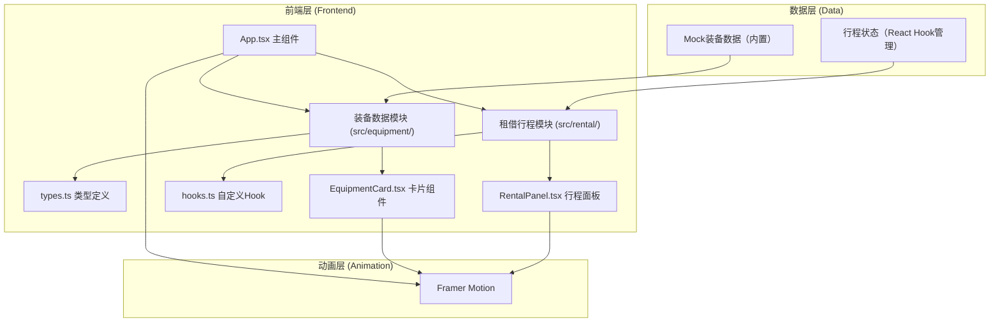

## 1. 架构设计



## 2. 技术描述

- **前端框架**：React 18 + TypeScript（严格模式）
- **构建工具**：Vite 5 + @vitejs/plugin-react
- **动画库**：framer-motion
- **状态管理**：React Hooks（useState、useMemo、自定义useRental hook）
- **样式方案**：CSS Modules + 内联样式（遵循设计规范的精确像素控制）
- **后端**：无（纯前端演示，数据全部Mock）
- **数据库**：无（内存状态管理）

## 3. 目录结构

```
d:\Pro\tasks\auto188\
├── package.json
├── index.html
├── vite.config.js
├── tsconfig.json
├── src/
│   ├── App.tsx
│   ├── main.tsx
│   ├── index.css
│   ├── equipment/
│   │   ├── types.ts
│   │   └── EquipmentCard.tsx
│   └── rental/
│       ├── hooks.ts
│       └── RentalPanel.tsx
└── .trae/
    └── documents/
        ├── PRD.md
        └── technical-architecture.md
```

## 4. 模块职责定义

### 4.1 装备数据模块 (src/equipment/)

| 文件 | 职责 | 导出内容 |
|------|------|----------|
| types.ts | 定义装备相关TypeScript接口 | Equipment接口、EquipmentCategory类型、DateRange接口 |
| EquipmentCard.tsx | 单张装备卡片UI组件 | EquipmentCard组件（接收装备数据+回调props） |

### 4.2 租借行程模块 (src/rental/)

| 文件 | 职责 | 导出内容 |
|------|------|----------|
| hooks.ts | 行程状态管理自定义Hook | useRental() hook、动态价格计算、库存检查、凭证数据生成 |
| RentalPanel.tsx | 行程面板+凭证弹窗组件 | RentalPanel组件（接收添加的装备列表+操作方法） |

### 4.3 主组件 (src/App.tsx)

| 职责 | 说明 |
|------|------|
| 布局管理 | 顶部导航、左侧搜索分类、中央卡片网格、右侧行程面板 |
| 装备数据 | 内置Mock装备数据（5类×若干件），含出租率数组 |
| 筛选逻辑 | 分类筛选、关键词搜索过滤 |
| 数据加载 | 模拟异步加载，骨架屏→真实数据过渡 |
| 状态传递 | 将添加装备方法和行程数据传递给子组件 |

## 5. 数据模型

### 5.1 装备接口 (Equipment)

```typescript
interface Equipment {
  id: string;                    // 唯一标识
  name: string;                  // 装备名称
  category: EquipmentCategory;   // 分类：露营/徒步/攀岩/水上/冬季
  basePrice: number;             // 每日基础价格（元）
  stock: number;                 // 库存数量
  description?: string;          // 描述（用于搜索匹配）
  rentalRateLast7Days: number[]; // 最近7天出租率（0-1数组，7个元素）
}
```

### 5.2 分类类型

```typescript
type EquipmentCategory = '露营' | '徒步' | '攀岩' | '水上' | '冬季';
```

### 5.3 日期范围接口

```typescript
interface DateRange {
  startDate: string; // YYYY-MM-DD
  endDate: string;   // YYYY-MM-DD
}
```

### 5.4 行程项接口

```typescript
interface RentalItem {
  equipmentId: string;
  equipmentName: string;
  basePrice: number;
  dateRange: DateRange;
  days: number;
  rentalRate: number;      // 计算出的平均出租率
  dynamicCoefficient: 0.8 | 1.0 | 1.2;
  unitPrice: number;       // 基础价×系数后的单日价
  totalPrice: number;      // 单日价×天数
}
```

### 5.5 凭证数据接口

```typescript
interface VoucherData {
  id: string;              // 凭证ID（8位字母数字）
  customerName: string;
  customerPhone: string;
  items: RentalItem[];
  startDate: string;
  endDate: string;
  totalAmount: number;
  createdAt: string;
}
```

## 6. 核心算法

### 6.1 动态系数计算

```
计算最近7天出租率平均值 avgRate
if avgRate < 0.3 → coefficient = 0.8
elif avgRate <= 0.7 → coefficient = 1.0
else → coefficient = 1.2
```

### 6.2 租用天数计算

```
days = ceil((endDate - startDate) / 86400000) + 1
（含首尾两天）
```

### 6.3 条形码生成

```
字符集：A-Z, 0-9（共36个字符）
长度：8位随机 + 两侧*起始终止符
示例：*3K9P2X7Q*
下方显示对应数字串（字母映射为数字 A=10, B=11...）
```

### 6.4 库存检查逻辑

```
对于每件装备，检查用户选择的日期范围
当前演示版本：只要 stock > 0 即视为可用（简化逻辑）
实际生产版本：需查询该装备在日期范围内的租借记录计算冲突
```

## 7. 组件通信数据流

```
App.tsx
  ├─ state: equipments（装备列表）
  ├─ state: selectedCategory（当前分类）
  ├─ state: searchKeyword（搜索关键词）
  ├─ hook: useRental() → 提供 addItem / removeItem / voucher 等
  │
  ├─ 渲染 EquipmentCard[]
  │   └─ onAddToTrip(equipment, dateRange) → 调用 useRental.addItem
  │
  └─ 渲染 RentalPanel
      ├─ props: items（useRental.items）
      ├─ props: totalAmount（useRental.totalAmount）
      └─ props: onRemove / onGenerateVoucher（useRental方法）
```
