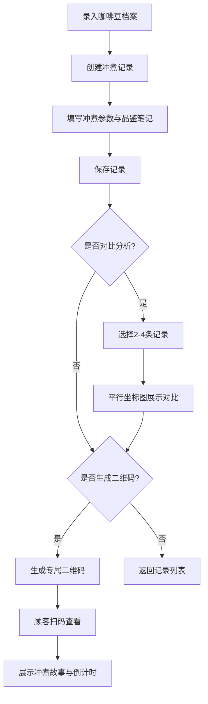

## 1. 产品概述

咖啡冲煮记录与分享应用，帮助独立咖啡店主系统化记录每杯手冲咖啡的完整冲煮参数，追踪同一款咖啡豆在不同冲煮手法下的风味变化，并让顾客通过扫描二维码了解手中咖啡的冲煮故事。

- 目标用户：独立咖啡店店主、专业咖啡师、咖啡爱好者
- 核心价值：解决咖啡师难以系统化记录和分享每次冲煮独特数据的痛点，让顾客能够了解咖啡背后的细节故事

## 2. 核心功能

### 2.1 用户角色

| 角色 | 注册方式 | 核心权限 |
|------|----------|----------|
| 咖啡师/店主 | 本地应用（无需注册） | 咖啡豆档案管理、冲煮记录、对比分析、二维码生成 |
| 顾客 | 无需注册 | 扫描二维码查看冲煮故事 |

### 2.2 功能模块

1. **咖啡豆档案管理**：录入/编辑咖啡豆信息，风味轮展示，雷达图评分
2. **冲煮记录时间线**：记录每次冲煮参数，时间线展示，详情展开
3. **冲煮对比模式**：选择2-4条记录并列对比，平行坐标图展示趋势
4. **二维码冲煮故事**：生成专属二维码，顾客扫码查看详情，最佳饮用时间倒计时

### 2.3 页面详情

| 页面名称 | 模块名称 | 功能描述 |
|----------|----------|----------|
| 咖啡豆管理页 | 咖啡豆卡片列表 | 展示所有咖啡豆，支持添加/编辑/删除，点击查看详情 |
| 冲煮记录页 | 时间线列表 | 按时间展示冲煮记录，点击展开详情面板 |
| 对比分析页 | 对比视图 | 选择多条记录进行参数对比，平行坐标图可视化 |
| 二维码生成页 | 二维码展示 | 生成并展示冲煮记录专属二维码，可复制分享链接 |
| 顾客展示页 | 冲煮故事卡片 | 扫码后展示咖啡豆信息、冲煮参数、品鉴笔记、最佳饮用倒计时 |

## 3. 核心流程

### 主流程描述
咖啡师录入咖啡豆档案 → 创建冲煮记录并填写参数 → 可选择多条记录进行对比分析 → 为特定冲煮记录生成二维码 → 顾客扫码查看冲煮故事

## 4. 用户界面设计

### 4.1 设计风格
- **主色调**：暖色咖啡调，浅米色背景 #F5E6CC，深褐色导航 #4E342E
- **卡片样式**：宽280px高320px，圆角16px，白底#FFFFFF，1px实线边框#E0D5C7
- **悬停效果**：边框变深褐#6D4C41，阴影加深，向上位移6px，过渡0.3s ease-out
- **字体**：展示字体用Playfair Display，正文字体用Source Serif Pro
- **图标**：使用lucide-react图标库，咖啡相关图标

### 4.2 页面设计概述

| 页面名称 | 模块名称 | UI元素 |
|----------|----------|--------|
| 咖啡豆管理页 | 卡片网格 | 风味轮SVG、雷达图(recharts)、悬停动画、淡入过渡 |
| 冲煮记录页 | 时间线列表 | 每行高60px，时间戳左对齐，参数摘要右对齐，展开面板宽400px淡黄背景 |
| 对比分析页 | 平行坐标图 | recharts ParallelCoordinates组件，多色线条区分记录 |
| 二维码展示页 | 二维码卡片 | qrcode.react渲染，冲煮摘要，复制链接按钮 |
| 顾客展示页 | 冲煮故事 | 半透明卡片#FFFFFFCC，圆角16px，实时倒计时组件 |

### 4.3 响应式
- **桌面端**（≥1024px）：左侧菜单宽240px，内容区≥980px
- **平板端**（<1024px）：左侧菜单折叠为图标模式宽60px
- **移动端**：纵向布局，菜单顶部展开

### 4.4 动画与交互
- 页面加载：淡入动画 opacity 0→1，持续0.4s
- 卡片悬停：向上位移6px，阴影变化，过渡0.3s ease-out
- 导航切换：平滑过渡0.2s
- 时间线展开：高度过渡动画
