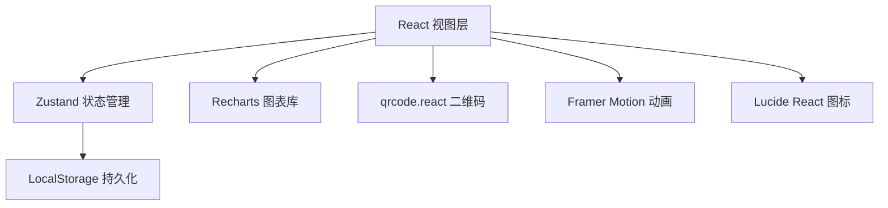
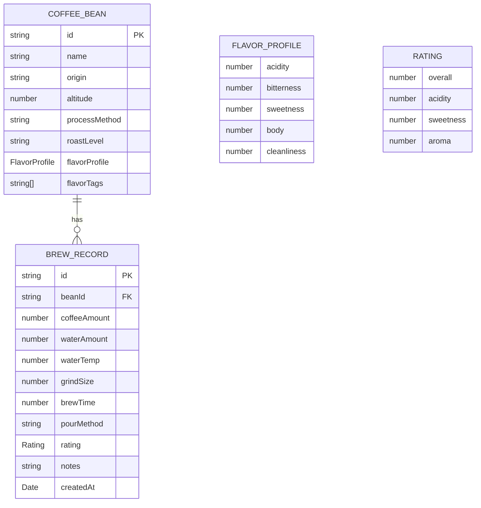

## 1. 架构设计



## 2. 技术描述

- **前端框架**：React@18 + TypeScript@5
- **构建工具**：Vite@5 + @vitejs/plugin-react@4
- **状态管理**：Zustand@4
- **图表库**：Recharts@2
- **二维码**：qrcode.react@3
- **动画库**：framer-motion@11
- **图标库**：lucide-react@0.300
- **类型支持**：@types/react@18, @types/react-dom@18

## 3. 路由定义

| 路由 | 用途 |
|------|------|
| / | 首页/咖啡豆列表 |
| /beans | 咖啡豆管理 |
| /brews | 冲煮记录时间线 |
| /compare | 冲煮对比分析 |
| /qr/:id | 二维码生成展示 |
| /story/:id | 顾客冲煮故事展示页 |

## 4. 数据模型

### 4.1 数据模型定义



### 4.2 TypeScript 类型定义

```typescript
interface FlavorProfile {
  acidity: number;
  bitterness: number;
  sweetness: number;
  body: number;
  cleanliness: number;
}

interface CoffeeBean {
  id: string;
  name: string;
  origin: string;
  altitude: number;
  processMethod: string;
  roastLevel: string;
  flavorProfile: FlavorProfile;
  flavorTags: string[];
  createdAt: Date;
}

interface Rating {
  overall: number;
  acidity: number;
  sweetness: number;
  aroma: number;
}

interface BrewRecord {
  id: string;
  beanId: string;
  coffeeAmount: number;
  waterAmount: number;
  waterTemp: number;
  grindSize: number;
  brewTime: number;
  pourMethod: 'single-pour' | 'three-stage' | 'stirred';
  rating: Rating;
  notes: string;
  createdAt: Date;
}

interface StoreState {
  beans: CoffeeBean[];
  brewRecords: BrewRecord[];
  selectedForComparison: string[];
  addBean: (bean: Omit<CoffeeBean, 'id' | 'createdAt'>) => void;
  addBrewRecord: (record: Omit<BrewRecord, 'id' | 'createdAt'>) => void;
  toggleComparison: (id: string) => void;
  clearComparison: () => void;
}
```

## 5. 项目文件结构

```
src/
├── components/
│   ├── BeanCard.tsx          # 咖啡豆卡片组件
│   ├── BrewTimeline.tsx      # 冲煮记录时间线
│   ├── ComparisonView.tsx    # 对比视图组件
│   ├── FlavorWheel.tsx       # 风味轮组件
│   ├── Layout.tsx            # 布局组件
│   ├── Navigation.tsx        # 导航组件
│   ├── QRCodeDisplay.tsx     # 二维码展示组件
│   └── RadarChart.tsx        # 雷达图组件
├── pages/
│   ├── BeansPage.tsx         # 咖啡豆管理页
│   ├── BrewsPage.tsx         # 冲煮记录页
│   ├── ComparePage.tsx       # 对比分析页
│   ├── HomePage.tsx          # 首页
│   ├── QRPage.tsx            # 二维码页
│   └── StoryPage.tsx         # 顾客故事页
├── utils/
│   └── qrGenerator.ts        # 二维码生成工具
├── types.ts                  # 类型定义
├── store.ts                  # Zustand状态管理
├── App.tsx                   # 主应用
├── main.tsx                  # 入口文件
└── index.css                 # 全局样式
```

## 6. 性能优化策略

- 使用React.memo优化列表项渲染
- 冲煮记录列表使用虚拟滚动（超过100条时）
- Zustand状态选择器避免不必要重渲染
- 图表数据使用useMemo缓存
- 动画使用transform而非top/left属性，保证60fps
- 首次加载数据控制在1秒内，分批次加载
