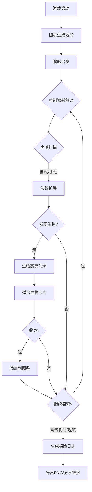

## 1. 产品概述

深海潜艇探险与生物图鉴记录是一款基于浏览器的3D深海探险游戏，玩家驾驶远程遥控潜艇在随机生成的深海峡谷中探索，通过声呐扫描发现发光生物，自动生成带插图的生物图鉴，并记录每次探险数据形成可分享的探险日志。

- 目标用户：喜欢探索类、收集类游戏的休闲玩家
- 核心价值：沉浸式深海探索体验 + 生物收集养成 + 可分享的探险成果

## 2. 核心功能

### 2.1 功能模块

1. **探险主界面**：3D深海峡谷场景、潜艇操控、声呐扫描交互
2. **生物卡片系统**：发现新生物时弹出卡片预览、收录到图鉴
3. **探险日志页面**：探险结束后生成完整日志，支持导出与分享

### 2.2 页面详情

| 页面名称 | 模块名称 | 功能描述 |
|----------|----------|----------|
| 探险主界面 | 3D深海场景 | 使用Three.js渲染深海峡谷，潜艇视角占屏幕70%，背景渐变#0A0E27→#0F2042 |
| 探险主界面 | 潜艇状态面板 | 左侧240px半透明面板，显示深度/氧气/声呐能量，氧气<20%时红色脉冲警示 |
| 探险主界面 | 小地图 | 右下角180×180px圆形小地图，显示已探索区域轮廓和生物位置光点 |
| 探险主界面 | 声呐波纹 | 同心圆波纹从潜艇中心扩展，半径0→80单位，透明度0.6→0衰减 |
| 探险主界面 | 生物卡片弹窗 | 右侧滑入320×200px卡片，展示生物轮廓图、属性信息、收录按钮 |
| 探险日志页 | 日志总览 | 全屏展示总深度、航线轨迹图（Canvas 2D贝塞尔曲线）、生物列表 |
| 探险日志页 | 操作按钮 | 导出为PNG、复制分享链接，分享链接跳转只读视图 |

## 3. 核心流程

1. 玩家启动游戏，系统随机生成深海峡谷地形（Perlin噪声）
2. 潜艇从峡谷顶部出发，玩家通过键盘/鼠标控制移动
3. 氧气值逐步下降，声呐可自动或手动触发扫描
4. 扫描发现发光生物时，生物高亮闪烁并弹出卡片
5. 玩家收录生物到图鉴（最多100种）
6. 氧气耗尽或手动返航，生成探险日志
7. 日志可导出为图片或生成分享链接

## 4. 用户界面设计

### 4.1 设计风格

- **主色调**：深海蓝黑渐变（#0A0E27 → #0F2042），峡谷壁深紫#1A0A2E→深蓝#0D1B3E
- **强调色**：发光青色#00E5FF（声呐、边框、轨迹）、生物自身发光色
- **警告色**：红色#FF5252（低氧警告）
- **面板风格**：半透明深蓝#0B1A30CC背景，圆角12px，内边距16px
- **字体**：科技感显示字体用于标题和数据，简洁无衬线用于正文
- **动画**：framer-motion数字过渡、卡片滑入、声呐脉冲、生物闪烁

### 4.2 页面设计概览

| 页面名称 | 模块名称 | UI元素 |
|----------|----------|--------|
| 探险主界面 | 3D场景 | 深海渐变背景，峡谷壁紫蓝渐变，潜艇胶囊体白色#E0E0E0+蓝色推进器光晕 |
| 探险主界面 | 状态面板 | 240px宽，半透明深蓝背景，圆角12px，深度/氧气/声呐数值，低氧红色脉冲 |
| 探险主界面 | 小地图 | 180×180px圆形，2px发光青色边框，像素轮廓+生物光点 |
| 探险主界面 | 声呐波纹 | 同心圆波纹，半径0→80，透明度0.6→0，青色#00E5FF |
| 探险主界面 | 生物卡片 | 320×200px，白底#FFFFFF，1px发光边框#00E5FF，圆角16px，0.4s ease-out滑入 |
| 探险日志页 | 日志总览 | 全屏，总深度、Canvas贝塞尔轨迹图、生物列表(行高80px，圆角12px，交替色) |
| 探险日志页 | 操作按钮 | 导出PNG按钮 + 复制分享链接按钮 |

### 4.3 响应式设计

- 桌面优先设计，潜艇视角区域占屏幕70%
- 状态面板固定左侧240px，小地图固定右下角
- 键盘方向键 + 鼠标拖拽双操控方式

### 4.4 3D场景指导

- **环境**：深海峡谷氛围，深蓝黑渐变背景，体积雾效营造深海压迫感
- **光照**：极弱环境光 + 生物自发光点光源，营造深海黑暗感
- **摄像机**：第三人称跟随潜艇，视角区域占屏幕70%
- **焦点元素**：潜艇模型（胶囊体+推进器光晕）、发光生物（闪烁点光源）
- **交互**：声呐波纹扩展动画、生物高亮闪烁、潜艇推进器粒子
- **后处理**：辉光效果(Bloom)增强发光生物视觉
- **性能预算**：45+ FPS，粒子总数≤600，对象池复用

## 5. 性能要求

- 探险过程保持≥45FPS
- 声呐扫描和卡片弹出时帧率不低于30FPS
- 粒子总数不超过600个，使用对象池缓存复用
- 声呐波纹和生物闪烁使用shader优化
