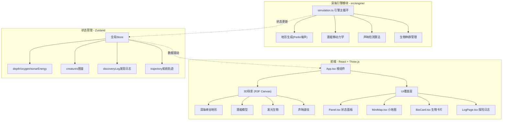
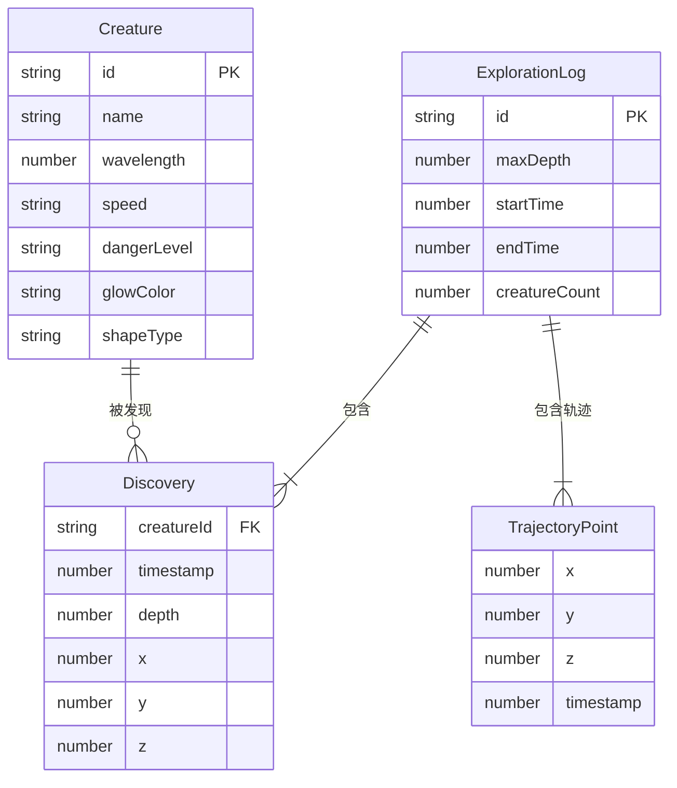

## 1. 架构设计



## 2. 技术说明

- **前端框架**：React 18 + TypeScript + Vite
- **3D渲染**：Three.js + @react-three/fiber + @react-three/drei
- **状态管理**：Zustand
- **动画**：Framer Motion（UI过渡）+ Three.js Shader（声呐波纹/生物闪烁）
- **样式**：CSS Modules + 内联样式（深海主题定制度高）
- **地形算法**：Perlin噪声（海拔高度+坡度）
- **构建工具**：Vite + @vitejs/plugin-react
- **无后端**：纯前端应用，数据存储在内存/Zustand store中

## 3. 路由定义

| 路由 | 用途 |
|------|------|
| `/` | 探险主界面（3D场景+状态面板+小地图+生物卡片） |
| `/log` | 探险日志页面（总深度+轨迹图+生物列表+导出按钮） |
| `/log/:id` | 只读分享视图（可缩放查看完整日志） |

## 4. 模块详细设计

### 4.1 深海引擎模块 (src/engine/)

**simulation.ts** 对外暴露接口：
- `startSimulation()` — 初始化地形、潜艇位置、生物种群
- `updateFrame(deltaTime: number)` — 每帧更新：潜艇运动、氧气消耗、生物游动
- `triggerScan()` — 触发声呐扫描，返回扫描范围内的生物列表
- `getDiscoveredCreatures()` — 获取已发现生物列表

**核心算法**：
- **地形生成**：Perlin噪声生成2D高度图，3D网格化渲染峡谷壁
- **潜艇运动**：6方向移动，速度上限4单位/帧，惯性衰减0.9
- **声呐检测**：以潜艇为中心，半径80单位球体碰撞检测
- **生物种群**：每局随机分布20-40种生物，每种有独立发光色/游动速度/危险等级

### 4.2 界面与图鉴模块 (src/ui/)

**App.tsx**：根组件，R3F Canvas + UI覆盖层，Zustand全局状态
**Panel.tsx**：状态面板，0.1秒刷新，framer-motion数字动画，低氧红色脉冲
**BioCard.tsx**：生物卡片，0.4s ease-out右侧滑入，收录动画
**LogPage.tsx**：探险日志，Canvas 2D贝塞尔曲线轨迹图，html2canvas导出PNG

## 5. 数据模型

### 5.1 数据模型定义



### 5.2 核心TypeScript类型

```typescript
interface Creature {
  id: string;
  name: string;
  wavelength: number;
  speed: 'slow' | 'medium' | 'fast';
  dangerLevel: 'low' | 'medium' | 'high';
  glowColor: string;
  shapeType: string;
  position: [number, number, number];
  discovered: boolean;
}

interface GameState {
  depth: number;
  oxygen: number;
  sonarEnergy: number;
  creatures: Creature[];
  discoveryLog: Discovery[];
  trajectory: TrajectoryPoint[];
  isExploring: boolean;
  sonarMode: 'auto' | 'manual';
  scanActive: boolean;
}
```

## 6. 性能优化策略

- **对象池**：粒子系统使用预分配数组，避免运行时GC
- **LOD**：远距离生物降低渲染精度
- **空间分区**：使用八叉树加速声呐碰撞检测
- **Shader**：声呐波纹使用自定义ShaderMaterial，GPU计算
- **按需渲染**：小地图使用Canvas 2D独立渲染，不影响3D帧率
- **帧率控制**：R3F useFrame中控制更新频率，非关键逻辑降频
