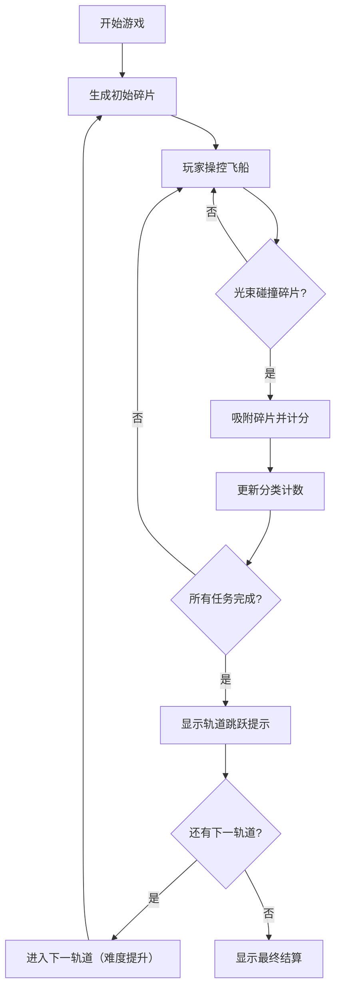

## 1. 产品概述

微型太空垃圾清理与轨道碎片拼图游戏，玩家操控回收飞船在近地轨道使用牵引光束捕获太空碎片，按材料分类回收，完成任务解锁新轨道区域。

- 核心玩法：使用牵引光束吸附漂浮碎片，分类计数，限时完成任务目标
- 目标用户：休闲游戏玩家、太空主题爱好者

## 2. 核心功能

### 2.1 功能模块
1. **游戏画布**：Canvas实现，中央70%区域渲染飞船、碎片和牵引光束
2. **左侧状态面板**：分数、碎片分类计数（金属/塑料/电子）、倒计时
3. **右侧任务面板**：当前轨道区域名称、任务目标及完成状态
4. **碎片系统**：随机生成、物理漂浮、类型分类、碰撞吸附
5. **牵引光束**：锥形蓝色半透明光束，碰撞检测吸附
6. **轨道区域解锁**：完成任务后跳跃到下一轨道，难度递增
7. **分数弹出动画**：+10分数从吸附位置向上飘动消失

### 2.2 页面详情
| 页面名称 | 模块名称 | 功能描述 |
|---------|---------|---------|
| 游戏主界面 | Canvas游戏区 | 飞船、碎片、牵引光束渲染与交互 |
| 游戏主界面 | 左侧状态面板 | 分数显示、三类碎片计数、倒计时 |
| 游戏主界面 | 右侧任务面板 | 轨道区域名称、三个任务目标及完成状态 |
| 游戏主界面 | 轨道跳跃提示 | 闪烁过渡动画，显示正在跳跃到下一轨道 |
| 游戏主界面 | 结算界面 | 显示最终总分和碎片回收统计 |

## 3. 核心流程

玩家使用鼠标/触控操控飞船 → 牵引光束触碰碎片 → 碎片被吸附到飞船 → 对应类别计数+1、分数+10并播放动画 → 检查任务目标 → 全部完成后触发轨道跳跃 → 进入下一轨道（更大碎片、更快速度、更短时间）→ 共3组9个轨道 → 显示最终结算。

## 4. 用户界面设计

### 4.1 设计风格
- **主色调**：深太空风格，纯黑#000000到深蓝#0B0D17径向渐变背景
- **面板样式**：半透明深蓝#0F1433B3，圆角10px
- **碎片颜色**：金属#B0BEC5、塑料#FFAB91、电子#80CBC4
- **任务状态**：已完成绿色#4CAF50打勾，未完成灰色#9E9E9E
- **按钮风格**：深蓝灰色背景，白色/浅蓝文字，圆角8px，悬停变亮带0.2s过渡
- **牵引光束**：蓝色半透明锥形，透明度0.2，延伸140px

### 4.2 页面设计概览
| 页面名称 | 模块名称 | UI元素 |
|---------|---------|--------|
| 游戏主界面 | Canvas游戏区 | 径向渐变背景、多边形碎片、飞船、锥形光束、+10弹出动画 |
| 游戏主界面 | 左侧面板 | 分数(20px加粗)、三类碎片计数(14px)、倒计时数字(20px加粗) |
| 游戏主界面 | 右侧面板 | 轨道区域名称、三个任务目标(14px)带勾选状态 |
| 游戏主界面 | 轨道跳跃提示 | 圆角矩形，蓝白渐变背景，闪烁文字，1.5s过渡 |

### 4.3 响应式
- 桌面优先布局，Canvas居中占70%宽度
- 两侧面板固定宽220px

### 4.4 性能要求
- Canvas使用requestAnimationFrame，维持60fps
- 每帧计算deltaTime确保不同刷新率速度一致
- 碎片数量固定15-20个，不随区域增加
