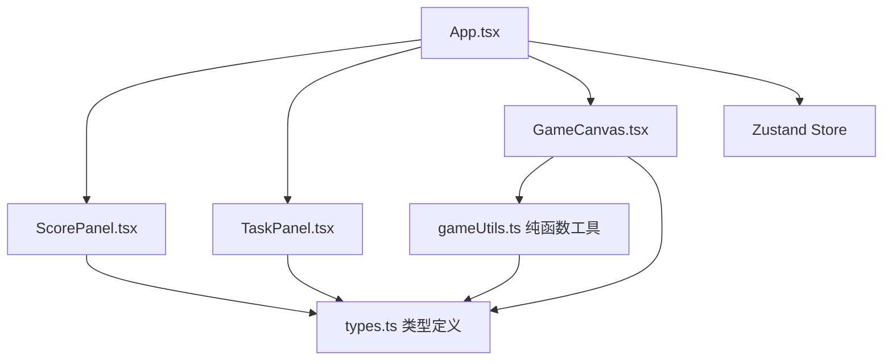

## 1. 架构设计



## 2. 技术描述
- **前端框架**：React 18 + TypeScript
- **构建工具**：Vite + @vitejs/plugin-react
- **状态管理**：Zustand
- **渲染引擎**：HTML5 Canvas（requestAnimationFrame）
- **后端**：无，纯前端游戏

## 3. 目录结构
```
src/
├── App.tsx           # 主应用组件，状态管理，组装面板和canvas
├── GameCanvas.tsx    # Canvas游戏循环组件，渲染与碰撞检测
├── ScorePanel.tsx    # 左侧状态面板
├── TaskPanel.tsx     # 右侧任务面板
├── types.ts          # TypeScript类型定义
└── gameUtils.ts      # 纯函数工具（碎片生成、碰撞检测等）
```

## 4. 数据模型

### 4.1 类型定义
```typescript
type DebrisType = 'metal' | 'plastic' | 'electronic';

interface Debris {
  id: number;
  x: number;
  y: number;
  vx: number;
  vy: number;
  size: number;
  rotation: number;
  rotationSpeed: number;
  type: DebrisType;
  vertices: { x: number; y: number }[];
  isBeingCaptured: boolean;
  captureProgress: number;
}

interface Ship {
  x: number;
  y: number;
  angle: number;
  beamLength: number;
  beamAngle: number;
}

interface TaskGoal {
  type: DebrisType;
  count: number;
}

interface OrbitZone {
  id: number;
  name: string;
  group: 'low' | 'medium' | 'high';
  debrisSizeMin: number;
  debrisSizeMax: number;
  debrisSpeedMin: number;
  debrisSpeedMax: number;
  timeLimit: number;
  tasks: TaskGoal[];
}

interface CapturePopup {
  id: number;
  x: number;
  y: number;
  opacity: number;
  createdAt: number;
}

interface GameState {
  score: number;
  timeRemaining: number;
  currentZoneIndex: number;
  debrisCounts: Record<DebrisType, number>;
  isTransitioning: boolean;
  isGameOver: boolean;
  finalStats: { totalScore: number; totalDebris: Record<DebrisType, number> } | null;
}
```

## 5. 核心算法
- **碎片生成**：从画布四边随机生成，随机多边形顶点(4-8个)，随机方向速度
- **碰撞检测**：判断碎片中心点是否在锥形牵引光束区域内
- **deltaTime计算**：每帧基于时间差调整运动速度，保证不同刷新率一致性
- **区域难度递增**：每进入下一轨道，碎片尺寸增大、速度加快、时间减少5秒
