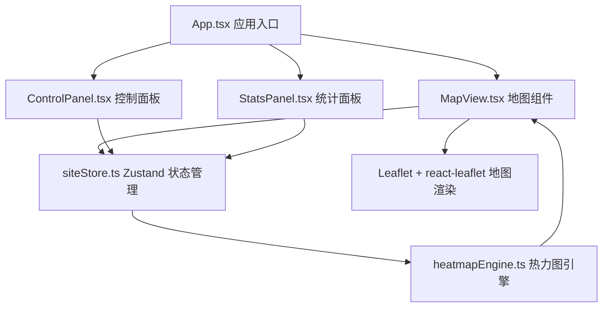

## 1. 架构设计



## 2. 技术描述
- **前端框架**：React 18 + TypeScript（严格模式）
- **构建工具**：Vite + @vitejs/plugin-react
- **状态管理**：Zustand
- **地图渲染**：Leaflet + react-leaflet
- **动画库**：framer-motion
- **工具库**：uuid（唯一ID生成）

## 3. 项目结构

```
src/
├── types.ts              # 类型定义（设施、人流、热力点）
├── store/
│   └── siteStore.ts      # Zustand 状态管理
├── components/
│   ├── MapView.tsx       # 地图视图组件
│   ├── ControlPanel.tsx  # 控制面板组件
│   └── StatsPanel.tsx    # 统计摘要面板
├── utils/
│   └── heatmapEngine.ts  # 热力图引擎（高斯核密度估计）
└── App.tsx               # 应用入口
```

## 4. 数据模型

### 4.1 核心类型定义

```typescript
// 设施类型枚举
enum FacilityType {
  STAGE = 'stage',
  FOOD = 'food',
  RESTROOM = 'restroom',
  REST = 'rest',
  MEDICAL = 'medical'
}

// 设施接口
interface Facility {
  id: string
  type: FacilityType
  name: string
  lat: number
  lng: number
  color: string
}

// 人流数据点
interface PersonPoint {
  id: string
  lat: number
  lng: number
  originLat: number
  originLng: number
  weight: number
  createdAt: number
  lifespan: number
}

// 热力点
interface HeatPoint {
  x: number
  y: number
  lat: number
  lng: number
  value: number
}

// 热力网格
interface HeatGrid {
  width: number
  height: number
  data: Float32Array
  bounds: [number, number, number, number]
}
```

## 5. Store 状态设计

```typescript
interface SiteState {
  facilities: Facility[]
  personPoints: PersonPoint[]
  heatGrid: HeatGrid | null
  densityFactor: number
  isSimulating: boolean
  maxHeatPoint: { lat: number; lng: number; value: number } | null
  
  // Actions
  addFacility: (type: FacilityType, lat: number, lng: number) => void
  removeFacility: (id: string) => void
  moveFacility: (id: string, lat: number, lng: number) => void
  clearFacilities: () => void
  setDensityFactor: (value: number) => void
  startSimulation: () => void
  stopSimulation: () => void
  updateHeatGrid: () => void
  getFacilityDensity: (facilityId: string) => number
}
```

## 6. 热力图引擎算法

1. **输入**：设施位置数组、人群密度因子、地图边界
2. **人群点生成**：
   - 每个设施生成 `densityFactor * (0.5 ~ 2.0)` 个随机点
   - 以设施为中心，高斯分布偏移
3. **高斯核密度估计**：
   - 输出 256x256 权重网格
   - 每个人群点对周围网格产生高斯衰减影响
   - 带宽参数：约 50 米对应地图像素距离
4. **颜色映射**：
   - 归一化权重到 [0, 1]
   - 颜色插值：蓝(0) → 绿(0.5) → 红(1)
5. **渲染**：Canvas 2D 绘制，半透明叠加到地图

## 7. 性能优化策略

- **热力图刷新节流**：每 2 秒最多刷新一次
- **requestAnimationFrame**：人群点移动使用 RAF
- **Web Worker**（可选）：热力图计算可移至 Worker
- **Canvas 分层**：热力图层单独 Canvas，避免重绘底图
- **对象池**：人群点复用，减少 GC
- **离屏渲染**：热力网格计算使用 Float32Array 批量处理
