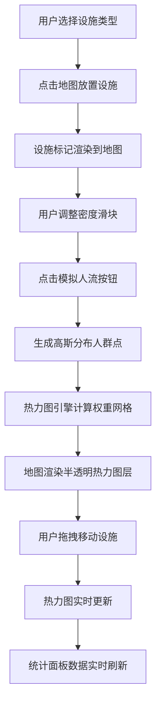

## 1. 产品概述

音乐节场地规划与实时人流热力监测应用，帮助音乐节组织者在地图上可视化布置场地设施并模拟人流分布，优化场地布局决策。

- 面向用户：音乐节活动组织者、场地规划人员
- 核心价值：通过交互式地图和实时热力图，直观展示场地设施布局与人流分布，辅助决策

## 2. 核心功能

### 2.1 功能模块
1. **地图交互模块**：Leaflet地图底图、设施标记渲染、热力图层叠加
2. **设施管理模块**：设施类型选择、地图放置、拖拽移动、删除、信息弹窗
3. **人流模拟模块**：人群密度控制、模拟人流生成、实时人流移动更新
4. **热力图引擎模块**：高斯核密度估计、256x256权重网格生成、颜色渐变映射
5. **统计面板模块**：设施统计、人流密度摘要、最高密度点显示
6. **控制面板模块**：设施列表、批量操作、排序筛选

### 2.2 页面详情

| 页面名称 | 模块名称 | 功能描述 |
|-----------|-------------|---------------------|
| 主应用页 | 地图视图 | Leaflet地图、设施标记、热力图层、拖拽交互 |
| 主应用页 | 左侧控制面板 | 设施类型选择器、添加按钮、密度滑块、模拟按钮、设施列表 |
| 主应用页 | 右上角统计面板 | 设施总数、各类型占比、平均人流密度、最高密度点坐标 |

## 3. 核心流程

## 4. 用户界面设计

### 4.1 设计风格
- **主题**：深色音乐节风格，暗紫色基调搭配霓虹红高光
- **主色**：深紫 #1A1A2E（背景）、半透明深紫 #16213EBB（面板）、霓虹红 #E94560（按钮/高亮）
- **设施配色**：舞台紫 #9C27B0、餐饮橙 #FF9800、卫生间蓝 #2196F3、休息绿 #4CAF50、医疗红 #F44336
- **热力渐变**：蓝 #0000FF → 绿 #00FF00 → 红 #FF0000
- **字体**：现代无衬线字体，标题加粗，正文常规
- **按钮**：圆角 8px，背景 #E94560，悬停亮度提升 10%，过渡 0.2s
- **面板**：半透明背景，圆角设计，阴影层次

### 4.2 页面设计概述

| 页面名称 | 模块名称 | UI元素 |
|-----------|-------------|-------------|
| 主应用页 | 地图容器 | 全屏 100vh，Leaflet 底图，设施标记带图标和名称标签，热力图层半透明覆盖 |
| 主应用页 | 左侧控制面板 | 宽 280px，圆角 0 12px 12px 0，右边界 2px 高光，设施类型卡片选择，密度滑块，设施列表条目高 44px 悬停背景变浅 |
| 主应用页 | 统计摘要面板 | 宽 200px，半透明白 #FFFFFFDD，圆角 12px，内边距 12px，固定右上角 |

### 4.3 响应式设计
- 桌面端（≥768px）：左侧悬浮控制面板，右上角统计面板
- 移动端（<768px）：控制面板折叠为顶部可展开抽屉，下滑动画 0.3s，高度自适应

### 4.4 动效设计
- 设施标记悬停微放大
- 热力图每 2 秒刷新，0.5s 平滑过渡
- 控制面板展开/收起 0.3s 动画
- 按钮悬停亮度提升过渡 0.2s
- 列表项悬停背景色变化过渡
