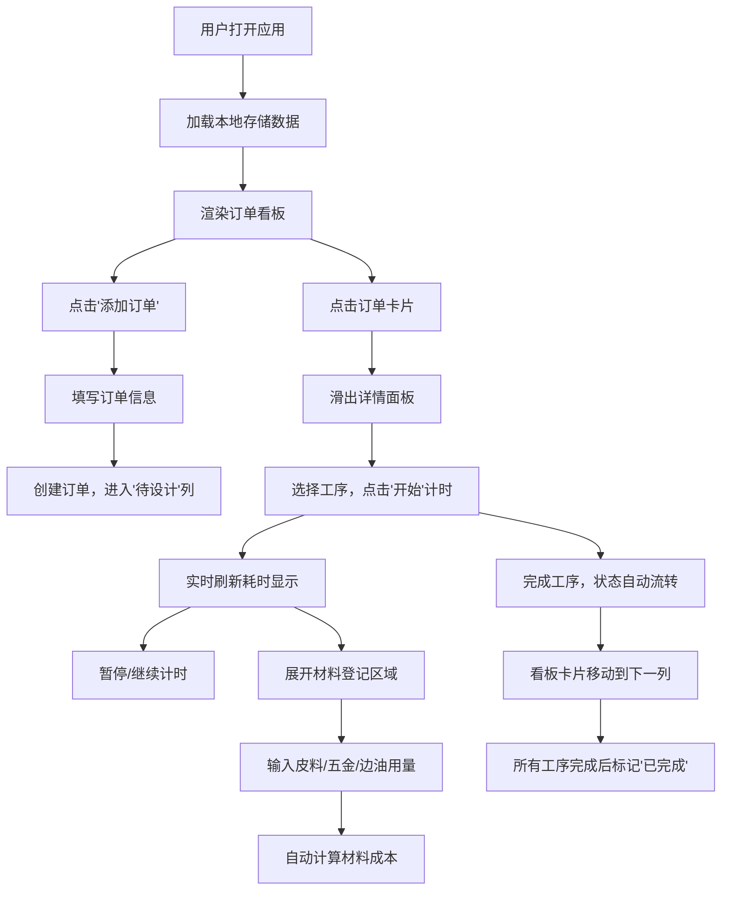

## 1. 产品概述

手工皮具工作室订单管理系统，专为小型手作皮具工作室设计，解决定制订单管理难、工序耗时统计复杂、工费报价不精准以及材料利用率低的核心痛点。通过可视化看板、高精度工序计时和智能成本核算，帮助工作室提升管理效率、降低材料损耗、提高报价精准度。

## 2. 核心功能

### 2.1 用户角色

| 角色 | 注册方式 | 核心权限 |
|------|----------|----------|
| 工作室管理员 | 本地应用，无需注册 | 订单全生命周期管理、工序计时、材料登记、参数配置 |

### 2.2 功能模块

1. **订单管理看板**：6列状态看板，展示全量订单及其流转状态
2. **工序计时系统**：高精度工序计时，支持暂停/继续，自动计算工费
3. **材料损耗追踪**：每道工序材料消耗登记，自动核算材料成本
4. **数据持久化**：localStorage 本地存储，刷新自动恢复

### 2.3 页面详情

| 页面名称 | 模块名称 | 功能描述 |
|----------|----------|----------|
| 主页面 | 顶部导航栏 | 品牌Logo、添加订单按钮 |
| 主页面 | 状态筛选标签 | 6种订单状态筛选（待设计、裁切中、缝合中、封边、质检、已完成） |
| 主页面 | 订单看板 | 6列看板布局，每列对应一个状态，卡片展示订单信息 |
| 主页面 | 订单卡片 | 显示订单编号、客户名、接单日期、当前工序耗时 |
| 详情面板 | 工序列表 | 展示订单所有工序，支持计时控制 |
| 详情面板 | 材料登记 | 每道工序可展开登记材料消耗 |
| 详情面板 | 成本汇总 | 总工时、工费总额、材料成本、材料损耗金额 |
| 设置面板 | 费率配置 | 各工序小时费率、皮料单价、五金单价配置 |

## 3. 核心流程

## 4. 用户界面设计

### 4.1 设计风格

- **主色调**：深棕色 #5D4037、棕色 #8B6F47、浅棕色 #C49A6C
- **背景色**：暖米色 #F5F0E6
- **状态色**：待设计-橙 #FF8C00、裁切-蓝 #4FC3F7、缝合-绿 #81C784、封边-紫 #CE93D8、质检-黄 #FFD54F、完成-灰 #BDBDBD
- **文字色**：深灰 #424242、标题 #5D4037
- **圆角**：卡片8px、按钮8px、状态标签16px、面板12px
- **阴影**：rgba(0,0,0,0.08)，悬停时阴影8px平移-2px
- **过渡**：背景色0.2s、卡片悬停0.25s cubic-bezier、面板滑入0.35s cubic-bezier(0.4, 0, 0.2, 1)

### 4.2 字体与排版

- **字体**：标题使用衬线字体（体现手作质感），正文使用无衬线字体
- **字体层级**：标题18px、副标题14px、正文13px、辅助文字12px
- **字重**：标题600、正文400

### 4.3 布局

- **顶部导航栏**：高48px，深棕色背景
- **主体内容**：宽度1200px，水平居中
- **看板布局**：6列，每列宽240px，列间距16px
- **订单卡片**：宽220px，高120px，带2px状态色左边框
- **详情面板**：右侧滑出，宽420px

### 4.4 页面设计概述

| 页面名称 | 模块名称 | UI元素 |
|----------|----------|--------|
| 主页面 | 状态筛选标签 | 圆角16px，默认浅灰#E0E0E0，选中棕色#8B6F47白色文字，0.2s过渡 |
| 主页面 | 订单卡片 | 白底，2px左边框状态色，悬停阴影升高，framer-motion动画 |
| 主页面 | 看板列 | 每列标题对应状态，卡片AnimatePresence增删动画 |
| 详情面板 | 工序行 | 工序名、开始时间、计时按钮（圆角6px，80x32px）、耗时显示 |
| 详情面板 | 材料区域 | max-height过渡展开/折叠，输入框登记用量 |
| 详情面板 | 成本汇总 | 分区显示工时、工费、材料成本、损耗金额 |

### 4.5 响应式

- **桌面端**（≥1200px）：6列看板，右侧滑出420px详情面板
- **平板端**（768-1199px）：自适应列数，保持最佳可读性
- **移动端**（<768px）：单列垂直布局，详情面板全屏覆盖
- **触控优化**：按钮最小尺寸44x44px，增大点击区域

### 4.6 动效设计

- **卡片悬停**：阴影升高至8px，向上平移2px，0.25s cubic-bezier过渡
- **状态标签**：背景色0.2s平滑过渡
- **面板滑入**：translateX从100%到0，0.35s cubic-bezier(0.4, 0, 0.2, 1)
- **卡片移动**：framer-motion layoutId实现平滑位置过渡
- **增删动画**：AnimatePresence实现卡片淡入淡出
- **材料区域**：max-height 0.3s ease过渡实现展开折叠
