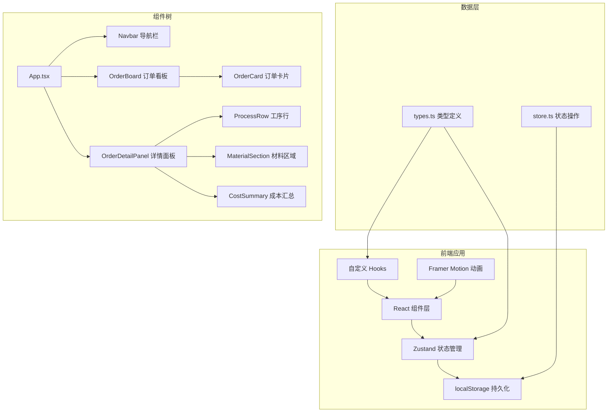
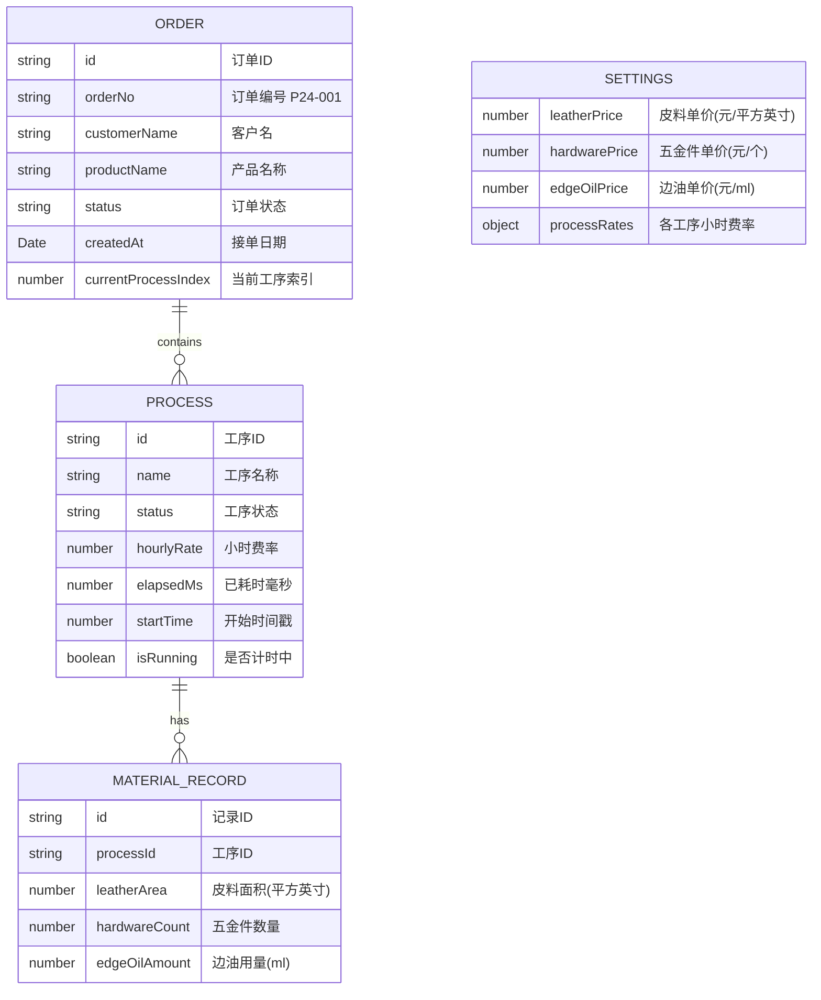

## 1. 架构设计



## 2. 技术描述

- **前端框架**：React 18 + TypeScript 5
- **构建工具**：Vite 5（开发端口3000）
- **状态管理**：Zustand 4（带 persist 中间件实现 localStorage 持久化）
- **动画库**：Framer Motion 11（卡片动画、面板滑入、布局过渡）
- **工具库**：uuid 9（生成唯一ID）
- **样式方案**：CSS Modules + CSS 变量（设计系统统一管理）

## 3. 路由定义

本项目为单页应用（SPA），无多页面路由，所有功能在主页面内通过组件状态控制实现。

| 视图 | 触发方式 | 描述 |
|------|----------|------|
| 看板视图 | 默认 | 展示6列订单看板 |
| 详情面板 | 点击订单卡片 | 右侧滑出显示工序详情 |
| 添加订单弹窗 | 点击"添加订单"按钮 | 新建订单表单 |

## 4. 数据模型

### 4.1 数据模型定义



### 4.2 TypeScript 类型定义

```typescript
// 订单状态枚举
type OrderStatus = 'design' | 'cutting' | 'stitching' | 'edge' | 'quality' | 'done';

// 工序状态
type ProcessStatus = 'pending' | 'running' | 'paused' | 'completed';

// 工序定义
interface Process {
  id: string;
  name: string;
  status: ProcessStatus;
  hourlyRate: number;
  elapsedMs: number;
  startTime: number | null;
  isRunning: boolean;
}

// 材料记录
interface MaterialRecord {
  id: string;
  processId: string;
  leatherArea: number;
  hardwareCount: number;
  edgeOilAmount: number;
}

// 订单
interface Order {
  id: string;
  orderNo: string;
  customerName: string;
  productName: string;
  status: OrderStatus;
  createdAt: string;
  currentProcessIndex: number;
  processes: Process[];
  materials: MaterialRecord[];
}

// 系统设置
interface Settings {
  leatherPrice: number;
  hardwarePrice: number;
  edgeOilPrice: number;
  processRates: Record<string, number>;
}

// Store 状态
interface AppState {
  orders: Order[];
  selectedOrderId: string | null;
  settings: Settings;
  // 操作方法
  addOrder: (order: Omit<Order, 'id' | 'createdAt' | 'processes' | 'materials'>) => void;
  updateOrder: (id: string, updates: Partial<Order>) => void;
  selectOrder: (id: string | null) => void;
  startProcess: (orderId: string, processIndex: number) => void;
  pauseProcess: (orderId: string, processIndex: number) => void;
  updateMaterial: (orderId: string, processId: string, updates: Partial<MaterialRecord>) => void;
  updateSettings: (settings: Partial<Settings>) => void;
}
```

## 5. 项目文件结构

```
auto198/
├── package.json
├── index.html
├── vite.config.ts
├── tsconfig.json
├── tsconfig.node.json
└── src/
    ├── main.tsx                 # React 入口
    ├── App.tsx                  # 根组件
    ├── types.ts                 # TypeScript 类型定义
    ├── store.ts                 # Zustand 状态管理
    ├── hooks/
    │   └── useTimer.ts          # 高精度计时器 Hook
    ├── components/
    │   ├── Navbar.tsx           # 顶部导航栏
    │   ├── OrderBoard.tsx       # 订单看板
    │   ├── OrderCard.tsx        # 订单卡片
    │   ├── OrderDetailPanel.tsx # 详情面板
    │   ├── ProcessRow.tsx       # 工序行组件
    │   ├── MaterialSection.tsx  # 材料登记区域
    │   ├── CostSummary.tsx      # 成本汇总
    │   ├── AddOrderModal.tsx    # 添加订单弹窗
    │   └── SettingsPanel.tsx    # 设置面板
    ├── utils/
    │   ├── format.ts            # 格式化工具
    │   └── constants.ts         # 常量配置
    └── styles/
        ├── variables.css        # CSS 变量
        └── global.css           # 全局样式
```

## 6. 关键技术实现

### 6.1 高精度计时器

```typescript
// useTimer.ts - 使用 performance.now() 实现高精度计时
const useTimer = (initialElapsed: number = 0) => {
  const [elapsedMs, setElapsedMs] = useState(initialElapsed);
  const [isRunning, setIsRunning] = useState(false);
  const startTimeRef = useRef<number | null>(null);
  const rafRef = useRef<number | null>(null);

  const tick = useCallback(() => {
    if (startTimeRef.current !== null) {
      const now = performance.now();
      const delta = now - startTimeRef.current;
      setElapsedMs(initialElapsed + delta);
    }
    rafRef.current = requestAnimationFrame(tick);
  }, [initialElapsed]);

  const start = useCallback(() => {
    startTimeRef.current = performance.now();
    setIsRunning(true);
    rafRef.current = requestAnimationFrame(tick);
  }, [tick]);

  // 精度保证：使用 requestAnimationFrame 而非 setInterval，误差 < 100ms
}
```

### 6.2 性能优化策略

1. **虚拟滚动**：看板列内超过20张卡片时使用虚拟滚动
2. **React.memo**：OrderCard 使用 memo 避免不必要重渲染
3. **useTransition**：订单状态切换使用 useTransition 保持 UI 响应
4. **批量更新**：计时器使用 requestAnimationFrame 批量更新状态
5. **防抖节流**：材料输入使用 onChange 防抖处理

### 6.3 localStorage 持久化

使用 Zustand persist 中间件，自动序列化/反序列化状态到 localStorage：

```typescript
import { create } from 'zustand';
import { persist } from 'zustand/middleware';

export const useAppStore = create<AppState>()(
  persist(
    (set, get) => ({ /* state & actions */ }),
    {
      name: 'leather-workshop-storage',
      partialize: (state) => ({
        orders: state.orders,
        settings: state.settings,
      }),
    }
  )
);
```

## 7. 性能指标

| 指标 | 目标值 | 实现方案 |
|------|--------|----------|
| 滚动帧率 | ≥ 55fps | CSS transform、will-change、虚拟滚动 |
| 计时精度 | ≤ 100ms | performance.now() + requestAnimationFrame |
| 首屏加载 | < 2s | 代码分割、按需加载、CSS 优化 |
| 交互响应 | < 100ms | Zustand 细粒度订阅、React.memo |
| 大数据量 | 240张卡片流畅 | 虚拟滚动、懒渲染、批量更新 |
