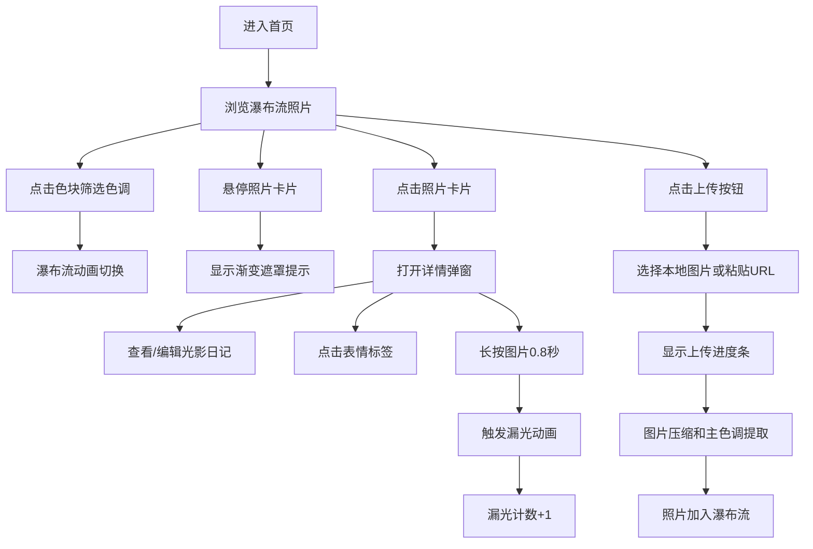

## 1. 产品概述

街头摄影作品展览与光影日记平台，为摄影爱好者提供复古胶片风格的作品展示空间。用户可上传街头抓拍照片，系统自动提取主色调生成拍立得风格卡片，支持添加光影日记、表情标签互动和漏光动画效果。

- 核心价值：以复古美学和光影互动为特色，打造沉浸式街头摄影社区
- 目标用户：街头摄影爱好者、胶片摄影爱好者、视觉艺术创作者

## 2. 核心功能

### 2.1 功能模块

1. **首页**：顶部导航栏、左侧色调筛选栏、右侧瀑布流照片展示区、上传入口
2. **照片详情弹窗**：原图展示、光影日记编辑、表情标签选择、漏光动画触发
3. **照片上传**：本地图片上传/URL粘贴、图片压缩处理、主色调自动提取、进度条展示

### 2.2 页面详情

| 页面名称 | 模块名称 | 功能描述 |
|-----------|-------------|---------------------|
| 首页 | 色调筛选栏 | 8个色块圆点纵向排列，点击高亮并激活缩放动画，筛选对应主色调照片 |
| 首页 | 瀑布流网格 | CSS columns实现自适应布局，照片卡片宽240px，支持交错淡入淡出切换动画 |
| 首页 | 照片卡片 | 白底圆角8px，悬停显示深棕渐变遮罩和漏光提示文字，点击进入详情 |
| 详情弹窗 | 图片展示 | 左半部分显示原图，右下角主色调标签，左下角漏光计数图标 |
| 详情弹窗 | 光影日记 | 140字限文本编辑区，记录拍摄光线条件和心情 |
| 详情弹窗 | 表情标签 | 5个emoji按钮(😮😭😂😌😊)，点击添加并显示计数 |
| 详情弹窗 | 漏光动画 | 长按图片0.8秒触发canvas漏光动画，每日每图限一次 |
| 上传功能 | 图片处理 | 缩放至最大宽度800px，转JPEG格式，自动提取主色调 |
| 上传功能 | 进度反馈 | 渐变进度条从#FFD54F到#FF7043，0.5秒内完成 |

## 3. 核心流程

## 4. 用户界面设计

### 4.1 设计风格

- **设计基调**：复古胶片风格，温暖怀旧的视觉氛围
- **主色调**：深棕#4A3728（导航栏、文字、遮罩）、米灰#F5F0E8（背景）、浅米#EAE0C8（文字）
- **强调色**：暖黄#FFD54F、橙红#FF7043（漏光动画、进度条渐变）
- **8种筛选色**：红#D32F2F、橙#FF6F00、黄#FBC02D、绿#388E3C、蓝#1976D2、紫#7B1FA2、粉#C2185B、灰#616161
- **圆角规范**：卡片8px，弹窗16px，按钮统一8px
- **字体**：衬线字体营造复古感，标题粗体，正文常规
- **按钮样式**：悬停0.2秒背景加深效果，点击0.3秒缓动

### 4.2 页面设计概述

| 页面名称 | 模块名称 | UI元素 |
|-----------|-------------|-------------|
| 首页 | 导航栏 | 高50px，深棕背景，浅米文字，左侧Logo，右侧上传按钮 |
| 首页 | 主区域 | 宽1120px居中，左侧80px筛选栏，右侧瀑布流区域 |
| 首页 | 筛选栏 | 8个直径24px色块圆点，间距12px纵向排列，选中高亮缩放 |
| 首页 | 瀑布流 | CSS columns布局，最小列宽220px，卡片间距20px |
| 首页 | 照片卡片 | 白底，1px边框#D7CCC8，圆角8px，底部留白显示色调标签 |
| 详情弹窗 | 遮罩层 | 半透明深棕#4A3728CC，0.3秒cubic-bezier淡入 |
| 详情弹窗 | 内容卡片 | 白底圆角16px，左右两栏布局，左图右文 |
| 详情弹窗 | 漏光动画 | canvas绘制3-6条斜向光线，暖黄到橙红渐变，1.2秒后淡出 |

### 4.3 动画规范

- **筛选切换**：未匹配照片左滑缩小淡出，匹配照片右滑放大淡入，0.5秒交错动画
- **卡片悬停**：0.5秒从无到有显示半透明深棕渐变遮罩
- **弹窗过渡**：0.3秒cubic-bezier缓动，缩放+淡入组合效果
- **按钮交互**：0.2秒背景加深，0.3秒缩放反馈
- **漏光动画**：1.2秒光线扫过，持续0.3秒淡出

### 4.4 响应式

- 桌面端优先，主内容区固定1120px宽度
- 瀑布流使用CSS columns实现自适应，最小列宽220px
- 移动端适配时筛选栏改为横向滚动
- 触摸设备优化长按交互

### 4.5 性能要求

- 首次加载15张照片，页面渲染≤800ms
- 滚动加载每次追加10张，DOM插入≤600ms
- 漏光动画帧率≥30fps
- 图片压缩后单张≤200KB
