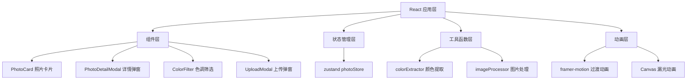

## 1. 架构设计



## 2. 技术描述

- **前端框架**：React 18 + TypeScript
- **构建工具**：Vite 5 + @vitejs/plugin-react
- **状态管理**：zustand 4
- **动画库**：framer-motion 11
- **工具库**：uuid 9
- **样式方案**：CSS Modules + CSS Variables
- **布局方案**：CSS Columns（瀑布流）+ Flexbox（布局）

## 3. 项目结构

```
auto199/
├── package.json
├── index.html
├── vite.config.js
├── tsconfig.json
├── src/
│   ├── App.tsx                    # 根组件，布局骨架
│   ├── main.tsx                   # 应用入口
│   ├── index.css                  # 全局样式，CSS变量
│   ├── components/
│   │   ├── PhotoCard.tsx          # 照片卡片组件
│   │   ├── PhotoDetailModal.tsx   # 详情弹窗组件
│   │   ├── ColorFilter.tsx        # 色调筛选组件
│   │   ├── Navbar.tsx             # 顶部导航栏
│   │   ├── UploadModal.tsx        # 上传弹窗组件
│   │   └── LightLeakCanvas.tsx    # 漏光动画Canvas组件
│   ├── store/
│   │   └── photoStore.ts          # zustand状态管理
│   └── utils/
│       ├── colorExtractor.ts      # 颜色提取算法
│       └── imageProcessor.ts      # 图片压缩处理
└── .trae/
    └── documents/
        ├── PRD.md
        └── TECH_ARCHITECTURE.md
```

## 4. 数据模型

### 4.1 照片数据结构

```typescript
interface Photo {
  id: string;
  url: string;
  thumbnailUrl: string;
  width: number;
  height: number;
  dominantColor: {
    h: number;
    s: number;
    l: number;
    hex: string;
    name: string;
  };
  diary: string;
  username: string;
  createdAt: string;
  emojiCounts: {
    surprised: number;
    moved: number;
    funny: number;
    peaceful: number;
    happy: number;
  };
  lightLeakCount: number;
  lastLightLeakDate: string | null;
}
```

### 4.2 筛选状态

```typescript
type ColorFilter = 'all' | 'red' | 'orange' | 'yellow' | 'green' | 'blue' | 'purple' | 'pink' | 'gray';

interface FilterState {
  activeColor: ColorFilter;
  filteredPhotos: Photo[];
}
```

## 5. 核心算法

### 5.1 主色调提取算法（colorExtractor.ts）

1. 将ImageData转换为HSL色彩空间
2. 统计每个色相区间（30度为一个区间）的像素占比
3. 排除饱和度<15%或亮度<10%或亮度>90%的像素
4. 选取占比最高的色相区间作为主色调
5. 匹配到预设的8种筛选色

### 5.2 漏光动画算法（LightLeakCanvas.tsx）

1. 长按0.8秒后触发，检查每日限制
2. 随机生成3-6条光线，参数：
   - 起始点：画布左上角区域随机
   - 角度：45°-135°斜线
   - 宽度：4-12px随机
   - 颜色：#FFD54F到#FF7043渐变
3. 光线以线性速度扫过全图（1.2秒）
4. 使用requestAnimationFrame保证帧率≥30fps
5. 动画结束后0.3秒淡出，计数+1

### 5.3 图片处理算法（imageProcessor.ts）

1. 加载图片到canvas
2. 等比缩放至最大宽度800px
3. 转换为JPEG格式，质量0.85
4. 同时创建缩略图（240px宽）
5. 调用colorExtractor提取主色调
6. 返回处理后的图片数据和主色调信息

## 6. 性能优化策略

### 6.1 渲染优化

- 使用CSS columns实现瀑布流，避免JavaScript布局计算
- 照片卡片使用React.memo减少不必要重渲染
- 瀑布流图片使用loading="lazy"懒加载
- 滚动加载使用IntersectionObserver

### 6.2 动画优化

- framer-motion使用transform和opacity属性，避免重排
- Canvas动画使用requestAnimationFrame，离屏渲染
- 筛选切换动画使用GPU加速，控制同时动画元素数量

### 6.3 图片优化

- 上传时自动压缩至最大宽800px，JPEG格式
- 生成240px缩略图用于瀑布流
- 使用will-change提示浏览器优化

## 7. 状态管理

zustand store包含：
- photos: Photo[] - 所有照片数据
- activeFilter: ColorFilter - 当前筛选色
- selectedPhotoId: string | null - 当前选中照片
- isModalOpen: boolean - 详情弹窗开关
- isUploadOpen: boolean - 上传弹窗开关
- actions: addPhoto, updateDiary, addEmoji, triggerLightLeak, setFilter
