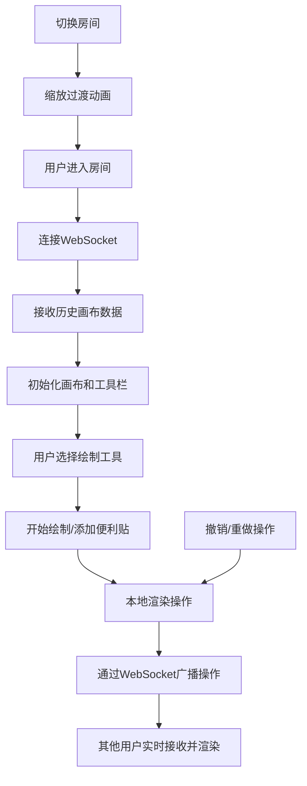

## 1. 产品概述
在线协作白板是一款支持多人实时协作的交互式画布工具，适用于远程头脑风暴、在线教学和团队协作场景。用户可通过浏览器进入同一房间，实时共享绘制内容和便利贴，实现低延迟的协作体验。

### 核心价值
- 解决远程团队协作时的视觉沟通难题
- 提供即时、流畅的多人绘图协作体验
- 支持便利贴式头脑风暴和讨论
- 操作延迟低于200ms，画布保持60FPS流畅度

---

## 2. 核心功能

### 2.1 用户角色
| 角色 | 加入方式 | 核心权限 |
|------|----------|----------|
| 协作用户 | 输入房间号直接加入 | 绘制图形、添加便利贴、撤销/重做、查看在线用户 |

### 2.2 功能模块
1. **白板房间视图**：画布展示、工具栏、用户面板、房间切换
2. **绘制系统**：线条、矩形、圆形绘制，颜色和粗细调节
3. **便利贴系统**：添加、拖动、编辑便利贴，淡入动画
4. **历史管理**：撤销/重做功能，最多50步操作历史
5. **实时同步**：WebSocket 实时同步所有用户操作
6. **用户面板**：显示在线用户列表，可折叠

### 2.3 页面详情
| 页面名称 | 模块名称 | 功能描述 |
|---------|----------|----------|
| 白板房间 | 画布区域 | 纯白底色带25px网格线，支持绘制和便利贴展示 |
| 白板房间 | 顶部工具栏 | 毛玻璃效果，颜色选择器（8色）、粗细调节（2-20px）、撤销/重做按钮 |
| 白板房间 | 左侧用户面板 | 可折叠，显示在线人数和用户名 |
| 白板房间 | 便利贴组件 | 圆角阴影效果，支持拖动和双击编辑，淡入动画 |
| 白板房间 | 房间切换 | 平滑缩放过渡动画 |

---

## 3. 核心流程

### 主协作流程
用户通过URL或房间号进入白板房间 → 连接WebSocket服务器 → 加载历史画布内容 → 选择工具开始绘制/添加便利贴 → 操作实时同步给其他用户 → 可随时撤销/重做操作

---

## 4. 用户界面设计

### 4.1 设计风格
- **主色调**：纯白画布背景 `#FFFFFF`，浅灰网格线 `#F0F0F0`
- **强调色**：8种预设颜色 - 黑、红、橙、黄、绿、蓝、紫、粉
- **工具栏**：毛玻璃效果（`backdrop-filter: blur(12px)` + 半透明白色背景）
- **按钮风格**：圆角8px，悬停状态有轻微放大和阴影变化
- **字体**：现代无衬线字体，标题16px，正文14px
- **布局**：固定顶部工具栏，左侧可折叠用户面板，中央画布区域
- **动画**：便利贴淡入（opacity 0→1 + translateY -10px→0），房间切换缩放过渡

### 4.2 页面设计概述
| 页面名称 | 模块名称 | UI 元素 |
|---------|----------|---------|
| 白板房间 | 画布区域 | 白色背景 + 25px浅灰网格线，覆盖全屏 |
| 白板房间 | 顶部工具栏 | 毛玻璃背景，工具按钮横向排列，颜色选择器圆形色块，粗细滑块 |
| 白板房间 | 用户面板 | 左侧抽屉式，半透明背景，用户头像+名字列表 |
| 白板房间 | 便利贴 | 彩色圆角矩形，阴影效果，拖动时光标变为move |
| 白板房间 | 警告提示 | 便利贴超100个时弹出警告弹窗 |

### 4.3 响应式设计
- 桌面端优先设计
- 移动端自适应：工具栏按钮缩小，用户面板改为底部抽屉
- 触摸操作优化：支持触摸绘制和手势缩放

### 4.4 性能要求
- 画布渲染保持60FPS
- 操作同步延迟低于200ms
- 便利贴数量上限100个，超出时警告
- 历史记录最多保留50步
