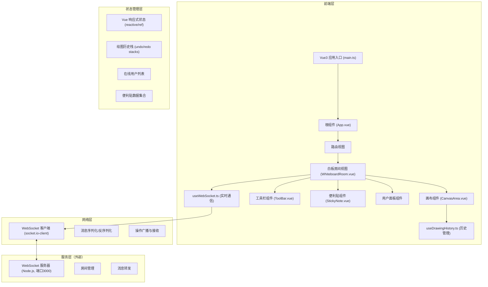

## 1. 架构设计



---

## 2. 技术选型

- **前端框架**：Vue 3 + TypeScript + Composition API
- **构建工具**：Vite 5.x
- **实时通信**：socket.io-client 4.x
- **唯一标识**：uuid 9.x
- **开发服务器端口**：8080（Vite），WebSocket 代理到 3000
- **样式方案**：原生 CSS + CSS 变量，Vue Scoped Styles

---

## 3. 项目文件结构

```
auto2/
├── package.json              # 项目依赖和脚本
├── index.html                # 入口 HTML
├── vite.config.js            # Vite 构建配置
├── tsconfig.json             # TypeScript 配置
└── src/
    ├── main.ts               # Vue 应用入口
    ├── App.vue               # 根组件
    ├── types/
    │   └── index.ts          # 类型定义
    ├── composables/
    │   ├── useWebSocket.ts   # WebSocket 组合式函数
    │   └── useDrawingHistory.ts  # 历史管理组合式函数
    ├── components/
    │   ├── CanvasArea.vue    # 画布组件
    │   ├── ToolBar.vue       # 工具栏组件
    │   └── StickyNote.vue    # 便利贴组件
    └── views/
        └── WhiteboardRoom.vue  # 白板房间主视图
```

---

## 4. 路由定义

| 路由 | 用途 |
|------|------|
| `/room/:roomId` | 白板房间页面，根据 roomId 加入对应房间 |
| `/` | 默认重定向到 `/room/default` |

---

## 5. 类型定义

### 绘图操作类型
```typescript
type ToolType = 'pen' | 'rectangle' | 'circle' | 'select' | 'note';

interface Point {
  x: number;
  y: number;
}

interface DrawOperation {
  id: string;
  type: 'pen' | 'rectangle' | 'circle';
  userId: string;
  color: string;
  lineWidth: number;
  points?: Point[];           // 自由绘制的点集合
  startPoint?: Point;         // 矩形/圆形起点
  endPoint?: Point;           // 矩形/圆形终点
  timestamp: number;
}

interface StickyNoteData {
  id: string;
  userId: string;
  content: string;
  x: number;
  y: number;
  color: string;
  timestamp: number;
}

interface User {
  id: string;
  name: string;
  color: string;
  roomId: string;
}

interface WebSocketMessage {
  type: 'join' | 'leave' | 'draw' | 'undo' | 'redo' | 'note-add' | 'note-update' | 'note-delete' | 'user-list' | 'history';
  payload: any;
}
```

---

## 6. WebSocket 消息协议

| 消息类型 | 触发时机 | 数据内容 |
|---------|----------|----------|
| `join` | 用户加入房间 | `{ roomId, user }` |
| `leave` | 用户离开房间 | `{ userId }` |
| `draw` | 用户绘制操作 | `{ operation: DrawOperation }` |
| `undo` | 用户撤销操作 | `{ userId, operationId }` |
| `redo` | 用户重做操作 | `{ userId, operation }` |
| `note-add` | 添加便利贴 | `{ note: StickyNoteData }` |
| `note-update` | 更新便利贴 | `{ noteId, updates }` |
| `note-delete` | 删除便利贴 | `{ noteId }` |
| `user-list` | 服务器推送用户列表 | `{ users: User[] }` |
| `history` | 加入房间时拉取历史 | `{ operations: DrawOperation[], notes: StickyNoteData[] }` |

---

## 7. 核心组合式函数

### useWebSocket.ts
- 管理 WebSocket 连接生命周期
- 房间加入/离开逻辑
- 消息发送与事件监听
- 自动重连机制

### useDrawingHistory.ts
- 维护 undoStack 和 redoStack
- `push(operation)` - 入栈新操作
- `undo()` - 弹出栈顶到重做栈，返回撤销的操作
- `redo()` - 从重做栈恢复
- 栈大小限制为50

---

## 8. Vite 代理配置

```javascript
// vite.config.js
export default {
  server: {
    port: 8080,
    proxy: {
      '/socket.io': {
        target: 'http://localhost:3000',
        ws: true,
        changeOrigin: true
      }
    }
  }
}
```

---

## 9. 性能优化策略

1. **Canvas 渲染优化**：使用 requestAnimationFrame 批量绘制
2. **离屏 Canvas**：历史绘制缓存，减少重绘
3. **操作合并**：短时间内的同类型操作合并传输
4. **便利贴虚拟化**：可视区域外的便利贴延迟渲染
5. **节流防抖**：鼠标移动事件节流，resize 防抖
6. **Web Worker**：复杂计算移至 Worker 线程
7. **内存管理**：超过50步历史后自动清理最早记录
