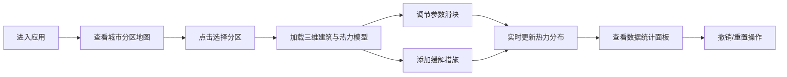

## 1. 产品概述

城市热岛效应模拟与缓解策略可视化应用，通过三维热力模型直观展示城市建筑密度、植被覆盖、材料反射率对区域温度的影响，并提供绿色屋顶、垂直绿化、透水路面等缓解措施的实时对比分析。面向城市规划师、环境研究人员和学生群体，帮助理解热岛效应形成机制及缓解策略效果。

## 2. 核心功能

### 2.1 功能模块

1. **地图选择区**：城市分区缩略图，点击选择模拟区域
2. **三维热力场景**：建筑模型、热力粒子云、温度标签的3D可视化
3. **参数控制面板**：建筑密度、植被覆盖率、材料反射率调节滑块
4. **缓解措施面板**：绿色屋顶、垂直绿化、透水路面添加/移除
5. **数据统计面板**：平均温、最高温、最低温、温差对比展示

### 2.2 页面详情

| 页面名称 | 模块名称 | 功能描述 |
|---------|---------|----------|
| 主页面 | 地图选择器 | 2D城市分区网格，灰度表示建筑密度，点击高亮选中 |
| 主页面 | 三维热力场景 | Three.js渲染的建筑、热力粒子、温度标签，支持旋转缩放平移 |
| 主页面 | 参数控制面板 | 三个滑块实时调节参数，场景同步更新 |
| 主页面 | 缓解措施面板 | 三个按钮添加/移除缓解措施，温度平滑过渡动画 |
| 主页面 | 数据统计面板 | 实时显示温度统计和缓解效果对比 |

## 3. 核心流程

用户进入应用 → 查看左侧城市分区缩略图 → 点击选择一个分区 → 右侧加载该分区三维建筑模型和热力云 → 通过滑块调节参数观察热力变化 → 点击缓解措施按钮添加绿色屋顶/垂直绿化/透水路面 → 查看温度降幅和热力颜色变化 → 可撤销/重置操作

## 4. 用户界面设计

### 4.1 设计风格
- **主色调**：深灰 #1E1E1E（背景）、#2C2C2C（面板）、#2A2A2A（地图背景）
- **强调色**：亮蓝 #00BFFF（选中高亮）、深绿 #2E7D32（缓解措施）、#00E676（绿化效果）
- **热力渐变色**：蓝色 #0000FF（25°C）→ 红色 #FF0000（45°C）
- **字体**：等宽字体（数据展示）、无衬线字体（界面文字）
- **按钮样式**：圆角8px，深绿背景白色文字，悬停变深
- **滑块样式**：圆形滑块头，轨道高6px圆角3px
- **过渡动画**：所有交互元素0.2秒平滑过渡，热力颜色0.5秒平滑插值

### 4.2 页面布局
| 区域 | 模块名称 | UI元素 |
|-----|---------|--------|
| 左侧40% | 地图选择器 | 400x400px画布，网格分区，灰度建筑密度，选中高亮边框 |
| 中间60% | 三维场景 | Three.js Canvas，OrbitControls控制，初始俯视45度 |
| 右侧外 | 控制面板 | 260px宽深灰面板，滑块组，缓解措施按钮组 |
| 场景右下角 | 数据面板 | 220px宽半透明面板，温度统计，温差对比 |

### 4.3 响应式设计
- 桌面端（≥1024px）：左右分屏布局，地图40% + 场景60%，控制面板在场景右侧
- 移动端（<1024px）：地图折叠为顶部横条（60px高），场景居中，控制面板移至场景下方

### 4.4 3D场景设计
- **环境**：深色背景，方向光模拟日照，环境光补光
- **相机**：PerspectiveCamera，初始位置俯视45度，距离25单位
- **控制**：OrbitControls，支持旋转、缩放、平移
- **建筑**：随机长方体，高度5-20单位，颜色根据反射率渐变
- **热力粒子**：3000个半透明粒子，Y轴浮动，温度对应颜色
- **缓解措施模型**：绿色屋顶（半透明绿方块）、垂直绿化（粒子流）、透水路面（纹理贴片）
