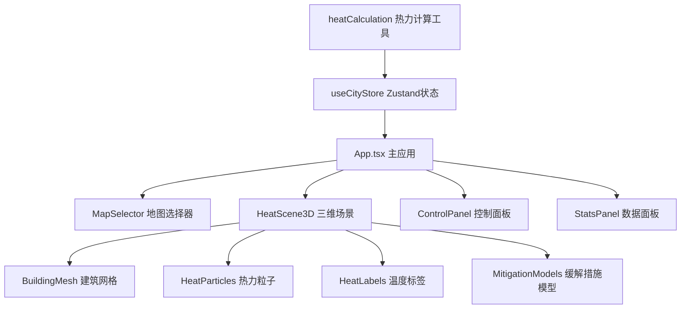

## 1. 架构设计



## 2. 技术栈描述

- **前端框架**：React 18 + TypeScript
- **构建工具**：Vite
- **3D引擎**：Three.js + @react-three/fiber + @react-three/drei
- **状态管理**：Zustand
- **动画库**：framer-motion
- **代码风格**：严格TypeScript模式，ESNext模块

## 3. 文件结构

| 文件路径 | 用途 |
|---------|------|
| `package.json` | 项目依赖与脚本配置 |
| `index.html` | 入口HTML页面 |
| `vite.config.js` | Vite构建配置 |
| `tsconfig.json` | TypeScript配置 |
| `src/App.tsx` | 主应用组件，布局与状态连接 |
| `src/components/MapSelector.tsx` | 2D城市分区地图选择组件 |
| `src/components/HeatScene3D.tsx` | Three.js三维热力场景核心组件 |
| `src/components/ControlPanel.tsx` | 参数调节与缓解措施控制面板 |
| `src/components/StatsPanel.tsx` | 温度统计数据面板 |
| `src/stores/useCityStore.ts` | Zustand全局状态管理 |
| `src/utils/heatCalculation.ts` | 热力分布计算工具函数 |

## 4. 数据模型

### 4.1 状态数据结构

```typescript
interface CityState {
  selectedZone: string | null;
  buildingDensity: number;      // 0-100
  vegetationCoverage: number;   // 0-100
  materialAlbedo: number;       // 0.1-0.9
  mitigations: {
    greenRoof: boolean;
    verticalGreening: boolean;
    permeablePavement: boolean;
  };
  heatData: HeatGridPoint[];
  buildings: Building[];
  stats: {
    avgTemp: number;
    maxTemp: number;
    minTemp: number;
    tempReduction: number;
  };
}
```

### 4.2 建筑与热力数据

```typescript
interface Building {
  id: string;
  position: [number, number, number];
  height: number;
  width: number;
  depth: number;
  baseTemp: number;
  hasGreenRoof: boolean;
  hasVerticalGreening: boolean;
}

interface HeatGridPoint {
  x: number;
  z: number;
  temperature: number;
  color: string;
}
```

## 5. 核心算法

### 5.1 热力计算
- 基础温度：25°C + 建筑密度因子(0-15°C) - 植被覆盖降温(0-5°C) - 反射率降温(0-3°C)
- 缓解措施降温：绿色屋顶-2°C、垂直绿化-1.5°C、透水路面-1°C
- 颜色插值：蓝#0000FF(25°C) → 青 → 黄 → 橙 → 红#FF0000(45°C)
- 计算优化：网格点缓存，参数变化时增量更新，目标200ms内完成

### 5.2 性能优化
- 建筑使用InstancedMesh批量渲染
- 热力粒子使用Points + ShaderMaterial
- 状态更新节流，避免频繁重算
- 颜色插值使用requestAnimationFrame平滑过渡

## 6. 性能指标

- 3000热力粒子 + 三种缓解措施：≥45 FPS
- 参数滑块拖动更新：≥30 FPS
- 热力重算完成时间：≤200ms
- 颜色过渡动画：0.5秒平滑插值
