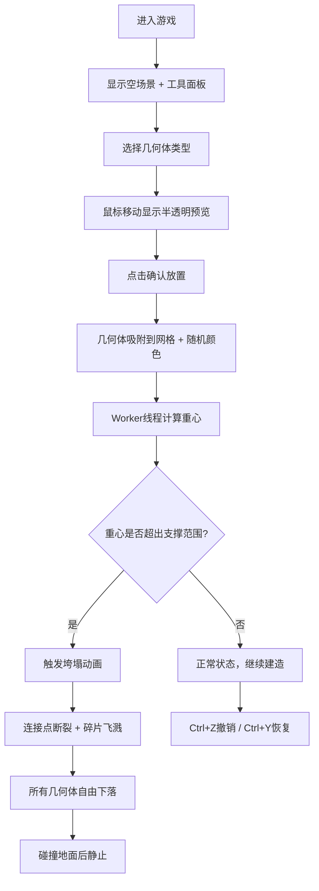

## 1. 产品概述

「虚空造物」是一款基于Web的3D体素沙盒建造游戏，玩家在漂浮的虚拟空间中用基本几何体自由拼接结构，系统实时检测重心并模拟物理倒塌效果。

- 面向独立游戏爱好者和创意建造玩家，提供轻量化的物理沙盒体验
- 核心价值：低门槛的3D建造乐趣 + 真实物理反馈的沉浸感

## 2. 核心功能

### 2.1 用户角色
| 角色 | 注册方式 | 核心权限 |
|------|----------|----------|
| 玩家 | 无需注册，直接进入 | 几何体放置、删除、撤销/恢复、查看物理模拟 |

### 2.2 功能模块
1. **3D建造场景**：几何体渲染、网格地面、粒子背景、拖拽放置交互
2. **物理模拟系统**：实时重心计算、垮塌检测、碎片飞溅、重力下落
3. **工具面板**：几何体选择、重心显示、清除按钮、倒塌预警
4. **操作历史系统**：撤销/恢复、步数显示、平滑过渡动画
5. **状态监控栏**：FPS计数、重心偏移百分比、总重量显示

### 2.3 页面详情
| 页面名称 | 模块名称 | 功能描述 |
|----------|----------|----------|
| 主游戏页 | 3D场景 | Three.js渲染几何体、地面、粒子背景；支持鼠标拖拽放置、点击确认 |
| 主游戏页 | 右侧工具面板 | 几何体类型按钮、重心数值、清除按钮、倒塌预警灯 |
| 主游戏页 | 底部状态栏 | FPS、重心偏移、总重量实时显示 |
| 主游戏页 | 右下角菜单 | 圆形浮动按钮、撤销/恢复步数显示 |

## 3. 核心流程

## 4. 用户界面设计

### 4.1 设计风格
- **主色调**：深空色#0A0B10到#16213E径向渐变背景
- **面板色**：半透明深灰#1A1A1ACC，1px边框#333333
- **强调色**：绿色#2ECC71（正常）、红色#E74C3C（警告）、黄色#F1C40F（提示）
- **按钮风格**：高40px圆角8px，悬停背景#2A2A2A
- **字体**：现代无衬线字体，白色主文字
- **布局风格**：沉浸式全屏3D场景，浮动UI面板
- **图标风格**：简约线性图标

### 4.2 页面设计概述
| 页面名称 | 模块名称 | UI元素 |
|----------|----------|--------|
| 主游戏页 | 3D场景 | 全屏Three.js画布、网格地面、粒子星空、几何体模型 |
| 主游戏页 | 工具面板 | 右侧固定240px、几何体按钮（3个）、重心数值、清除按钮、预警灯 |
| 主游戏页 | 底部状态栏 | 底部居中600px×30px半透明条、FPS（绿）、偏移%（黄/红）、总重量 |
| 主游戏页 | 右下角操作区 | 圆形浮动按钮、步数显示"第X/20步" |

### 4.3 响应式
- 桌面端优先（≥1024px）：右侧面板240px，底部条600px
- 小屏幕（<1024px）：面板缩为180px，底部条宽度80%，字体缩小15%

### 4.4 3D场景指导
- **环境**：深空渐变背景 + 3万粒子星空，营造漂浮虚空感
- **光照**：环境光 + 方向光，几何体使用哑光材质带轻微高光
- **相机**：透视相机，可围绕场景旋转缩放（OrbitControls）
- **交互**：鼠标射线检测，预览体半透明跟随，点击确认放置
- **动画**：垮塌时碎片飞溅（30-50个/连接点）、自由下落、弹性碰撞
- **后处理**：轻微泛光效果增强虚空氛围
- **性能**：对象池技术复用几何体，碎片上限5000个，100个几何体≥30fps
