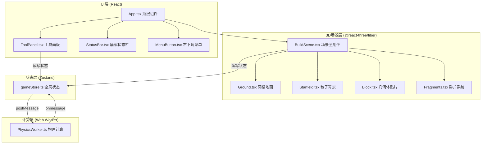

## 1. 架构设计



## 2. 技术描述

- **前端框架**：React@18 + TypeScript
- **构建工具**：Vite@5 + @vitejs/plugin-react
- **3D引擎**：Three.js + @react-three/fiber + @react-three/drei
- **状态管理**：Zustand
- **Web Worker**：原生Web Worker API处理物理计算
- **唯一ID**：uuid
- **无后端**：纯前端应用，无服务端依赖

## 3. 路由定义
| 路由 | 用途 |
|------|------|
| / | 主游戏页面 |

## 4. 数据模型

### 4.1 几何体数据结构
```typescript
interface Block {
  id: string;
  type: 'cube' | 'sphere' | 'prism';
  position: [number, number, number];
  color: string;
  velocity?: [number, number, number];
  isCollapsed?: boolean;
}
```

### 4.2 重心数据
```typescript
interface CenterOfMass {
  position: [number, number, number];
  offsetPercent: number;
  isOutOfBounds: boolean;
  totalMass: number;
}
```

### 4.3 碎片数据
```typescript
interface Fragment {
  id: string;
  position: [number, number, number];
  velocity: [number, number, number];
  size: number;
  color: string;
  opacity: number;
  life: number;
}
```

### 4.4 历史记录
```typescript
interface HistoryState {
  blocks: Block[];
  timestamp: number;
}
```

### 4.5 Store状态
```typescript
interface GameState {
  blocks: Block[];
  selectedType: 'cube' | 'sphere' | 'prism' | null;
  centerOfMass: CenterOfMass;
  isCollapsed: boolean;
  history: HistoryState[];
  historyIndex: number;
  maxHistory: number;
  
  addBlock: (block: Block) => void;
  removeBlock: (id: string) => void;
  updatePosition: (id: string, position: [number, number, number]) => void;
  clearAll: () => void;
  triggerCollapse: () => void;
  undo: () => void;
  redo: () => void;
  setSelectedType: (type: 'cube' | 'sphere' | 'prism' | null) => void;
  updateCenterOfMass: (com: CenterOfMass) => void;
}
```

## 5. 核心模块说明

### 5.1 gameStore.ts
- 存放几何体列表、选中状态、重心数据、倒塌状态、历史记录
- 提供增删改查、撤销恢复、倒塌触发等方法
- UI组件和3D场景均通过该store读写状态

### 5.2 BuildScene.tsx
- Three.js场景主组件
- 渲染地面、粒子背景、所有几何体
- 处理鼠标射线检测和放置交互
- 监听store变化，驱动动画
- 与PhysicsWorker通信

### 5.3 PhysicsWorker.ts
- 独立线程执行重心计算
- 计算支撑多边形最小外接圆
- 判断重心是否超出阈值
- 计算碎片飞溅方向与速度
- 每帧计算时间控制在2ms内

### 5.4 ToolPanel.tsx
- 右侧工具面板
- 几何体类型选择按钮
- 重心数值实时显示（保留两位小数）
- 一键清除按钮
- 倒塌预警指示灯

## 6. 性能优化策略

1. **对象池技术**：复用几何体和碎片Mesh，避免频繁创建销毁
2. **Web Worker分离**：物理计算在独立线程，不阻塞主线程渲染
3. **碎片上限**：总碎片数不超过5000个，超出忽略新生成
4. **InstancedMesh**：相同类型几何体使用实例化渲染
5. **帧率控制**：Worker计算节流，确保100个几何体时≥30fps
6. **Transition动画**：撤销恢复时使用0.3秒ease-out平滑过渡
