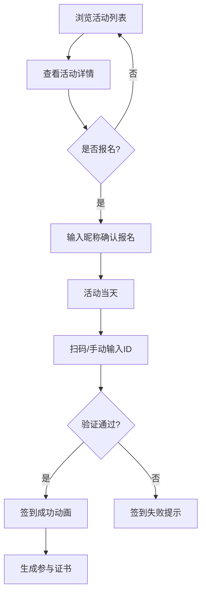

## 1. 产品概述

微型独立书店在线读书会活动策划与签到系统，为独立书店提供完整的读书会活动管理解决方案。书店可创建主题活动、管理报名、生成签到二维码，用户可浏览活动、在线报名、扫码签到并自动获取参与证书。

- 解决问题：传统读书会活动管理效率低，签到流程繁琐，缺乏数字化参与凭证
- 目标用户：独立书店运营者、读书会爱好者
- 市场价值：提升书店活动运营效率，增强用户参与体验，打造数字化阅读社区

## 2. 核心功能

### 2.1 用户角色

| 角色 | 注册方式 | 核心权限 |
|------|----------|----------|
| 书店运营者 | 无需注册（本地系统） | 创建活动、管理活动、生成签到码、查看报名名单 |
| 活动参与者 | 昵称报名 | 浏览活动、在线报名、扫码签到、获取参与证书 |

### 2.2 功能模块

1. **活动列表页**：瀑布流卡片展示、日期排序、标题搜索、卡片懒加载
2. **活动创建页**：表单输入、实时预览、日期验证、人数限制
3. **活动详情页**：完整信息展示、报名功能、参与名单、签到码生成
4. **签到页面**：二维码扫描、手动输入ID、签到动画、参与证书生成

### 2.3 页面详情

| 页面名称 | 模块名称 | 功能描述 |
|---------|---------|----------|
| 活动列表页 | 筛选栏 | 日期升序/降序切换、实时搜索标题 |
| 活动列表页 | 卡片网格 | 瀑布流布局、悬停效果、懒加载动画 |
| 活动创建页 | 表单区域 | 标题、日期、时间、地点、封面、简介输入 |
| 活动创建页 | 预览区域 | 实时显示活动卡片效果 |
| 活动详情页 | 信息展示 | 封面大图、活动基本信息、简介 |
| 活动详情页 | 参与名单 | 按报名顺序展示、显示剩余名额 |
| 活动详情页 | 报名弹窗 | 昵称输入、确认报名 |
| 活动详情页 | 签到码弹窗 | 二维码显示、30秒刷新倒计时 |
| 签到页面 | 扫码区域 | 图片上传识别、手动输入ID |
| 签到页面 | 成功动画 | 背景变色、对号缩放、外发光脉冲 |
| 签到页面 | 参与证书 | 活动名称、用户昵称、日期、书店名称 |

## 3. 核心流程

用户浏览活动列表 → 点击卡片查看详情 → 点击报名按钮 → 输入昵称确认 → 活动当天扫码/输入ID签到 → 签到成功显示动画 → 生成参与证书

## 4. 用户界面设计

### 4.1 设计风格

- **主色调**：深蓝 #2C5F8A，米白背景 #FDFBF7，卡片白底 #FFFFFF
- **辅助色**：琥珀橙 #D69E2E（悬停/标签），绿色 #38A169（名额充足），红色 #E53E3E（已满/错误）
- **字体**：使用思源宋体或Noto Serif SC，搭配现代无衬线字体
- **按钮风格**：圆角8px，深蓝背景白字，悬停变深，带0.2s过渡
- **布局风格**：卡片式布局，顶部导航，瀑布流网格
- **动效**：framer-motion实现staggerChildren入场、弹窗scale动画、签到成功脉冲效果

### 4.2 页面设计概述

| 页面名称 | 模块名称 | UI元素 |
|---------|---------|--------|
| 活动列表页 | 筛选栏 | 下拉选择器、搜索输入框、水平布局 |
| 活动列表页 | 活动卡片 | 封面区域、标题、日期、地点、剩余名额标签、悬停阴影 |
| 活动创建页 | 表单 | 标签+输入框组合、日期选择器、时间选择器、多行文本域 |
| 活动详情页 | 左右两栏 | 左栏信息、右栏名单、报名按钮 |
| 签到页面 | 扫码区域 | 虚线边框、拖拽提示、文件上传 |
| 签到页面 | 证书 | 深蓝边框、大号字体、右下日期签名 |

### 4.3 响应式设计

- 桌面端（≥768px）：4列卡片网格，详情页左右两栏，完整导航
- 移动端（<768px）：2列卡片网格，详情页上下单栏，汉堡菜单导航
- 触摸优化：按钮最小44px高度，足够点击区域

### 4.4 性能优化

- 虚拟列表/懒加载：超过20个活动时使用卡片懒加载，保持30fps以上
- 二维码生成优化：使用qrcode库，控制在50ms内生成
- 动画性能：优先使用transform和opacity属性实现动画
