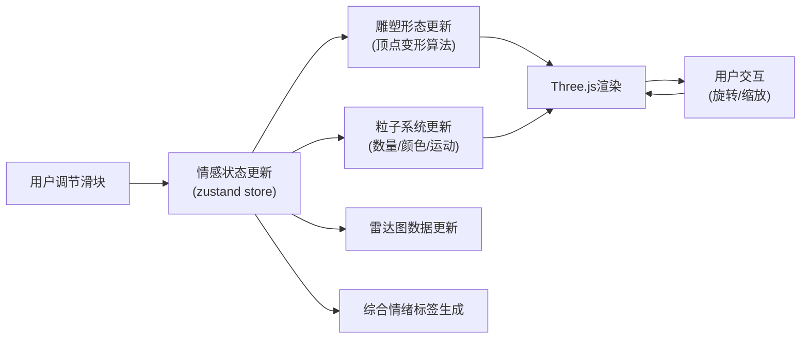

## 1. 产品概述

情感雕塑是一个交互式三维可视化应用，将抽象的情感状态（快乐、悲伤、愤怒、平静）实时映射为动态的三维抽象雕塑形态。它解决了用户难以用语言精确描述复杂情绪，以及传统情绪记录方式缺乏表现力与沉浸感的问题。

- 核心价值：为用户提供直观、沉浸式的情感表达与探索体验
- 目标用户：心理学爱好者、艺术创作者、冥想实践者、普通用户
- 市场价值：创新的情绪可视化方式，可应用于心理疗愈、艺术创作、教育等领域

## 2. 核心功能

### 2.1 Feature Module

1. **情感控制模块**：四个情感滑块（快乐、悲伤、愤怒、平静），实时调节情感强度
2. **三维雕塑生成模块**：根据情感值实时生成由5000个顶点构成的动态雕塑
3. **粒子系统模块**：环绕雕塑的半透明粒子光晕与呼吸动画
4. **视角交互模块**：鼠标拖拽旋转、滚轮缩放视角控制
5. **环境渲染模块**：半反射地面、动态阴影、渐变天空盒
6. **数据可视化模块**：雷达图展示五维情感指标，综合情绪标签

### 2.2 Page Details

| 页面名称 | 模块名称 | 功能描述 |
|-----------|-------------|---------------------|
| 主页面 | 控制面板 | 四个情感滑块（各宽200px，圆角6px）、雷达图、重置按钮 |
| 主页面 | 三维视口 | 全屏Three.js场景，包含雕塑、粒子、地面、天空盒 |
| 主页面 | 情绪标签 | 左上角显示当前综合情绪状态描述 |

## 3. 核心流程

用户通过四个滑动条分别调节快乐、悲伤、愤怒、平静四种情感的强度（0-100），系统每帧根据这四个值实时更新三维雕塑的形态。用户可以通过鼠标拖拽旋转视角、滚轮缩放来观察雕塑的不同角度。当任何情感值超过80时，粒子系统会产生增强效果。雷达图实时反映当前情感状态分布。

## 4. 用户界面设计

### 4.1 Design Style

- **设计风格**：暗色调沉浸式、科技感与艺术感融合、雾面玻璃UI
- **主背景色**：极深灰蓝 `#0A0B14`
- **控制面板**：半透明雾面玻璃 `#1A1C2ECC`，背模糊8px，圆角16px
- **情感颜色**：
  - 快乐：`#FFD700`（金色）
  - 悲伤：`#4A90D9`（蓝色）
  - 愤怒：`#FF4500`（橙红）
  - 平静：`#98FB98`（浅绿）
- **字体**：采用现代无衬线字体，标签14px，情绪标签18px带微光描边
- **按钮**：圆角8px，深灰`#333`，悬浮变`#555`，0.2s过渡
- **动画**：所有界面过渡使用0.3s ease-out缓动

### 4.2 Page Design Overview

| 页面名称 | 模块名称 | UI Elements |
|-----------|-------------|-------------|
| 主页面 | 整体布局 | 左侧控制面板（宽280px，距左20px，垂直居中），右侧全屏三维视口 |
| 主页面 | 控制面板 | 情感名称+数值（14px #E0E0E0），滑块（宽200px，圆角6px），五边形雷达图（边长100px），重置按钮（宽100px，高36px） |
| 主页面 | 三维视口 | 左上角综合情绪标签（18px带微光描边），可拖拽旋转、滚轮缩放 |
| 主页面 | 响应式 | 移动设备（宽<768px）控制面板折叠为底部半高抽屉，点击箭头展开 |

### 4.3 Responsiveness

- **设计原则**：桌面优先，移动自适应
- **桌面端**：左侧固定控制面板，右侧三维视口
- **移动端**：控制面板折叠为底部半高抽屉，点击箭头图标展开，触控优化
- **交互优化**：支持触控拖拽旋转、双指缩放

### 4.4 3D Scene Guidance

- **环境与氛围**：渐变天空盒（深蓝`#0B0D17`到淡紫`#4A2A6A`），神秘沉浸氛围
- **光照设置**：环境光+方向光，支持真实阴影投射（2048x2048阴影贴图）
- **相机设置**：透视相机，初始距离5单位，限制X轴旋转-30到60度，Y轴360度自由旋转，缩放距离2-10单位
- **构图**：雕塑位于场景中心，地面为半反射材质（反射率0.3）
- **交互与动画**：每帧更新雕塑顶点（100ms内响应），粒子呼吸动画（4-8秒周期），平静值影响旋转速度
- **后处理**：适当的抗锯齿，增强视觉沉浸感
- **性能预算**：顶点数上限15000，粒子数上限6000，单帧计算不超过16ms，稳定60FPS
