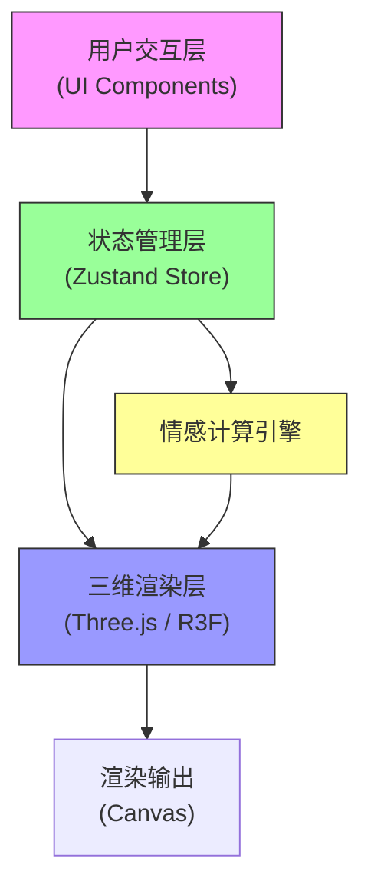

## 1. 架构设计



## 2. 技术描述

- **前端框架**：React@18 + TypeScript
- **构建工具**：Vite@5（确保ES模块支持）
- **三维渲染**：three@0.160 + @react-three/fiber@8 + @react-three/drei@9
- **状态管理**：zustand@4
- **样式方案**：原生CSS + CSS变量，实现玻璃态效果和响应式布局
- **初始化方式**：使用 vite-init 创建 react-ts 模板项目

## 3. 项目文件结构

```
auto204/
├── index.html              # 入口HTML，全屏根容器#root
├── package.json            # 项目依赖与脚本
├── vite.config.js          # Vite构建配置
├── tsconfig.json           # TypeScript严格模式配置
└── src/
    ├── App.tsx             # 主布局组件，控制面板+三维视口
    ├── main.tsx            # 应用入口
    ├── index.css           # 全局样式
    ├── store/
    │   └── emotionStore.ts # 情感状态管理（zustand）
    ├── components/
    │   ├── ControlPanel.tsx   # 控制面板：滑块、雷达图、重置按钮
    │   └── EmotionLabel.tsx   # 综合情绪标签组件
    ├── scene/
    │   ├── SculptureScene.tsx # 三维场景主组件
    │   ├── Sculpture.tsx      # 雕塑网格组件（5000顶点）
    │   ├── Particles.tsx      # 粒子系统组件（2000-4000粒子）
    │   └── Environment.tsx    # 环境：地面、天空盒、光照
    └── utils/
        ├── emotionMath.ts     # 情感计算工具函数
        └── colors.ts          # 颜色处理工具
```

## 4. 数据模型

### 4.1 情感状态定义

```typescript
interface EmotionState {
  joy: number;      // 快乐 0-100
  sadness: number;  // 悲伤 0-100
  anger: number;    // 愤怒 0-100
  calm: number;     // 平静 0-100
}

interface EmotionActions {
  setJoy: (value: number) => void;
  setSadness: (value: number) => void;
  setAnger: (value: number) => void;
  setCalm: (value: number) => void;
  reset: () => void;
  getCompositeLabel: () => string;
  getActivityLevel: () => number;
}

type EmotionStore = EmotionState & EmotionActions;
```

### 4.2 情感颜色映射

```typescript
const EMOTION_COLORS = {
  joy: '#FFD700',      // 快乐 - 金色
  sadness: '#4A90D9',  // 悲伤 - 蓝色
  anger: '#FF4500',    // 愤怒 - 橙红
  calm: '#98FB98',     // 平静 - 浅绿
} as const;
```

## 5. 核心算法说明

### 5.1 雕塑顶点变形算法

每帧对5000个顶点进行计算，响应时间<100ms：

```
对于每个顶点 i (x, y, z):
1. 基础半径: r_base = 3.0
2. 快乐膨胀: r_joy = r_base * (1 + joy/100 * 0.5)
3. 波纹频率: freq = 0.5 + joy/100 * 1.5  (0.5-2.0 Hz)
4. 波纹偏移: wave = sin(time * freq + noise(x,y,z) * 10) * (joy/100 * 0.3)
5. 悲伤下垂: y_sag = y - (sadness/100 * 1.5)
6. 愤怒尖刺: 
   - 随机选取 anger/100 * 200 个顶点
   - spike_height = random(5, 25) * (anger/100)
   - spike_offset = normalize(vertex) * spike_height
7. 平静振荡: 
   - osc_amp = 0.1 + (1 - calm/100) * 0.4
   - osc = sin(time * 2 + i * 0.1) * osc_amp
8. 最终顶点 = base * r_joy + wave + spike_offset + osc
9. Y坐标应用 y_sag 偏移
```

### 5.2 颜色混合算法

```
基础颜色 = (joy * #FFD700 + sadness * #4A90D9 + anger * #FF4500 + calm * #98FB98) / 400

悲伤饱和度降低: saturation = 1 - sadness/200
愤怒红色偏移: red_shift = anger/100 * 0.3
最终颜色 = adjustHSV(baseColor, saturation, red_shift, 0)
```

### 5.3 粒子系统算法

```
基础粒子数: 2000
如果任一情感 > 80: 粒子数 = 4000

对于每个粒子:
1. 位置: 以雕塑为中心，半径3.5-6单位随机分布
2. 大小: 0.05-0.3随机
3. 透明度: 0.1-0.4随机
4. 颜色: 雕塑主色 ±30度色相偏移
5. 呼吸运动:
   - 周期: 4-8秒随机
   - 幅度: 0.5单位
   - position += normalize(particle) * sin(time/period) * amplitude
6. 高强度扩散: 情感>80时，粒子向外扩散速度增加
```

### 5.4 综合情绪标签生成

根据四个情感值的组合生成描述性标签：

```typescript
function getCompositeLabel(emotions): string {
  const dominant = maxKey(emotions);
  const secondary = secondMaxKey(emotions);
  const activity = (joy + anger - sadness - calm) / 2;
  
  const prefixes = {
    high: ['激昂的', '强烈的', '狂热的'],
    mid: ['温和的', '微妙的', '适度的'],
    low: ['平静的', '柔和的', '淡淡的'],
  };
  
  const intensity = activity > 50 ? 'high' : activity > 20 ? 'mid' : 'low';
  const prefix = randomChoice(prefixes[intensity]);
  
  const emotionNames = {
    joy: '快乐',
    sadness: '悲伤',
    anger: '愤怒',
    calm: '平静',
  };
  
  if (secondary && emotions[secondary] > 30) {
    return `${prefix}${emotionNames[dominant]}与${emotionNames[secondary]}`;
  }
  return `${prefix}${emotionNames[dominant]}`;
}
```

### 5.5 雷达图五维数据

```
五维指标 = [joy, sadness, anger, calm, activity]
其中 activity = (joy + anger + sadness + calm) / 4
```

## 6. 性能优化策略

1. **顶点计算优化**：使用Float32Array直接操作GPU缓冲区，避免JS对象分配
2. **粒子池化**：预分配最大6000个粒子，通过visible属性控制显示数量
3. **帧时间控制**：使用requestAnimationFrame，单帧计算限制<16ms
4. **离屏计算**：在useFrame中使用delta时间平滑动画，避免大跳变
5. **阴影优化**：阴影贴图分辨率2048x2048，仅雕塑投射阴影
6. **状态订阅优化**：使用zustand的selector避免不必要的重渲染
7. **Lerp平滑**：所有参数变化使用线性插值，过渡自然（100ms响应）

## 7. 性能指标

- **目标帧率**：60 FPS
- **顶点上限**：15000（雕塑5000 + 预留10000）
- **粒子上限**：6000
- **单帧预算**：< 16ms
- **响应延迟**：< 100ms（滑块调节到视觉反馈）
