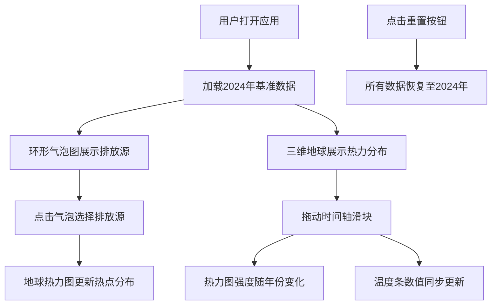

## 1. 产品概述

本应用是一个温室气体排放溯源与升温情景模拟的可视化平台，帮助气候研究员向公众和决策者直观展示不同温室气体排放源对全球温度上升的贡献比例，以及在不同减排情景下未来50年的温度变化趋势。

- **核心目标**：通过交互式可视化让复杂的气候科学数据变得可理解、可感知
- **目标用户**：气候研究员、公众、政策制定者
- **市场价值**：提升气候科学传播效率，支持科学决策

## 2. 核心 Features

### 2.1 用户角色
| 角色 | 注册方式 | 核心权限 |
|------|----------|----------|
| 普通用户 | 无需注册 | 浏览可视化内容、交互探索数据 |

### 2.2 Feature Module
1. **主页面**：环形气泡图、三维地球热力图、时间轴滑块、温度结果面板
2. **交互系统**：气泡点击高亮、时间轴拖动、场景重置
3. **数据模拟**：基于历史数据的温度变化趋势模拟

### 2.3 页面详情
| 页面名称 | 模块名称 | Feature description |
|----------|----------|---------------------|
| 主页面 | 环形气泡图 | 展示各排放源贡献，支持点击高亮和悬停信息 |
| 主页面 | 三维地球 | 展示全球热力分布，支持动态颜色强度变化 |
| 主页面 | 时间轴滑块 | 2024-2074年时间范围，拖动控制模拟进度 |
| 主页面 | 结果面板 | 显示温度增量、排放源排名、温度条 |

## 3. 核心流程

用户打开应用 → 查看2024年基准数据 → 点击气泡图选择排放源 → 观察地球热力图变化 → 拖动时间轴查看未来趋势 → 查看温度数据变化 → 点击重置按钮恢复初始状态

## 4. User Interface Design

### 4.1 Design Style
- **主色调**：深蓝黑渐变背景 (#0B132B → #1C2541)，科技感深色主题
- **强调色**：CO2橙 (#E67E22)、CH4蓝 (#3498DB)、N2O绿 (#27AE60)、高亮金 (#FFD700)
- **卡片样式**：深蓝背景 (#1A2744)，圆角12px，内边距20px
- **字体**：标题使用 Inter Bold，数据显示使用 Monospace
- **动画**：所有过渡使用0.3s easeInOut缓动，滑块拖动带弹性反馈

### 4.2 Page Design Overview
| 页面名称 | 模块名称 | UI Elements |
|----------|----------|-------------|
| 主页面 | 顶部导航栏 | 高48px，半透明深蓝背景，中央标题 |
| 主页面 | 三栏布局 | 左400px气泡图，中间flex-1地球，右360px控制面板 |
| 主页面 | 环形气泡图 | 气泡按比例分布在环形轨道，悬停显示数据 |
| 主页面 | 三维地球 | 网格细分64，蓝色纹理，200个热力点 |
| 主页面 | 时间轴滑块 | 宽600px，渐变灰背景，渐变蓝滑块 |
| 主页面 | 温度条 | 高400px，蓝到红20色阶渐变，白色圆点标记 |
| 主页面 | 重置按钮 | 右下角圆形按钮，半透明深灰背景 |

### 4.3 Responsiveness
- **桌面端**（≥1024px）：三栏标准布局
- **平板/移动端**（<1024px）：左侧面板折叠为顶部标签栏，地球全屏，右侧面板变为底部抽屉（可向上拖动，最高占60%高度）

### 4.4 3D Scene Guidance
- **环境**：深色太空背景，营造宇宙视角
- **光照**：柔和环境光 + 方向光模拟太阳光
- **相机**：透视相机，支持鼠标拖动旋转、滚轮缩放
- **动画**：地球缓慢自转，热力点闪烁呼吸效果
- **后期处理**：轻微辉光效果提升科技感
- **性能**：热力点使用实例化渲染，保持50fps以上
