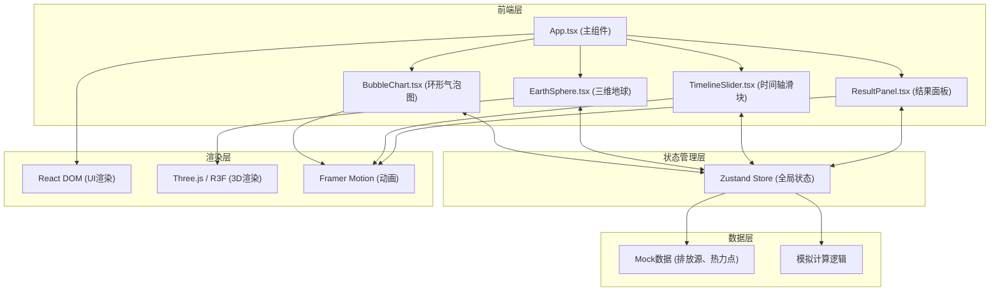

## 1. Architecture Design



## 2. Technology Description

- **前端框架**: React 18 + TypeScript 5
- **构建工具**: Vite 5 + @vitejs/plugin-react
- **3D渲染**: Three.js + @react-three/fiber + @react-three/drei
- **状态管理**: Zustand 4
- **动画库**: Framer Motion 11
- **样式方案**: CSS Modules / 内联样式 (配合 framer-motion)

## 3. 目录结构

```
src/
├── App.tsx                          # 主应用组件，三栏布局
├── main.tsx                         # 应用入口
├── index.css                        # 全局样式
├── modules/
│   ├── visualization/
│   │   ├── BubbleChart.tsx          # 环形气泡图组件
│   │   └── EarthSphere.tsx          # 三维地球组件
│   └── simulation/
│       ├── TimelineSlider.tsx       # 时间轴滑块组件
│       └── ResultPanel.tsx          # 结果面板组件
├── store/
│   └── useAppStore.ts               # Zustand全局状态管理
├── data/
│   ├── emissionSources.ts           # 排放源模拟数据
│   └── heatPoints.ts                # 热力点位置数据
├── types/
│   └── index.ts                     # TypeScript类型定义
└── utils/
    └── temperatureCalculator.ts     # 温度模拟计算工具
```

## 4. 模块调用关系与数据流向

### 4.1 数据流向图
```
emissionSources.ts ──→ useAppStore.ts ←── heatPoints.ts
                            ↑↓
           ┌────────────────┼────────────────┐
           ↓                ↓                ↓
    BubbleChart.tsx   EarthSphere.tsx   TimelineSlider.tsx
           ↑                ↑                ↑
           └────────────────┼────────────────┘
                            ↓
                        App.tsx
                            ↑
                        ResultPanel.tsx
```

### 4.2 模块职责说明

| 模块 | 输入 | 输出 | 依赖 |
|------|------|------|------|
| [BubbleChart.tsx](file:///d:/Pro/tasks/auto205/src/modules/visualization/BubbleChart.tsx) | store.emissionSources, store.selectedSourceId | 点击事件 → store.setSelectedSourceId | zustand, framer-motion |
| [EarthSphere.tsx](file:///d:/Pro/tasks/auto205/src/modules/visualization/EarthSphere.tsx) | store.selectedSourceId, store.currentYear, store.heatPoints | 3D渲染 | @react-three/fiber, @react-three/drei, three |
| [TimelineSlider.tsx](file:///d:/Pro/tasks/auto205/src/modules/simulation/TimelineSlider.tsx) | store.currentYear | 拖动事件 → store.setCurrentYear | zustand, framer-motion |
| [ResultPanel.tsx](file:///d:/Pro/tasks/auto205/src/modules/simulation/ResultPanel.tsx) | store.currentYear, store.selectedSourceId, store.temperatureData | 数据展示 | zustand, framer-motion |
| [useAppStore.ts](file:///d:/Pro/tasks/auto205/src/store/useAppStore.ts) | 各组件action | 全局state | zustand |

## 5. 数据模型

### 5.1 核心类型定义

```typescript
// 温室气体类型
type GasType = 'CO2' | 'CH4' | 'N2O';

// 排放源类型
interface EmissionSource {
  id: string;
  name: string;           // 能源、农业、工业、交通等
  gasType: GasType;
  annualEmission: number; // 年排放量 GtCO2-eq
  contribution: number;   // 升温贡献系数
  sector: string;
}

// 热力点类型
interface HeatPoint {
  id: string;
  sourceId: string;       // 关联排放源ID
  lat: number;            // 纬度
  lng: number;            // 经度
  baseIntensity: number;  // 基础强度
}

// 温度数据类型
interface TemperatureData {
  year: number;
  increment: number;      // 温度增量 ℃
  sourceContributions: {
    sourceId: string;
    contribution: number;
  }[];
}

// 全局状态
interface AppState {
  currentYear: number;
  selectedSourceId: string | null;
  emissionSources: EmissionSource[];
  heatPoints: HeatPoint[];
  temperatureData: Record<number, TemperatureData>;
  setCurrentYear: (year: number) => void;
  setSelectedSourceId: (id: string | null) => void;
  resetToBase: () => void;
}
```

### 5.2 模拟数据说明

- **排放源数据**: 8个主要排放源，涵盖能源、工业、交通、农业等领域
- **热力点数据**: 200个点，随机分布在工业区、农业区附近
- **温度数据**: 2024-2074共51年的模拟数据，基于IPCC情景预测

## 6. 性能优化策略

1. **Three.js 性能**
   - 热力点使用 InstancedMesh 实例化渲染
   - 地球几何体使用 BufferGeometry
   - 限制粒子数量在200个以内

2. **React 性能**
   - 使用 Zustand 细粒度订阅避免不必要重渲染
   - 使用 React.memo 包装组件
   - 时间轴拖动使用 useAnimationFrame 节流

3. **动画性能**
   - Framer Motion 使用 transform 而非 layout 属性
   - 3D场景每帧更新不超过60次计算
   - 气泡图悬停响应延迟控制在50ms内

## 7. 状态管理设计

```
useAppStore
├── State
│   ├── currentYear: number (2024-2074)
│   ├── selectedSourceId: string | null
│   ├── emissionSources: EmissionSource[]
│   ├── heatPoints: HeatPoint[]
│   └── temperatureData: Record<number, TemperatureData>
└── Actions
    ├── setCurrentYear(year: number)
    ├── setSelectedSourceId(id: string | null)
    └── resetToBase()
```

## 8. 构建配置

- **vite.config.js**: 配置路径别名 @ 指向 /src，开启 React 严格模式
- **tsconfig.json**: 严格模式，启用路径别名
- **package.json**: 完整依赖列表，dev 启动脚本
