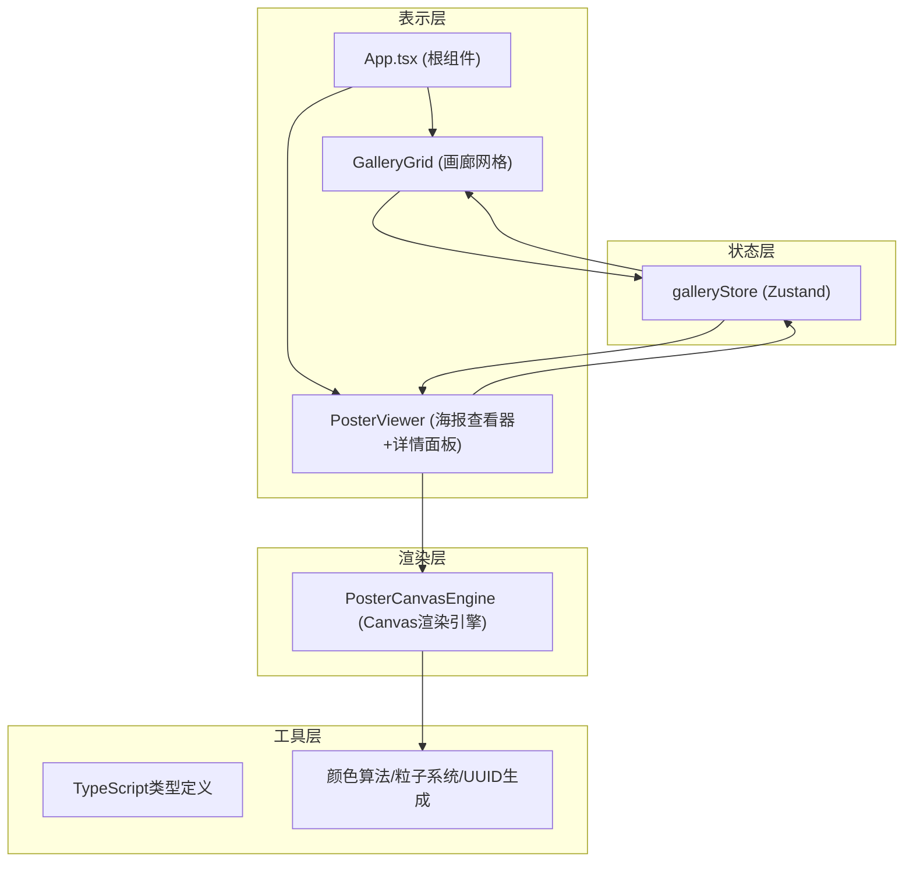

## 1. 架构设计


**数据流向**：
1. GalleryGrid 从 galleryStore 读取海报列表 → 渲染卡片
2. 用户点击卡片 → GalleryGrid 调用 store.setSelectedPoster()
3. PosterViewer 订阅 selectedPoster → 实例化 PosterCanvasEngine
4. PosterViewer 采集鼠标/时间数据 → 传入 engine.update()
5. 用户保存 → engine 导出画布 + store.addDerivedVersion()

## 2. 技术描述
- **前端框架**：React 18 + TypeScript (strict模式)
- **构建工具**：Vite + @vitejs/plugin-react
- **状态管理**：Zustand (轻量、无provider)
- **动画库**：framer-motion (页面/组件过渡)
- **画布导出**：html2canvas
- **路径别名**：@/ 映射到 src/

## 3. 目录结构与调用关系
```
src/
├── App.tsx                      ← 根组件：条件渲染GalleryGrid/PosterViewer
├── store/
│   └── galleryStore.ts          ← Zustand store：所有状态操作的单一数据源
├── modules/
│   ├── gallery/
│   │   ├── GalleryGrid.tsx      ← 读取store.posters，调用store.setSelectedPoster
│   │   └── UploadModal.tsx      ← 调用store.addPoster
│   └── viewer/
│       ├── PosterViewer.tsx     ← 读取store.selectedPoster，实例化PosterCanvasEngine
│       ├── PosterCanvasEngine.ts← 纯Canvas渲染逻辑，无React依赖
│       └── DetailPanel.tsx      ← 读取store.selectedPoster.derivedVersions
└── types/
    └── index.ts                 ← Poster/Template/Behavior/Particle类型定义
```

**调用链**：
- 上传流程：UploadModal → store.addPoster() → GalleryGrid重渲染
- 查看流程：GalleryGrid → store.setSelectedPoster() → App.tsx切换视图 → PosterViewer挂载
- 渲染流程：PosterViewer(鼠标事件/定时器) → engine.update(params) → engine.render()
- 保存流程：PosterViewer保存按钮 → engine.exportPNG() → store.addDerivedVersion()

## 4. 核心数据模型
```typescript
// 海报模板图层
interface PosterLayer {
  id: string;
  type: 'rect' | 'circle' | 'text' | 'image';
  x: number; y: number; w: number; h: number;
  color: string;
  opacity: number;
  zIndex: number;
  content?: string; // for text
  fontSize?: number;
}

// 海报模板
interface PosterTemplate {
  layers: PosterLayer[];
  palette: string[];
  width: number; height: number;
}

// 海报数据
interface Poster {
  id: string;
  name: string;
  author: string;
  createdAt: string;
  previewImage: string; // base64
  template: PosterTemplate;
  derivedVersions: DerivedVersion[];
}

// 衍生版本
interface DerivedVersion {
  uuid: string;
  savedAt: string;
  thumbnail: string; // base64
  behaviorSnapshot: BehaviorParams;
}

// 行为参数
interface BehaviorParams {
  dwellTime: number;       // 秒
  mouseX: number;          // 0~1 百分比
  mouseY: number;          // 0~1 百分比
  hueShift: number;        // -30~30
  compositionWeight: number; // 0.6~1.0
  particleCount: number;
}

// 粒子
interface Particle {
  id: number;
  x: number; y: number;
  vx: number; vy: number;
  radius: number;
  color: string;
  life: number; // 0~3 秒
}
```

## 5. 关键算法
### 5.1 色相偏移算法
```
hueShift = mouseX * 60 - 30  // X轴0~1映射到-30°~30°
每帧递增: hueShift += 0.5 * deltaTime * direction  // 0.5度/秒
使用 HSL → RGB 转换对每层颜色进行偏移
```

### 5.2 构图权重计算
```
compositionWeight = 0.6 + mouseY * 0.4  // Y轴0~1映射到0.6~1.0
layer.opacity = baseOpacity * compositionWeight
```

### 5.3 粒子系统
```
生成条件: dwellTime > 5s，每帧按概率生成
初始位置: 画布中心 + 随机偏移
速度方向: 与鼠标移动向量同向 + 随机扰动
生命周期: 3秒后FIFO移除，上限100个
```

### 5.4 渲染节流
```
计算更新: requestAnimationFrame (60fps)
实际绘制: 每2帧绘制1次 (30fps)
通过frame计数器奇偶判断
```
