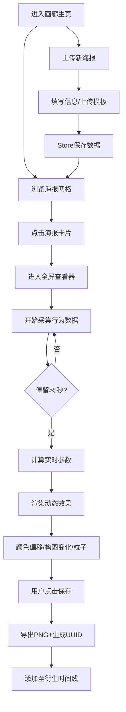

## 1. 产品概述
动态海报数字画廊是一个面向独立策展人和艺术家的互动式展示平台，让静态海报根据观众行为（停留时长、鼠标轨迹）实时生成独一无二的衍生作品。
- 核心目的：打破传统静态海报的单一呈现方式，通过观众参与创造动态、个性化的艺术体验
- 目标用户：独立策展人、数字艺术家、艺术爱好者

## 2. 核心功能

### 2.1 功能模块
1. **画廊主页**：响应式海报网格、上传新海报功能、海报卡片展示
2. **海报查看器**：全屏Canvas渲染、实时行为响应、颜色偏移/粒子效果、画面保存
3. **详情面板**：海报元信息、衍生版本UUID、历史衍生作品时间线

### 2.2 页面详情
| 页面名称 | 模块名称 | 功能描述 |
|---------|---------|---------|
| 画廊主页 | 导航栏 | 品牌标题、返回主页链接、56px深色导航 |
| 画廊主页 | 海报网格 | 4列响应式布局，卡片悬停上移动效 |
| 画廊主页 | 上传弹窗 | 半透明遮罩，填写海报信息+上传模板JSON+预览图 |
| 查看器 | Canvas渲染 | 90%视口居中，渐变背景，30fps渲染 |
| 查看器 | 行为采集 | 100ms间隔采集鼠标位置+停留时长 |
| 查看器 | 效果引擎 | 色相偏移(-30°~30°)、构图透明度(0.6~1.0)、粒子系统(上限100) |
| 查看器 | 参数面板 | 显示停留时长、色相偏移值、粒子数量、保存按钮 |
| 详情面板 | 元信息展示 | 海报名称、作者、创作日期、UUID |
| 详情面板 | 衍生时间线 | 最多20张历史缩略图，点击切换效果 |

## 3. 核心流程
用户进入画廊 → 浏览海报卡片或上传新海报 → 点击卡片进入查看器 → 系统采集行为数据 → 超过5秒触发生效效果 → 实时渲染动态海报 → 观众可保存为PNG → 衍生版本记录至时间线

## 4. 用户界面设计
### 4.1 设计风格
- **主色调**：浅灰背景 #F2F0EB，深色导航 #2C2C2C，卡片边框 #E0E0E0
- **按钮风格**：圆角，hover加深20%，点击scale(0.95) 0.15s过渡
- **字体**：Noto Sans SC 中文无衬线
- **布局**：卡片式网格，最大宽度1280px居中
- **动效**：framer-motion过渡，fade/slide动画，ease-in-out曲线

### 4.2 页面设计概览
| 页面名称 | 模块名称 | UI元素 |
|---------|---------|--------|
| 画廊主页 | 导航栏 | 56px高，深灰底#2C2C2C，白字居中标题 |
| 画廊主页 | 海报卡片 | 圆角12px，2px边框#E0E0E0，阴影0 4px 12px rgba(0,0,0,0.08)，悬停上移4px |
| 画廊主页 | 上传弹窗 | 半透明遮罩#00000050，表单居中 |
| 查看器 | 画布容器 | 背景#1A1A1A，fade 0.3s，渐变#1A1A1A→#2D2D2D |
| 查看器 | 操作提示 | 四角半透明文字 |
| 查看器 | 参数面板 | 右下角白底信息面板 |
| 详情面板 | 侧边栏 | 宽320px，白底#FAFAFA，圆角12px，右侧滑入0.4s |

### 4.3 响应式
- **桌面**：4列网格(≥1024px)，详情面板显示
- **平板**：3列网格(768px~1023px)
- **手机**：2列网格(≤480px)，隐藏详情面板，画布全屏

## 5. 性能约束
| 指标 | 约束值 |
|-----|-------|
| 行为采集频率 | ≤10次/秒(100ms间隔) |
| 粒子上限 | 同时存在≤100个(FIFO移除) |
| 渲染帧率 | 计算60fps，输出30fps |
| PNG导出 | ≤2秒 |
