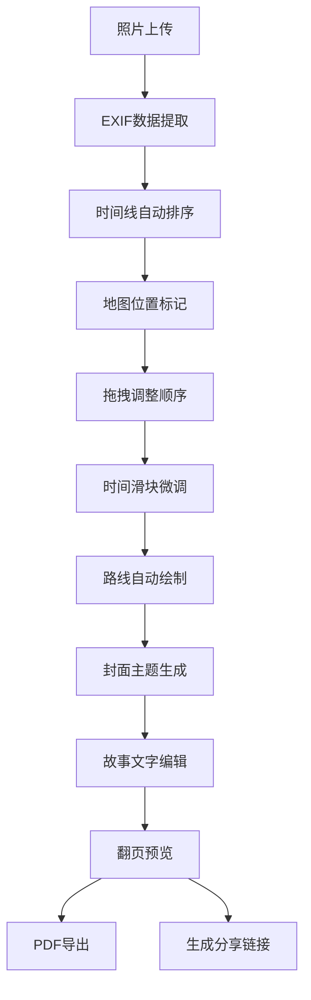

## 1. 产品概述

旅行照片智能排序与故事生成应用，解决用户整理旅行照片时缺乏叙事逻辑和视觉呈现工具的痛点，快速将零散照片组织成有故事感的图文合集。

- **核心问题**：用户上传的大量旅行照片缺乏时间线和地理位置关联，难以形成完整的旅行叙事
- **目标用户**：旅行爱好者、摄影爱好者、旅行博主
- **市场价值**：提供一站式照片整理-地图标记-故事生成-分享导出解决方案

## 2. 核心功能

### 2.1 用户角色

| 角色 | 注册方式 | 核心权限 |
|------|----------|----------|
| 普通用户 | 无需注册，本地使用 | 照片上传、编辑、导出、分享 |

### 2.2 功能模块

1. **照片管理模块**：照片上传、拖拽排序、时间线编辑、多选批量操作
2. **地图交互模块**：EXIF地理位置提取、Leaflet地图标记、路线绘制动画
3. **故事编辑模块**：封面生成、富文本排版、3D翻页动画
4. **导出分享模块**：PDF导出、分享链接生成、localStorage存储

### 2.3 页面详情

| 页面名称 | 模块名称 | 功能描述 |
|----------|----------|----------|
| 主编辑页 | 照片画布区 | 照片卡片拖拽排序，160x120px卡片，圆角8px，2px边框，选中高亮 |
| 主编辑页 | 时间线编辑 | 日期输入框+时间滑块（分钟级精度），不等距刻度曲线连接 |
| 主编辑页 | 地图区域 | Leaflet地图（40%宽度，600px高度），标记点渐变样式，点击弹出缩略图 |
| 封面编辑页 | 封面生成 | 自动提取照片主色调生成渐变背景，磨砂玻璃标题，天气图标选择 |
| 故事页 | 故事排版 | 主图自适应裁剪（横图16:9/竖图3:4），Markdown富文本，半透明白背景 |
| 预览/导出页 | 分享导出 | 3D翻页动画，A4 PDF导出，分享链接生成 |

## 3. 核心流程

用户上传多张旅行照片 → 系统自动提取EXIF时间和地理位置 → 用户在画布中拖拽排序调整顺序 → 通过时间滑块微调精确时间 → 地图自动标记所有位置并绘制路线 → 用户编辑封面标题和天气 → 为每张照片添加故事描述 → 预览3D翻页效果 → 导出PDF或生成分享链接。

## 4. 用户界面设计

### 4.1 设计风格

- **主色调**：#4A90D9（蓝），用于选中状态、按钮、标记点
- **背景色**：#F9F9F5（柔和米灰），营造温暖旅行氛围
- **辅助色**：#E0E0E0（浅灰边框），#333333（深灰文字）
- **按钮风格**：微妙hover动画（0.2s背景渐变 / 0.3s缩放1.05倍）
- **字体**：使用Playfair Display作为标题字体，Source Serif Pro作为正文字体，营造旅行博主杂志质感
- **布局**：卡片式布局，卡片间距32px，轻微阴影（box-shadow: 0 4px 12px rgba(0,0,0,0.06)）
- **图标**：Lucide线稿图标，白色（深色导航栏）/深灰（浅色背景）

### 4.2 页面设计概述

| 页面名称 | 模块名称 | UI元素 |
|----------|----------|--------|
| 主编辑页 | 左侧导航栏 | 60px宽深灰#2C2C2C，白色线稿图标，hover高亮 |
| 主编辑页 | 地图区域 | 40%宽度，600px高度，圆形渐变标记点（中心#4A90D9），虚线流动动画（10px/s） |
| 主编辑页 | 照片画布 | 1100px居中，上下40px边距，卡片拖拽Reorder组件，选中边框高亮 |
| 主编辑页 | 时间线轴 | 右侧不等距刻度，曲线连接各照片点，随滑块实时更新 |
| 封面编辑页 | 封面卡片 | 大面积渐变背景，磨砂玻璃标题（backdrop-filter: blur(8px)），白色文字0.2px阴影 |
| 故事页 | 内容卡片 | 主图max-height 400px，文字区半透明白#FFFFFFD9，圆角12px，内边距24px，行高1.6 |
| 故事页 | 翻页按钮 | 圆形直径40px，主色背景，白色箭头，3D旋转动画0.4s |

### 4.3 响应式设计

- **桌面端（>1100px）**：地图左侧40%，编辑区右侧1100px居中，双栏布局
- **平板（768-1100px）**：编辑区宽度自适应，地图缩小至35%
- **移动端（<768px）**：地图折叠到底部，编辑区单列布局，卡片宽度100%自适应，触摸优化拖拽交互

### 4.4 动画与交互

- **拖拽排序**：framer-motion Reorder，帧率≥50fps
- **翻页动画**：3D旋转效果，perspective 1000px，rotateY -180deg，持续0.4s，帧率≥30fps
- **路径动画**：虚线流动，stroke-dasharray 10 5，每秒移动10px
- **微交互**：按钮hover缩放1.05倍（0.3s），卡片hover阴影加深（0.2s）
- **地图标记**：点击弹出80x60px缩略图，弹性动画0.3s

## 5. 性能要求

- 照片拖拽帧率 ≥ 50fps
- 故事翻页动画帧率 ≥ 30fps
- 地图标记加载时间 ≤ 1秒
- 照片预览加载使用Web Worker处理EXIF提取
- 大图片采用渐进式加载策略
