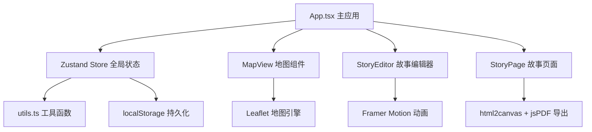

## 1. 架构设计

纯前端单页应用，采用React组件化架构，Zustand管理全局状态，无后端依赖，数据存储于localStorage。



## 2. 技术描述

- **前端框架**：React@18 + TypeScript + Vite@5
- **状态管理**：Zustand@4
- **动画引擎**：Framer Motion@11
- **地图组件**：Leaflet@1 + react-leaflet@4
- **导出工具**：html2canvas@1 + jsPDF@2
- **ID生成**：uuid@9
- **样式方案**：原生CSS + CSS Variables（不使用Tailwind，按用户指定精确样式）
- **数据持久化**：localStorage

## 3. 目录结构

```
auto209/
├── index.html                 # 入口HTML，lang=zh-CN
├── package.json               # 依赖与脚本
├── tsconfig.json              # TS配置，严格模式
├── vite.config.js             # Vite配置，React插件
└── src/
    ├── App.tsx                # 主应用组件，路由与布局
    ├── store.ts               # Zustand全局状态管理
    ├── MapView.tsx            # Leaflet地图组件
    ├── StoryEditor.tsx        # 故事编辑主组件
    ├── StoryPage.tsx          # 单页故事渲染组件
    └── utils.ts               # 工具函数集
```

## 4. 数据模型

### 4.1 核心TypeScript类型定义

```typescript
interface Photo {
  id: string;
  file: File;
  url: string;
  width: number;
  height: number;
  takenAt: Date;
  latitude?: number;
  longitude?: number;
  locationName?: string;
  dominantColors: string[];
  description: string;
}

interface Story {
  id: string;
  title: string;
  weather: 'sunny' | 'cloudy' | 'rainy';
  coverColors: [string, string];
  pages: StoryPageData[];
  createdAt: Date;
  updatedAt: Date;
}

interface StoryPageData {
  id: string;
  photoId: string;
  content: string;
}

interface MapMarker {
  id: string;
  photoId: string;
  latitude: number;
  longitude: number;
  locationName: string;
}

interface RouteSegment {
  id: string;
  date: string;
  color: string;
  coordinates: [number, number][];
}
```

### 4.2 Store状态定义

```typescript
interface AppState {
  photos: Photo[];
  selectedPhotoIds: string[];
  story: Story | null;
  markers: MapMarker[];
  routes: RouteSegment[];
  currentPage: number;
  isPreviewMode: boolean;
  
  // Actions
  addPhoto: (file: File) => Promise<void>;
  removePhoto: (id: string) => void;
  reorderPhotos: (ids: string[]) => void;
  updatePhotoTime: (id: string, date: Date) => void;
  updateGeoTag: (id: string, lat: number, lng: number, name?: string) => void;
  updateDescription: (photoId: string, content: string) => void;
  selectPhoto: (id: string, multi?: boolean) => void;
  updateStoryTitle: (title: string) => void;
  updateWeather: (weather: 'sunny' | 'cloudy' | 'rainy') => void;
  generateCover: () => void;
  setCurrentPage: (page: number) => void;
  togglePreviewMode: () => void;
  exportPDF: () => Promise<void>;
  generateShareLink: () => string;
  loadFromStorage: (id: string) => void;
}
```

## 5. 工具函数

### 5.1 EXIF解析

```typescript
function extractEXIF(file: File): Promise<{
  date?: Date;
  latitude?: number;
  longitude?: number;
}>
```

使用`exifr`库解析照片EXIF元数据，提取拍摄时间和GPS坐标。

### 5.2 主色调提取

```typescript
function extractDominantColors(imageUrl: string, count?: number): Promise<string[]>
```

使用Canvas像素采样+K-means聚类算法提取照片主色调。

### 5.3 PDF导出

```typescript
function exportStoryToPDF(story: Story, photos: Photo[]): Promise<void>
```

使用html2canvas将每页渲染为图片，jsPDF按A4尺寸拼接生成PDF。

### 5.4 路线生成

```typescript
function generateRouteSegments(photos: Photo[]): RouteSegment[]
```

按日期分组照片，为每个日期段分配不同颜色，生成路线坐标序列。

## 6. 组件职责划分

### 6.1 App.tsx
- 整体布局（左侧导航栏 + 主内容区）
- 路由切换（编辑模式 / 预览模式）
- 全局状态初始化与同步
- 照片上传入口

### 6.2 MapView.tsx
- Leaflet地图初始化与配置
- 标记点渲染（圆形渐变样式）
- 路线动画（虚线流动效果）
- 标记点击弹出缩略图
- 地图事件监听与状态同步

### 6.3 StoryEditor.tsx
- 照片拖拽排序区域（Framer Motion Reorder）
- 时间线编辑滑块
- 多选批量操作
- 封面编辑面板
- 故事文字编辑区

### 6.4 StoryPage.tsx
- 单页故事内容渲染
- 图片自适应裁剪（16:9 / 3:4）
- Markdown解析渲染
- 3D翻页动画
- 翻页导航按钮

## 7. 性能优化策略

1. **虚拟列表**：照片数量超过50张时采用虚拟滚动
2. **Web Worker**：EXIF解析和主色调提取在Worker线程执行
3. **图片懒加载**：非可视区照片使用Intersection Observer延迟加载
4. **防抖节流**：时间滑块拖动使用节流，地图标记更新使用防抖
5. **CSS优化**：使用transform和opacity实现动画，避免触发重排
6. **状态选择器**：Zustand使用selector精确订阅，避免不必要重渲染

## 8. 动画实现方案

### 8.1 拖拽排序
- Framer Motion `<Reorder.Group>` + `<Reorder.Item>`
- `layout`属性启用FLIP动画
- 自定义拖拽手柄提升性能

### 8.2 3D翻页
```css
.page-flip {
  transform-style: preserve-3d;
  transition: transform 0.4s ease-in-out;
  backface-visibility: hidden;
}
.page-flip.flipped {
  transform: perspective(1000px) rotateY(-180deg);
}
```

### 8.3 路线流动动画
```css
@keyframes dashFlow {
  to { stroke-dashoffset: -15; }
}
.route-line {
  stroke-dasharray: 10 5;
  animation: dashFlow 1.5s linear infinite;
}
```
