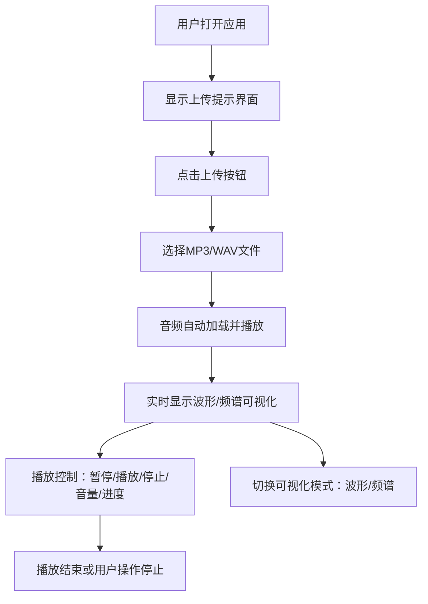

## 1. 产品概述
交互式音乐可视化播放器是一款基于Web Audio API的实时音频可视化应用，允许用户上传本地音频文件并在播放过程中查看动态波形和频谱动画。
- 面向音乐爱好者、音频工程师和创意人群，提供沉浸式音频可视化体验
- 目标价值：将抽象的音频信号转化为直观的视觉艺术，提升音乐欣赏体验

## 2. 核心功能

### 2.1 功能模块
1. **播放器主页**：音频上传、播放控制、进度管理、音量调节、可视化展示

### 2.2 页面详情
| 页面名称 | 模块名称 | 功能描述 |
|-----------|-------------|---------------------|
| 播放器主页 | 文件上传模块 | 支持MP3/WAV格式，点击按钮弹出文件选择器 |
| 播放器主页 | 播放控制模块 | 播放/暂停（空格快捷键）、停止、音量滑块（0-100%） |
| 播放器主页 | 进度显示模块 | 文件名、总时长、已播放时间、可拖动进度条 |
| 播放器主页 | VU电平表模块 | 左右声道峰值电平，0-50%绿/50-80%橙/80-100%红，30FPS |
| 播放器主页 | 波形可视化模块 | 绿色曲线（线宽2px）实时绘制振幅变化 |
| 播放器主页 | 频谱可视化模块 | 彩色柱状图（底部蓝到顶部红渐变），柱宽自适应 |
| 播放器主页 | 模式切换模块 | 波形/频谱切换按钮，带图标和0.3s淡入淡出动画 |

## 3. 核心流程
用户点击上传按钮 → 选择本地音频文件（MP3/WAV） → 音频自动加载并开始播放 → 实时渲染波形/频谱可视化 → 用户可控制播放、暂停、停止、调节音量、拖动进度条、切换可视化模式

## 4. 用户界面设计

### 4.1 设计风格
- 主色调：深灰背景 #1a1a2e，卡片背景 #16213e，Canvas背景 #0f0f23
- 辅助色：波形绿色，频谱蓝红渐变，VU表绿/橙/红三段色
- 按钮样式：圆角矩形（8px圆角），透明背景，白色图标，悬停背景加深
- 字体：现代无衬线字体，清晰易读
- 布局：卡片式布局，16px圆角卡片，内发光阴影效果
- 图标风格：线性简洁图标，白色为主

### 4.2 页面设计概述
| 页面名称 | 模块名称 | UI元素 |
|-----------|-------------|-------------|
| 播放器主页 | 顶部控制区 | 上传按钮、播放/暂停按钮、停止按钮、音量滑块、模式切换按钮 |
| 播放器主页 | 中央可视化区 | Canvas画布（2px浅蓝边框，4px阴影），波形/频谱动画 |
| 播放器主页 | 底部进度区 | VU电平表（左右声道）、文件名、时间显示、可拖动进度条 |
| 播放器主页 | 空状态提示 | 居中提示文字"请上传一个音频文件来开始"，半透明播放按钮 |

### 4.3 响应式设计
- 宽屏（>768px）：Canvas尺寸 800×400px，标准字体和按钮大小
- 窄屏（≤768px）：Canvas宽度100%，高度按比例自适应缩放，字体和按钮尺寸相应缩小
- 触屏优化：按钮最小点击区域 44×44px

## 5. 性能要求
- Canvas渲染频率：60FPS
- 频谱柱状图单帧计算量：≤5ms
- 音频播放延迟：<100ms
- VU表更新频率：30FPS
