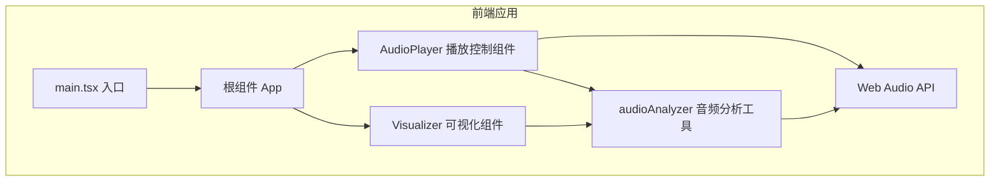

## 1. 架构设计



## 2. 技术描述
- 前端框架：React 18 + TypeScript
- 构建工具：Vite 5
- 音频处理：Web Audio API（原生）
- 可视化渲染：HTML5 Canvas 2D API
- 状态管理：React Hooks（useState, useEffect, useRef, useCallback）

## 3. 项目文件结构
| 文件路径 | 职责 |
|---------|------|
| `package.json` | 项目依赖和脚本配置 |
| `vite.config.ts` | Vite React 构建配置 |
| `tsconfig.json` | TypeScript 严格模式配置 |
| `index.html` | 应用入口 HTML 页面 |
| `src/main.tsx` | 应用入口，渲染根组件 |
| `src/App.tsx` | 根组件，整合 AudioPlayer 和 Visualizer |
| `src/components/AudioPlayer.tsx` | 播放控制组件：上传、播放/暂停、停止、进度条、音量、VU表 |
| `src/components/Visualizer.tsx` | 可视化组件：Canvas波形和频谱绘制、模式切换动画 |
| `src/utils/audioAnalyzer.ts` | 音频分析工具：封装Web Audio API，提供频率和时域数据 |

## 4. 核心组件接口定义

### 4.1 AudioAnalyzer 工具类
```typescript
class AudioAnalyzer {
  audioContext: AudioContext | null;
  analyser: AnalyserNode | null;
  source: MediaElementAudioSourceNode | null;
  frequencyData: Uint8Array;
  timeDomainData: Uint8Array;
  
  connect(audioElement: HTMLAudioElement): void;
  disconnect(): void;
  getFrequencyData(): Uint8Array;
  getTimeDomainData(): Uint8Array;
  getChannelPeaks(): { left: number; right: number };
}
```

### 4.2 AudioPlayer 组件 Props
```typescript
interface AudioPlayerProps {
  onAudioContextReady: (analyzer: AudioAnalyzer) => void;
  onPlayingChange: (isPlaying: boolean) => void;
  onSeekingChange: (isSeeking: boolean) => void;
}
```

### 4.3 Visualizer 组件 Props
```typescript
interface VisualizerProps {
  analyzer: AudioAnalyzer | null;
  isPlaying: boolean;
  isSeeking: boolean;
}
```

## 5. 性能优化策略
1. Canvas 渲染使用 requestAnimationFrame 实现 60FPS 同步刷新
2. 频谱计算复用 TypedArray 避免频繁 GC
3. VU 表使用独立节流定时器（30FPS），不占用主渲染循环
4. 进度条拖动期间暂停 Canvas 重绘，减少不必要的计算
5. 使用 useRef 保存高频访问的 DOM 引用和状态，避免不必要的重渲染
6. 音频分析器节点使用 fftSize=2048 平衡精度和性能
