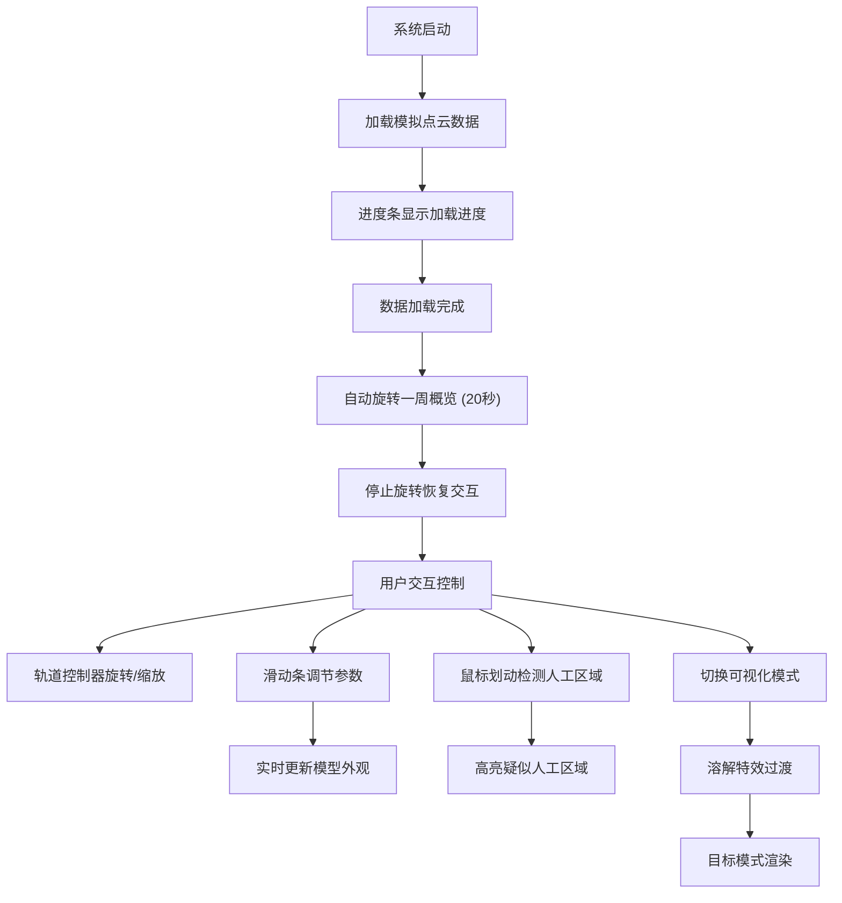

## 1. 产品概述

微型水下文物遗址三维重建与虚拟考古勘探系统，面向考古工作者，支持将水下声呐扫描数据（模拟为多组坐标点云数据）导入系统，自动生成遗址三维点云模型，并实时检测人工雕琢痕迹区域和模拟腐蚀风化效果。

- 目标用户：水下考古研究者、文物保护工作者
- 核心价值：通过三维可视化与算法分析，帮助考古人员快速识别疑似人工雕琢区域，并模拟环境腐蚀效果辅助文物保护决策

## 2. 核心功能

### 2.1 功能模块

1. **三维场景页**：水下氛围3D场景、点云模型展示、焦散光斑动画、交互式轨道控制
2. **数据分析页**：人工区域检测算法（曲率变化+平面拟合残差）、腐蚀风化模拟、参数实时调节

### 2.2 页面详情

| 页面名称 | 模块名称 | 功能描述 |
|----------|----------|----------|
| 三维场景 | 水下氛围渲染 | 背景深蓝绿渐变#062C36→#0F4C5C，方向光从上方斜射穿透水面产生动态焦散光斑投影在遗址表面，模型置中占视口60% |
| 三维场景 | 点云模型加载 | 接收多组坐标点云数据，解析生成三维点云模型，顶点数≥20000 |
| 三维场景 | 人工区域检测 | 基于局部曲率变化和平面拟合残差，鼠标/触控笔划动时实时高亮疑似人工雕琢区域 |
| 三维场景 | 腐蚀风化模拟 | 根据水深、水温、沉积物类型，模拟随时间变化的腐蚀风化效果叠加在模型表面 |
| 信息面板 | 遗址信息展示 | 左侧面板宽260px，半透明深蓝#0A3A47CC背景圆角12px，显示遗址名称、发现年份、总点数（实时统计）、已识别疑似人工区域数量 |
| 参数控制 | 滑动条组 | 三个滑动条各宽200px圆角6px，腐蚀程度#8B4513、温度#FF6347、光照角度#FFD700，0-100范围实时影响模型外观 |
| 模式切换 | 可视化模式 | 三种模式（原始点云+标签、人工区域高亮、腐蚀模拟），右下角圆形按钮组直径48px，切换时溶解特效过渡0.8秒 |
| 加载流程 | 进度条 | 宽400px高6px圆角3px深蓝#0F4C5C底色白色填充条纹动画0.3秒，显示当前点数/总点数和预计剩余秒数，加载完成后自动旋转一周（20秒360度） |
| 整体UI | 视觉风格 | 水下考古研究报告风格，Roboto无衬线字体，主色深青#0C4A5E和浅青#7EC8B8，半透明磨砂玻璃效果（背景模糊10px圆角12px），水波纹扩散动画反馈 |

## 3. 核心流程

用户打开系统 → 加载模拟点云数据（显示进度条） → 数据加载完成自动旋转一周概览 → 停止旋转恢复交互控制 → 用户通过轨道控制器旋转/缩放模型 → 用户调节三个滑动条参数实时影响模型外观 → 鼠标划动模型表面检测人工区域 → 切换三种可视化模式查看不同分析结果

## 4. 用户界面设计

### 4.1 设计风格

- 主色：深青色#0C4A5E，浅青色#7EC8B8
- 辅助色：腐蚀棕#8B4513、温度红#FF6347、光照金#FFD700
- 背景：深蓝绿渐变#062C36→#0F4C5C
- 面板背景：半透明深蓝#0A3A47CC，磨砂玻璃效果（背景模糊10px圆角12px）
- 字体：Roboto无衬线
- 按钮风格：圆形按钮直径48px，半透明背景，悬停扩大至52px加白色描边0.2秒过渡
- 布局风格：模型置中占60%，左侧信息面板，右下角模式按钮组

### 4.2 页面设计概览

| 页面名称 | 模块名称 | UI元素 |
|----------|----------|--------|
| 三维场景 | 背景渲染 | 深蓝绿渐变#062C36→#0F4C5C全屏，焦散光斑动态投影 |
| 三维场景 | 点云模型 | 置中占视口60%，半透明磨砂玻璃UI覆盖层 |
| 信息面板 | 遗址信息 | 左侧宽260px，半透明#0A3A47CC，圆角12px，Roboto字体 |
| 参数控制 | 滑动条 | 宽200px圆角6px，三色滑块#8B4513/#FF6347/#FFD700 |
| 模式切换 | 按钮组 | 右下角圆形48px，半透明，悬停52px+白色描边，0.2秒过渡 |
| 加载流程 | 进度条 | 宽400px高6px圆角3px，#0F4C5C底色白色填充条纹动画 |

### 4.3 响应式设计

- 桌面优先（1440px视口完美适配）
- 1024px以下切换为上下结构：模型占60%高度，面板堆叠在下方
- 触摸优化：水波纹扩散动画反馈（半径0→60px，透明度0.3→0）

### 4.4 3D场景指引

- 环境：水下深海氛围，深蓝绿渐变背景
- 光照：方向光从上方斜射穿透水面，产生动态焦散光斑投影在遗址表面；环境光补充底部照明
- 相机：透视相机，轨道控制器支持旋转/缩放/平移，加载完成后自动旋转一周（20秒360度）
- 构图：模型置中占视口60%，左侧信息面板，右下角模式按钮组
- 交互：鼠标/触控笔划动检测人工区域，滑动条实时调节参数，模式切换溶解特效过渡
- 后处理：焦散光斑动画着色器、柏林噪声溶解特效、腐蚀风化纹理叠加
- 性能预算：点云≥20000顶点时帧率≥50FPS，所有交互60FPS流畅

## 5. 性能要求

- 所有交互操作（滑动条调节、模式切换）在60FPS下流畅运行
- 点云模型顶点数≥20000个时场景帧率始终≥50FPS
- 溶解特效过渡持续0.8秒
- 自动旋转20秒完成360度
- 每帧根据参数重新计算并更新模型外观
