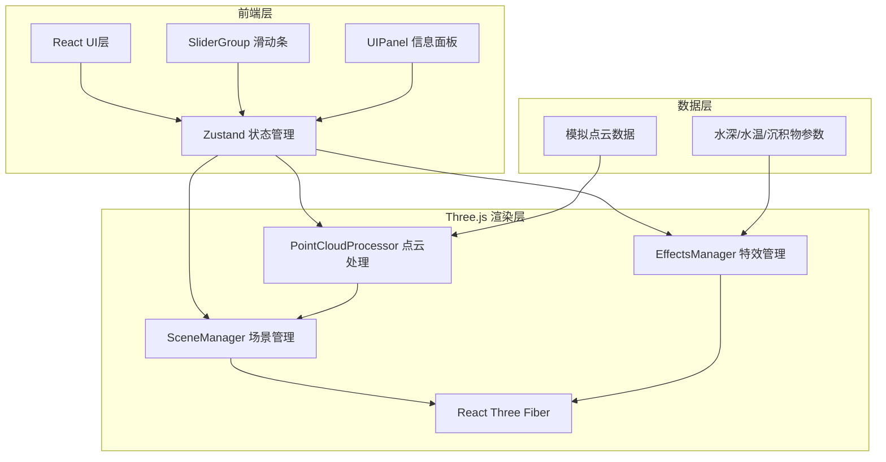

## 1. 架构设计



## 2. 技术说明

- 前端：React@18 + TypeScript + Vite
- 3D渲染：Three.js + @react-three/fiber + @react-three/drei
- 状态管理：Zustand
- 动画：Framer Motion
- 初始化工具：Vite
- 无后端：纯前端项目，使用模拟数据

## 3. 路由定义

| 路由 | 用途 |
|------|------|
| / | 主页面：三维场景+信息面板+参数控制 |

## 4. 文件结构

```
├── package.json
├── index.html
├── tsconfig.json
├── vite.config.js
└── src/
    ├── main.tsx
    ├── App.tsx
    └── modules/
        ├── scene/
        │   ├── SceneManager.ts
        │   ├── PointCloudProcessor.ts
        │   └── EffectsManager.ts
        └── ui/
            ├── UIPanel.tsx
            └── SliderGroup.tsx
```

### 各文件职责

| 文件 | 职责 |
|------|------|
| SceneManager.ts | Three.js场景初始化、相机控制（轨道控制器）、光线设置（方向光+环境光）、渲染循环、点云模型加载解析，导出Scene实例 |
| PointCloudProcessor.ts | 接收原始点云数据和用户参数，实现局部曲率计算和人工区域检测算法，输出处理后的顶点颜色和位置缓冲，与SceneManager回调通信 |
| EffectsManager.ts | 管理溶解过渡特效和腐蚀风化效果，使用着色器实现柏林噪声溶解和焦散光斑动画，接收模型引用和模式切换指令 |
| UIPanel.tsx | 左侧信息面板、右下角模式切换按钮、顶部加载进度条，zustand管理UI状态，framer-motion动画 |
| SliderGroup.tsx | 三个参数滑动条封装，framer-motion drag平滑拖动，值变化触发PointCloudProcessor重新计算 |
| App.tsx | 主入口组件，初始化Three.js场景挂载canvas，引入UIPanel和SliderGroup，全局状态和异常捕获 |
| main.tsx | ReactDom渲染入口，全局样式和字体 |

## 5. 核心算法

### 5.1 人工区域检测

- 对点云局部邻域计算曲率（基于法向量变化率）
- 对局部点集进行平面拟合，计算残差
- 曲率突变且残差异常的区域标记为疑似人工雕琢
- 每标记一个区域，已识别计数+1

### 5.2 腐蚀风化模拟

- 腐蚀程度参数 → 噪点纹理密度（柏林噪声叠加）
- 温度参数 → 颜色偏移量（冷暖色调偏移）
- 光照角度参数 → 阴影锐度（光照方向和阴影过渡）
- 每帧根据参数重新计算并更新模型外观

### 5.3 溶解特效

- 使用柏林噪声生成不连续碎片
- 从边缘到中心消散
- 持续0.8秒
- 用于三种可视化模式间的切换过渡

## 6. 状态管理（Zustand Store）

```typescript
interface AppState {
  mode: 'original' | 'highlight' | 'corrosion'
  corrosionLevel: number      // 0-100 腐蚀程度
  temperature: number         // 0-100 温度
  lightAngle: number          // 0-100 光照角度
  isLoading: boolean
  loadProgress: number
  loadedPoints: number
  totalPoints: number
  detectedAreas: number
  siteName: string
  discoveryYear: number
  autoRotating: boolean
}
```
