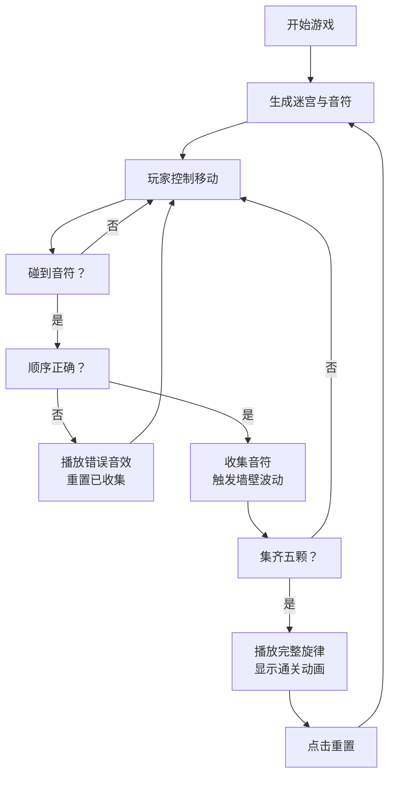

## 1. 产品概述
音律迷宫是一款将声音可视化与迷宫探索结合的交互式游戏，玩家在收集音符的过程中触发墙壁波动，最终拼凑出完整旋律。通过视觉与听觉的融合，创造沉浸式的游戏体验。

- 核心玩法：在20x20迷宫中移动，按正确顺序收集五颗彩色音符
- 目标用户：喜欢音乐、解谜和视觉艺术的休闲游戏玩家
- 产品价值：探索声音可视化的新颖交互方式，结合迷宫探索的趣味性

## 2. 核心功能

### 2.1 功能模块
1. **迷宫生成模块**：递归回溯算法生成连通迷宫，随机放置五颗音符
2. **玩家控制模块**：键盘控制角色移动，碰撞检测，移动动画
3. **音符收集模块**：检测玩家与音符碰撞，按顺序验证，收集动画
4. **墙壁波动模块**：收集音符时触发相邻墙壁正弦波动动画
5. **音频播放模块**：错误音效提示，正确顺序集齐后播放完整旋律
6. **HUD界面模块**：显示收集进度、播放状态、重置按钮

### 2.2 页面详情
| 页面名称 | 模块名称 | 功能描述 |
|-----------|-------------|---------------------|
| 游戏主页面 | 迷宫场景 | 20x20方格迷宫渲染，墙壁波动动画，玩家角色，音符 |
| 游戏主页面 | HUD面板 | 收集进度显示，进度条，通关状态，重置按钮 |
| 游戏主页面 | 通关动画 | 集齐音符后中央显示通关效果，旋律播放 |

## 3. 核心流程

玩家进入游戏 → 随机生成迷宫与音符 → 键盘控制角色移动 → 移动到音符格子 → 检查收集顺序是否正确 → 正确则收集并触发墙壁波动 → 错误则重置已收集音符 → 按顺序集齐五颗 → 播放完整旋律与通关动画 → 点击重置重新开始

## 4. 用户界面设计

### 4.1 设计风格
- **主色调**：深空蓝黑渐变背景 (#0B0D17 → #1A1D33)，哑光冷色系
- **强调色**：五音符颜色 (红#FF4136、橙#FF851B、黄#FFDC00、绿#2ECC40、蓝#0074D9)
- **字体**：现代无衬线字体，标题字重700，字号28px
- **交互元素**：hover/激活时0.2s过渡动画，玩家角色带白色外发光
- **整体风格**：夜光主题，霓虹色音符与深色背景形成对比

### 4.2 页面设计概述
| 页面名称 | 模块名称 | UI元素 |
|-----------|-------------|-------------|
| 游戏主页面 | 迷宫场景 | 20x20方格 (32px)，深灰背景，白色边框，墙壁波动动画 |
| 游戏主页面 | 玩家角色 | 金色圆形 (24px)，白色外发光，移动过渡0.2s |
| 游戏主页面 | 音符 | 彩色圆形 (20px)，收集时缩小消失动画 |
| 游戏主页面 | HUD面板 | 右上角半透明深色背景 (240px)，圆角12px，收集进度圆点，渐变进度条 |
| 游戏主页面 | 重置按钮 | 深灰背景，圆角8px，hover变色 |

### 4.3 响应式
- 桌面端：迷宫区域居中，占视口宽度80%，最小宽度800px，HUD固定右上角
- 移动端 (<900px)：迷宫方格缩小为24px，HUD改为横向显示在底部

## 5. 性能约束
- 帧率：整体60FPS，动画不低于55FPS
- 迷宫生成时间：≤50ms
- 动画流畅度：玩家移动和墙壁波动无明显卡顿
