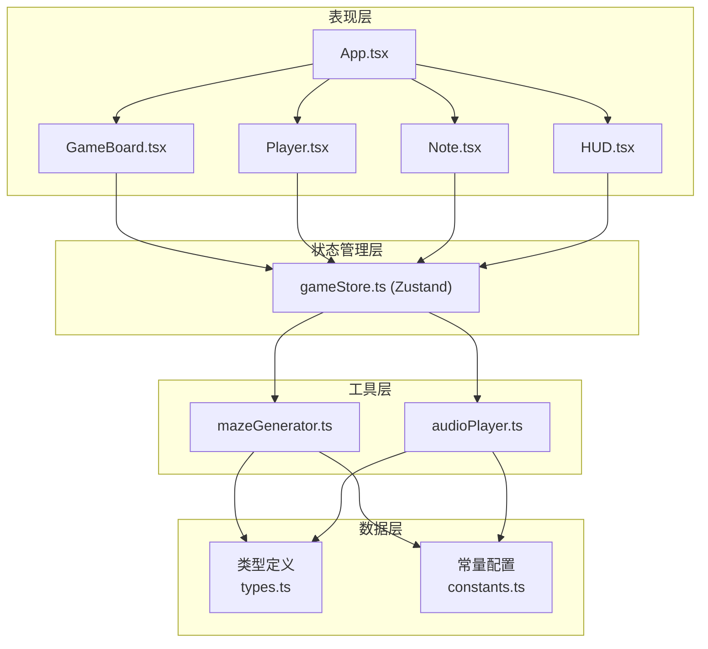

## 1. 架构设计



**数据流向说明：**
- `main.tsx` → 初始化 `gameStore`，渲染 `App` 组件
- `gameStore` → 管理全局状态：迷宫网格、玩家位置、音符列表、墙壁波动状态、播放状态
- `GameBoard` → 读取 store 中的迷宫网格和墙壁状态，驱动动画
- `Player` → 读取 store 中的玩家位置，发送移动 action
- `Note` → 读取 store 中的音符列表，监听收集状态
- `HUD` → 读取 store 中的收集进度和通关状态，显示UI

## 2. 技术描述

- **前端框架**：React 18 + TypeScript
- **构建工具**：Vite
- **状态管理**：Zustand
- **动画库**：Framer Motion
- **音频库**：Howler.js
- **唯一ID**：uuid

### 依赖清单
```json
{
  "react": "^18.x",
  "react-dom": "^18.x",
  "vite": "^5.x",
  "@vitejs/plugin-react": "^4.x",
  "typescript": "^5.x",
  "@types/react": "^18.x",
  "@types/react-dom": "^18.x",
  "framer-motion": "^11.x",
  "howler": "^2.x",
  "@types/howler": "^2.x",
  "zustand": "^4.x",
  "uuid": "^9.x",
  "@types/uuid": "^9.x"
}
```

## 3. 项目文件结构

```
src/
├── main.tsx              # React应用入口，初始化store和App
├── App.tsx               # 根组件，组合所有子组件
├── store/
│   └── gameStore.ts      # Zustand状态管理
├── components/
│   ├── GameBoard.tsx     # 迷宫主场景，渲染网格和墙壁动画
│   ├── Player.tsx        # 玩家角色，键盘控制
│   ├── Note.tsx          # 音符收集物
│   └── HUD.tsx           # 界面覆盖层，进度显示
├── utils/
│   ├── mazeGenerator.ts  # 迷宫生成算法（递归回溯）
│   └── audioPlayer.ts    # 音频播放封装
├── types/
│   └── index.ts          # TypeScript类型定义
└── constants/
    └── index.ts          # 常量配置（颜色、频率、顺序）
```

## 4. 数据模型

### 4.1 核心类型定义

```typescript
// 格子类型
type CellType = 'wall' | 'path';

// 音符颜色
type NoteColor = 'red' | 'orange' | 'yellow' | 'green' | 'blue';

// 位置
interface Position {
  x: number;
  y: number;
}

// 音符
interface Note {
  id: string;
  position: Position;
  color: NoteColor;
  frequency: number;
  collected: boolean;
  order: number; // 正确收集顺序 0-4
}

// 墙壁波动状态
interface WallWave {
  position: Position;
  frequency: number;
  color: string;
  progress: number; // 0-1 动画进度
  startTime: number;
}

// 游戏状态
interface GameState {
  grid: CellType[][];
  player: Position;
  notes: Note[];
  collectedNotes: Note[];
  wallWaves: Map<string, WallWave>;
  isComplete: boolean;
  isPlaying: boolean;
  correctOrder: NoteColor[];
}
```

### 4.2 常量配置

```typescript
// 音符颜色与频率映射
const NOTE_FREQUENCIES: Record<NoteColor, number> = {
  red: 261.63,    // C4
  orange: 293.66, // D4
  yellow: 329.63, // E4
  green: 349.23,  // F4
  blue: 392.00    // G4
};

// 音符颜色十六进制
const NOTE_COLORS: Record<NoteColor, string> = {
  red: '#FF4136',
  orange: '#FF851B',
  yellow: '#FFDC00',
  green: '#2ECC40',
  blue: '#0074D9'
};

// 正确收集顺序
const CORRECT_ORDER: NoteColor[] = ['red', 'orange', 'yellow', 'green', 'blue'];

// 迷宫配置
const GRID_SIZE = 20;
const CELL_SIZE = 32;
const CELL_SIZE_SMALL = 24;
const WALL_THICKNESS = 4;
```

## 5. Store Action 定义

### 5.1 核心 Action

| Action | 功能 | 参数 |
|--------|------|------|
| `initializeGame` | 初始化/重置游戏，生成迷宫和音符 | 无 |
| `movePlayer` | 移动玩家，碰撞检测 | `direction: 'up' \| 'down' \| 'left' \| 'right'` |
| `collectNote` | 收集音符，检查顺序，触发墙壁波动 | `noteId: string` |
| `triggerWallWave` | 触发指定墙壁的波动动画 | `positions: Position[], frequency: number, color: string` |
| `checkCompletion` | 检查是否集齐所有音符 | 无 |
| `playMelody` | 播放完整旋律 | 无 |
| `resetGame` | 重置游戏状态 | 无 |

## 6. 关键算法

### 6.1 迷宫生成（递归回溯算法）
```
1. 创建20x20网格，初始全部为墙壁
2. 从起点(1,1)开始，标记为路径
3. 随机选择一个未访问的相邻方向
4. 打通两格之间的墙壁，移动到新位置
5. 递归重复步骤3-4
6. 无路可走时回溯
7. 完成后在路径上随机放置5颗音符
```
时间复杂度：O(N²)，N=20，远小于50ms要求

### 6.2 墙壁波动动画
- 使用 `framer-motion` 的 `animate` 控制 `translateX` 和 `translateY`
- 正弦波公式：`offset = amplitude * Math.sin(frequency * time * 2 * Math.PI)`
- 振幅：4px，持续时间：1.5秒
- 颜色过渡：0.3s渐变

## 7. 性能优化策略

1. **组件粒度优化**：每个格子、音符、墙壁都是独立组件，避免全量重渲染
2. **状态选择器**：使用 Zustand 选择器只订阅需要的状态片段
3. **动画优化**：Framer Motion 使用 transform 和 opacity 触发 GPU 加速
4. **内存管理**：墙壁波动动画完成后自动清理 Map 中的条目
5. **防抖处理**：键盘输入防抖，避免快速连续移动
6. **CSS 变量**：颜色、尺寸等使用 CSS 变量，方便响应式切换
