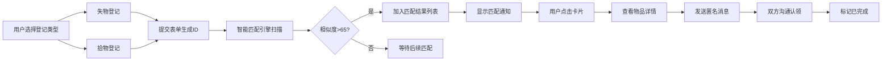

## 1. 产品概述

校园失物招领与智能配对寻物应用，旨在帮助校园内失主快速找回丢失物品，拾获者高效联系失主。通过智能匹配引擎自动关联失物与拾物信息，内置匿名消息系统保障用户隐私，提升物品找回效率。

- 核心价值：智能匹配算法、匿名沟通、快速登记流程
- 目标用户：校园师生、校园内工作人员

## 2. 核心功能

### 2.1 用户角色
| 角色 | 注册方式 | 核心权限 |
|------|----------|----------|
| 普通用户 | 无需注册（匿名使用） | 登记失物/拾物、查看匹配结果、匿名通讯 |

### 2.2 功能模块
1. **失物登记页**：物品名称、类别、颜色、地点、描述、图片上传
2. **拾物登记页**：物品名称、类别、颜色、地点、描述、拖拽上传图片
3. **匹配结果页**：智能匹配卡片列表、相似度展示、详情查看
4. **消息页**：匿名对话列表、对话详情、消息发送
5. **我的记录页**：历史记录列表、状态标签、聊天记录查看

### 2.3 页面详情
| 页面名称 | 模块名称 | 功能描述 |
|-----------|-------------|---------------------|
| 失物登记页 | 表单模块 | 5个必填字段：名称、类别、颜色（6色可多选）、地点关键词自动补全、200字符描述 |
| 拾物登记页 | 表单模块 | 结构同失物登记，增加拖拽图片上传+缩略图预览 |
| 匹配结果页 | 卡片列表 | 两列网格，卡片含彩色边框、图片/图标、相似度进度条动画、点击查看详情 |
| 匹配结果页 | 顶部横幅 | "发现X个可能匹配"提示，0.5s淡入动画 |
| 消息页 | 对话列表 | 匿名ID、最后消息预览、未读数红点 |
| 消息页 | 对话详情 | 时间戳、消息气泡区分、每日10条限制、新消息弹跳动画 |
| 匹配通知 | Toast通知 | 右下角浮出，最多3个，3秒后滑出消失 |
| 我的记录页 | 记录列表 | 时间倒序、状态标签（黄/绿/灰过渡动画） |

## 3. 核心流程

用户可选择登记失物或拾物，填写表单后系统自动扫描未匹配记录进行智能匹配计算。若匹配成功（分数>65），则显示匹配结果并触发通知。用户通过匿名消息系统沟通认领事宜，完成后标记记录为已完成状态。

## 4. 用户界面设计

### 4.1 设计风格
- **主色**：浅蓝 #4FC3F7
- **辅色**：橙 #FF8C00
- **错误色**：红 #E53935
- **背景色**：浅灰 #F5F5F5
- **卡片底色**：白 #FFFFFF
- **按钮样式**：圆角8px，主色背景白色文字，hover亮度+10%，点击scale(0.95)
- **输入框**：高44px，圆角8px，边框#E0E0E0，聚焦变主色
- **卡片样式**：圆角12px，hover上移4px加深阴影（transition 0.2s）
- **图标风格**：使用 lucide-react 线性图标

### 4.2 页面设计概览
| 页面名称 | 模块名称 | UI元素 |
|-----------|-------------|-------------|
| 全局 | 导航栏 | 高56px，白底浅阴影，左侧Logo（放大镜+爱心），右侧3个导航链接，hover中间展开下划线 |
| 失物登记页 | 表单区 | 最大宽度900px水平居中，组件间距24px，浅灰背景 |
| 拾物登记页 | 表单区 | 含拖拽上传区，虚线边框，hover高亮，缩略图预览 |
| 匹配结果页 | 卡片网格 | 桌面两列，平板/手机单列，卡片320x200px，左侧3px彩色分类边框 |
| 匹配结果页 | 进度条 | 相似度百分比，0.8s ease-out动画从0增长 |
| 消息页 | 消息气泡 | 自己消息右对齐浅蓝#E3F2FD，对方消息左对齐浅灰#F5F5F5，圆角12px |
| 我的记录页 | 状态标签 | 等待匹配#FFD54F、已匹配#A5D6A7、已完成#BDBDBD，0.3s颜色过渡 |
| 匹配通知 | Toast | 300x60px，白底圆角8px，2px左蓝边框，3秒后滑出消失 |

### 4.3 响应式设计
- 桌面（>768px）：匹配结果两列卡片网格
- 平板/手机（<=768px）：单列布局
- 手机（<=480px）：导航栏变为汉堡菜单+左侧滑入侧边栏+半透明深色遮罩
- 表单和卡片宽度在移动端100%适配

### 4.4 动画效果
- 匹配横幅：0.5s淡入
- 相似度进度条：0.8s ease-out从0到目标值
- 卡片hover：0.2s上移4px加深阴影
- 按钮点击：scale(0.95)缩放
- 导航链接hover：下划线0.3s cubic-bezier中间展开
- 状态标签切换：0.3s背景色过渡
- 新消息：spring阻尼20 stiffness 300弹跳动画
- Toast通知：3秒后向右滑出消失
- 侧边栏：从左侧滑入，遮罩淡入
