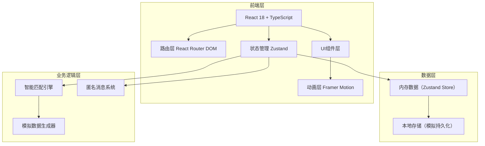
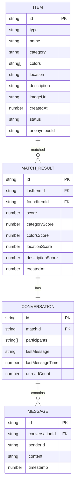

## 1. 架构设计



## 2. 技术说明

- **前端**：React 18 + TypeScript + Vite
- **路由**：react-router-dom v6
- **状态管理**：zustand
- **动画**：framer-motion
- **唯一ID生成**：uuid
- **后端**：无（纯前端模拟，内存状态+本地存储）
- **数据**：模拟数据，无需后端API

## 3. 路由定义

| 路由 | 用途 |
|-------|---------|
| / | 首页/默认路由（跳转到匹配结果页） |
| /lost | 失物登记表单页 |
| /found | 拾物登记表单页 |
| /matches | 匹配结果页 |
| /messages | 匿名消息对话列表 |
| /messages/:id | 匿名消息对话详情 |
| /records | 我的记录页 |

## 4. API定义（模拟接口，均为内存操作）

```typescript
// 物品条目类型
interface Item {
  id: string;
  type: 'lost' | 'found';
  name: string;
  category: Category;
  colors: Color[];
  location: string;
  description: string;
  imageUrl?: string;
  createdAt: number;
  status: 'pending' | 'matched' | 'completed';
  anonymousId: string;
}

// 匹配结果类型
interface MatchResult {
  id: string;
  lostItem: Item;
  foundItem: Item;
  score: number;
  scoreBreakdown: {
    category: number;
    colors: number;
    location: number;
    description: number;
  };
  createdAt: number;
}

// 消息类型
interface Message {
  id: string;
  conversationId: string;
  senderId: string;
  content: string;
  timestamp: number;
}

// 对话类型
interface Conversation {
  id: string;
  matchId: string;
  participants: string[];
  lastMessage?: string;
  lastMessageTime?: number;
  unreadCount: number;
  messagesSentToday: Record<string, number>;
}
```

## 5. 数据模型

### 5.1 数据模型定义



## 6. 项目文件结构

```
.
├── package.json
├── index.html
├── tsconfig.json
├── vite.config.js
└── src/
    ├── App.tsx              # 主应用组件，路由配置
    ├── main.tsx             # 入口文件
    ├── index.css            # 全局样式
    ├── store.ts             # Zustand全局状态管理
    ├── types/
    │   └── index.ts         # TypeScript类型定义
    ├── utils/
    │   ├── matchingEngine.ts # 智能匹配引擎
    │   └── helpers.ts        # 工具函数
    ├── components/
    │   ├── Navbar.tsx        # 导航栏组件
    │   ├── MatchCard.tsx     # 匹配结果卡片
    │   ├── Toast.tsx         # Toast通知组件
    │   ├── StatusBadge.tsx   # 状态标签组件
    │   ├── CategoryIcon.tsx  # 分类图标组件
    │   └── ColorPicker.tsx   # 颜色选择器组件
    └── pages/
        ├── LostForm.tsx      # 失物登记表单
        ├── FoundForm.tsx     # 拾物登记表单
        ├── MatchResult.tsx   # 匹配结果页
        ├── MessagePage.tsx   # 消息对话列表
        ├── MessageDetail.tsx # 对话详情页
        └── MyRecords.tsx     # 我的记录页
```

## 7. 智能匹配引擎算法说明

加权相似度计算（总分100）：

1. **类别匹配（40分）**：类别完全相同得40分，否则0分
2. **颜色重叠（30分）**：颜色交集数量 / 颜色并集数量 × 30
3. **地点关键词（20分）**：编辑距离相似度 × 20
4. **描述文本（10分）**：TF-IDF余弦相似度 × 10

匹配阈值：> 65分
