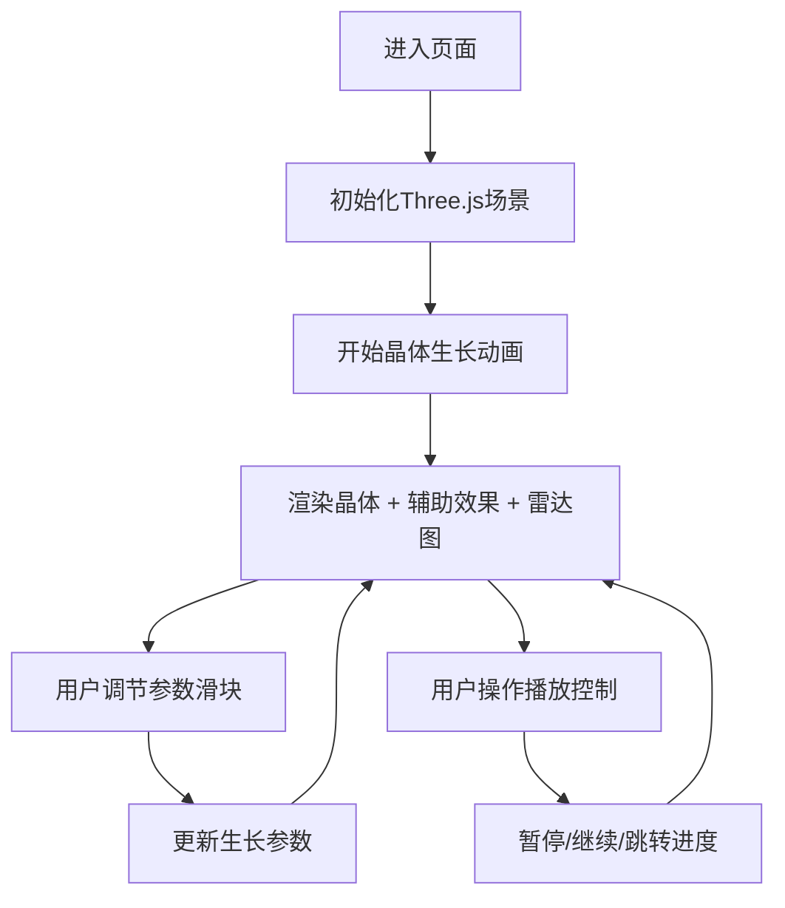

## 1. 产品概述
微观晶体生长过程模拟与结构展示系统，通过三维可视化方式呈现晶体从晶核到成熟晶体的完整生长过程，用户可调节环境参数观察晶体形态变化。
- 面向材料科学教育、科普展示和晶体学研究人员
- 提供交互式、沉浸式的晶体生长可视化体验，直观理解生长参数对晶体结构的影响

## 2. 核心功能

### 2.1 功能模块
1. **主场景页面**: 三维晶体生长场景、左侧控制面板、右侧雷达图、底部播放控制栏

### 2.2 页面详情
| 页面名称 | 模块名称 | 功能描述 |
|-----------|-------------|---------------------|
| 主场景 | 三维晶体渲染 | 使用Three.js渲染晶体，根据温度、浓度、杂质参数动态调整顶点位置和表面颜色 |
| 主场景 | 控制面板 | 三个滑块分别控制温度(100-1000度)、浓度(0.1-2.0)、杂质(0-100)，显示实时数值和生长阶段 |
| 主场景 | 雷达图 | Canvas 2D绘制极坐标雷达图，展示对称性、透明度、硬度、解理、光泽五个属性 |
| 主场景 | 播放控制栏 | 播放/暂停按钮、进度条拖动，支持时间轴回溯 |
| 主场景 | 辅助视觉效果 | 六边形辅助线、原子闪烁光点、生长波纹、脱离粒子 |

## 3. 核心流程

用户进入页面后，系统默认开始晶体生长模拟。用户可通过左侧滑块调节温度、浓度和杂质参数，实时观察晶体形态变化。右侧雷达图同步更新五个属性值。底部播放控制栏可暂停/继续生长，拖动进度条可回到任意历史时刻。

## 4. 用户界面设计

### 4.1 设计风格
- **主色调**: 暗色实验室风格，背景从#0D1117到#161B22垂直渐变
- **晶体颜色**: 理想面浅蓝#4FC3F7到深蓝#01579B渐变；杂质区域紫红#AB47BC到#6A1B9A斑块
- **滑块配色**: 温度红黄渐变#FF6B35→#FFD700，浓度蓝青渐变#2196F3→#00BCD4，杂质紫粉渐变#9C27B0→#E91E63
- **字体**: 使用现代无衬线字体，数字显示清晰醒目
- **布局**: 全屏沉浸式布局，左侧控制面板、中央三维场景、右侧雷达图、底部播放栏

### 4.2 页面设计概览
| 页面名称 | 模块名称 | UI元素 |
|-----------|-------------|-------------|
| 主场景 | 控制面板 | 半透明深色背景#12171EAA，圆角12px，内边距20px，三个渐变色滑块，圆形白色手柄，实时数值显示 |
| 主场景 | 雷达图 | 深色半透明圆盘背景，灰色网格#8B949E，青蓝色填充#4FC3F744，青蓝描边#4FC3F7 2px |
| 主场景 | 播放控制栏 | 灰色圆形播放按钮#30363D，进度条80%宽6px高，已播放青蓝色#4FC3F7，未播放深灰#21262D |

### 4.3 响应式
桌面端优先设计，全屏沉浸式体验。

### 4.4 3D场景指导
- **环境**: 暗色实验室风格，渐变背景，轻微雾化效果
- **光照**: 环境光 + 方向光，突出晶体表面质感和颜色差异
- **相机**: 透视相机，环绕晶体视角，支持自动旋转
- **辅助元素**: 六边形半透明辅助线环绕（随生长调整半径和旋转），内部原子闪烁光点，生长阶段触发波纹扩散光效，脱离粒子飞散效果
- **性能**: 晶体顶点数不超过6000，使用BufferGeometry共享顶点，保证60fps流畅运行
