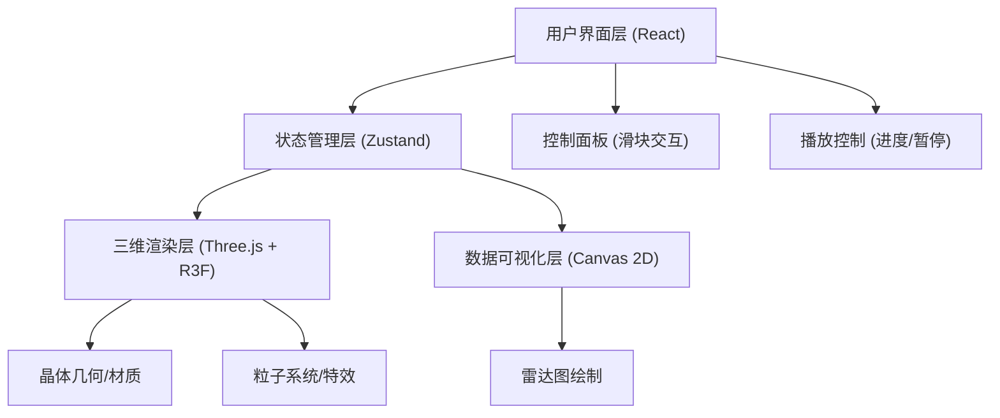

## 1. 架构设计



## 2. 技术说明

- **前端框架**: React@18 + TypeScript@5
- **构建工具**: Vite@5 + @vitejs/plugin-react
- **三维渲染**: three@0.160 + @react-three/fiber@8 + @react-three/drei@9
- **状态管理**: zustand@4
- **样式方案**: 原生CSS (styles.css)，CSS变量统一主题

## 3. 文件结构

| 文件路径 | 功能说明 |
|----------|----------|
| `/index.html` | 入口HTML文件 |
| `/package.json` | 项目依赖与脚本 |
| `/tsconfig.json` | TypeScript strict模式配置 |
| `/vite.config.js` | Vite基础配置 |
| `/src/App.tsx` | 主应用组件，组装布局，初始化Zustand store |
| `/src/CrystalScene.tsx` | Three.js场景，晶体几何、材质、粒子、动画循环 |
| `/src/ControlPanel.tsx` | 左侧控制面板，三个参数滑块和数值显示 |
| `/src/RadarChart.tsx` | Canvas 2D极坐标雷达图 |
| `/src/styles.css` | 全局样式，主题变量，滑块自定义样式 |

## 4. Zustand Store 数据模型

```typescript
interface CrystalState {
  temperature: number;    // 温度 100-1000
  concentration: number;  // 浓度 0.1-2.0
  impurity: number;       // 杂质 0-100
  isPlaying: boolean;     // 播放状态
  progress: number;       // 时间进度 0-1
  growthTime: number;     // 累计生长时间
  stage: string;          // 当前生长阶段
  attributes: {
    symmetry: number;     // 对称性 0-100
    transparency: number; // 透明度 0-100
    hardness: number;     // 硬度 0-100
    cleavage: number;     // 解理 0-100
    luster: number;       // 光泽 0-100
  };
  setTemperature: (v: number) => void;
  setConcentration: (v: number) => void;
  setImpurity: (v: number) => void;
  setPlaying: (v: boolean) => void;
  setProgress: (v: number) => void;
  tick: (delta: number) => void;
}
```

## 5. 属性计算规则

| 属性 | 计算依据 |
|------|----------|
| 对称性 symmetry | 主要受杂质影响：100 - impurity * 0.8，浓度微调 |
| 透明度 transparency | 与浓度正相关：concentration * 50，杂质负影响 |
| 硬度 hardness | 主要受温度影响：|temperature - 550| / 10 反向映射 |
| 解理 cleavage | 温度与杂质综合：(1000 - temperature) * 0.05 + (100 - impurity) * 0.05 |
| 光泽 luster | 浓度正相关 + 温度适中时最佳：浓度 * 40 + 温度适宜度 |

## 6. 生长阶段划分

| 阶段 | 时间进度范围 | 标题 |
|------|-------------|------|
| 0 | 0% - 15% | 初始成核 |
| 1 | 15% - 50% | 快速扩展 |
| 2 | 50% - 85% | 稳定结晶 |
| 3 | 85% - 100% | 晶体成熟 |
