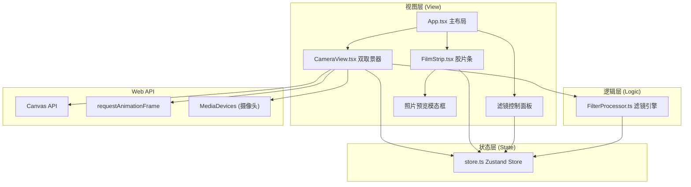

## 1. 架构设计



**数据流向说明：**
1. 组件通过 Zustand hooks (useStore) 读取全局状态
2. 用户交互（快门、调节滑块）通过 store actions 修改状态
3. CameraView 调用 FilterProcessor 处理图像，结果写回 store
4. FilmStrip 从 store 读取照片列表并渲染
5. 滤镜参数从 store 流向 FilterProcessor

## 2. 技术描述

- **前端框架**：React 18 + TypeScript（严格模式）
- **构建工具**：Vite 5 + @vitejs/plugin-react
- **状态管理**：Zustand 4
- **动画库**：Framer Motion 11
- **样式方案**：CSS Modules / 内联样式（Styled Components 备选）
- **图形处理**：Canvas 2D API + ImageData 直接像素操作
- **摄像头**：MediaDevices.getUserMedia API（带降级模拟画面）

**初始化方式**：手动搭建 Vite + React + TypeScript 项目结构

## 3. 文件结构

```
auto214/
├── package.json
├── vite.config.js
├── tsconfig.json
├── index.html
└── src/
    ├── main.tsx          # 应用入口
    ├── App.tsx           # 主布局组件
    ├── store.ts          # Zustand 状态管理
    ├── CameraView.tsx    # 双取景器组件
    ├── FilmStrip.tsx     # 胶片条组件
    ├── FilterProcessor.ts # 滤镜处理引擎
    └── types.ts          # 类型定义（可选）
```

### 各文件职责与调用关系

| 文件 | 职责 | 依赖/调用 | 被依赖 |
|-----|------|-----------|--------|
| `main.tsx` | React入口，挂载App | ReactDOM, App.tsx | - |
| `App.tsx` | 主布局，组合所有组件，全局样式，事件监听 | CameraView, FilmStrip, store | main.tsx |
| `store.ts` | Zustand状态管理：拍摄模式、照片列表、滤镜参数 | zustand | CameraView, FilmStrip, App, Controls |
| `CameraView.tsx` | 双圆形取景窗，摄像头流，缩放控制，对焦辅助线，快门触发 | store, FilterProcessor, Canvas API | App.tsx |
| `FilmStrip.tsx` | 胶片条组件，缩略图展示，滚动动画，模态框预览 | store, framer-motion | App.tsx |
| `FilterProcessor.ts` | 滤镜处理引擎：颗粒、色偏、晕影三层算法 | - | CameraView.tsx |

## 4. 状态模型 (Zustand Store)

### 4.1 状态定义

```typescript
interface Photo {
  id: string;
  dataUrl: string;
  timestamp: number;
  filterSettings: FilterSettings;
}

interface FilterSettings {
  grainIntensity: number;      // 0-100 颗粒强度
  colorShift: 'warm' | 'cool'; // 暖黄/冷青
  vignetteRadius: number;      // 0-50 晕影半径百分比
}

interface CameraState {
  // 照片
  photos: Photo[];
  maxPhotos: number;
  
  // 滤镜参数
  filterSettings: FilterSettings;
  
  // 拍摄
  isFlashing: boolean;
  captureMode: 'viewfinder' | 'focus';
  
  // 取景器
  zoom: number;           // 0.8-1.2
  focusDistance: number;  // 0.5-Infinity (米)
  
  // Actions
  addPhoto: (dataUrl: string) => void;
  setGrainIntensity: (value: number) => void;
  setColorShift: (value: 'warm' | 'cool') => void;
  setVignetteRadius: (value: number) => void;
  setZoom: (value: number) => void;
  setFocusDistance: (value: number) => void;
  triggerFlash: () => void;
  setCaptureMode: (mode: 'viewfinder' | 'focus') => void;
}
```

### 4.2 数据流向

```
用户交互 → Store Action → State更新 → 组件re-render
   ↑                                                ↓
   └──── 组件订阅 useStore(state => selector) ──────┘
```

## 5. 滤镜处理引擎

### 5.1 处理流程

```
输入 Canvas ImageData
    ↓
第一层：颗粒效果 (grain)
    ↓ 随机噪点叠加
第二层：色偏效果 (colorShift)
    ↓ RGB通道加权偏移
第三层：晕影效果 (vignette)
    ↓ 四角渐变暗化
输出 处理后 ImageData
```

### 5.2 核心算法

- **颗粒效果**：遍历像素，随机增减RGB值，强度控制噪点幅度
- **色偏效果**：暖色调增加红/绿通道，冷色调增加蓝/绿通道
- **晕影效果**：基于像素到中心距离计算暗化系数，径向渐变

## 6. 性能优化策略

1. **单Canvas处理**：所有滤镜在同一份ImageData上顺序操作，避免多次转换
2. **requestAnimationFrame**：取景器渲染与浏览器刷新率同步
3. **节流处理**：滚轮缩放和对焦调节使用节流，避免过度重绘
4. **照片上限**：最多保留6张照片，超出自动移除最旧的
5. **离屏Canvas**：滤镜处理使用离屏Canvas，不阻塞主渲染
6. **对象复用**：ImageData对象复用，减少GC压力
