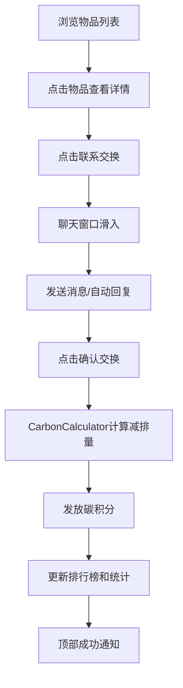

## 1. 产品概述

社区闲置物品交换与碳积分激励应用，让社区居民可以发布闲置物品信息、浏览附近的交换列表、通过聊天约定线下交换，每次成功交换后系统会根据物品类别和预估重量计算碳减排量并发放碳积分，用户可以查看自己的碳积分排行榜和环保贡献统计。

- 目标用户：社区居民，有闲置物品想要交换的人群
- 核心价值：促进闲置物品循环利用，减少浪费，通过碳积分激励机制鼓励环保行为

## 2. 核心功能

### 2.1 用户角色
| 角色 | 注册方式 | 核心权限 |
|------|----------|----------|
| 普通用户 | 模拟用户（无需注册） | 浏览物品、发布物品、聊天交换、查看积分 |

### 2.2 功能模块
1. **交换大厅**：物品列表展示、距离筛选、状态筛选、物品详情
2. **物品发布**：表单填写、类别选择、图片上传（占位）
3. **聊天系统**：对话列表、消息发送、自动回复、交换确认
4. **碳积分系统**：减排计算、积分发放、排行榜、个人统计
5. **底部导航**：交换大厅、环保仪表盘页面切换

### 2.3 页面详情
| 页面名称 | 模块名称 | 功能描述 |
|----------|----------|----------|
| 交换大厅 | 物品列表 | 网格布局展示物品卡片，支持距离筛选，显示状态标签 |
| 交换大厅 | 侧边栏 | 显示用户碳积分和排行榜前5名 |
| 物品详情 | 详情面板 | 大图展示、物品描述、联系交换按钮 |
| 物品详情 | 聊天窗口 | 消息列表、输入框、发送按钮脉冲动画、确认交换 |
| 发布物品 | 发布表单 | 浮动按钮弹出表单，填写物品信息并提交 |
| 环保仪表盘 | 统计卡片 | 总积分、本月交换次数、累计减排量 |
| 环保仪表盘 | 排行榜 | 10个用户排名，金银铜牌标识 |
| 环保仪表盘 | 趋势图 | 个人碳积分增长趋势迷你折线图 |

## 3. 核心流程

用户浏览物品列表 → 点击物品查看详情 → 联系交换发起聊天 → 聊天中确认交换 → 系统计算碳减排量并发放积分 → 积分和统计数据更新 → 顶部通知提示成功

## 4. 用户界面设计

### 4.1 设计风格
- 主色：#4A90D9（蓝色）
- 强调色：#2ECC71（绿色）
- 背景色：深蓝黑径向渐变 #0F1419 到 #1A2634
- 文字色：浅灰 #E0E0E0
- 卡片：毛玻璃效果（半透明背景 + backdrop-filter blur(8px)）
- 圆角：12px 为主
- 动画：framer-motion 实现过渡效果
- 字体：现代无衬线字体

### 4.2 页面设计概述
| 页面名称 | 模块名称 | UI 元素 |
|----------|----------|--------|
| 交换大厅 | 物品卡片 | 200x280px，圆角12px，白底，悬停上移4px+阴影 |
| 交换大厅 | 筛选标签 | 高32px，圆角16px，选中蓝底白字 |
| 交换大厅 | 侧边栏 | 280px宽，半透明深蓝背景 |
| 物品详情 | 详情面板 | 60%宽度主区域，右侧聊天框 |
| 聊天窗口 | 发送按钮 | 脉冲动画 |
| 发布按钮 | 浮动按钮 | 48px直径，绿色，右下角固定，扩散动画 |
| 排行榜 | 列表项 | 交替背景色，前三名奖牌 |
| 趋势图 | Canvas | 绿色线条，填充透明度0.2 |

### 4.3 响应式
- 桌面端：最大宽度1200px居中，物品卡片多列网格
- 移动端（768px以下）：卡片两列布局，导航栏图标缩小为36px
- 底部导航：高50px，半透明深蓝背景

### 4.4 动效设计
- 路由切换：淡入淡出 0.3s
- 按钮点击：缩放 0.15s
- 列表新增：从上方滑入
- 聊天窗口：从右侧滑入
- 通知条：从上方落下
- 发布按钮：扩散动画
- 发送按钮：脉冲动画
