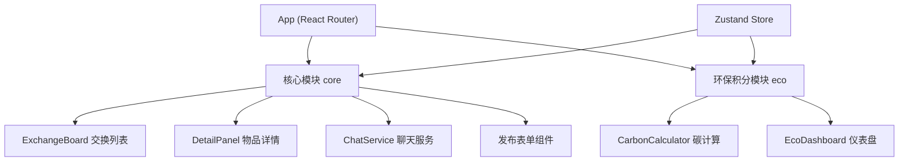

## 1. 架构设计



## 2. 技术说明
- 前端框架：React@18 + TypeScript
- 构建工具：Vite
- 路由：react-router-dom
- 状态管理：zustand
- 动画库：framer-motion
- 唯一ID：uuid
- 图表：Canvas 原生绘制
- 样式：CSS-in-JS / 内联样式 + 毛玻璃效果

## 3. 目录结构
```
src/
├── main.tsx
├── App.tsx
├── modules/
│   ├── core/
│   │   ├── ExchangeBoard.tsx
│   │   ├── DetailPanel.tsx
│   │   └── ChatService.ts
│   └── eco/
│       ├── CarbonCalculator.ts
│       └── EcoDashboard.tsx
├── store/
│   └── useStore.ts
├── components/
│   ├── BottomNav.tsx
│   ├── PublishButton.tsx
│   ├── PublishModal.tsx
│   ├── NotificationToast.tsx
│   └── ChatWindow.tsx
├── types/
│   └── index.ts
└── utils/
    └── mockData.ts
```

## 4. 路由定义
| 路由 | 用途 |
|------|------|
| / | 交换大厅（首页） |
| /item/:id | 物品详情页 |
| /eco | 环保仪表盘 |

## 5. 数据模型

### 5.1 物品 (Item)
```typescript
interface Item {
  id: string;
  name: string;
  category: '书籍' | '电子' | '家居' | '服饰' | '运动' | '其他';
  weight: number;
  description: string;
  imageUrl: string;
  distance: number;
  status: 'available' | 'reserved' | 'exchanged';
  publisherId: string;
  publisherName: string;
  publishTime: Date;
}
```

### 5.2 用户 (User)
```typescript
interface User {
  id: string;
  name: string;
  avatar: string;
  carbonPoints: number;
  exchangeCount: number;
  totalReduction: number;
}
```

### 5.3 消息 (Message)
```typescript
interface Message {
  id: string;
  conversationId: string;
  senderId: string;
  content: string;
  timestamp: Date;
}
```

### 5.4 对话 (Conversation)
```typescript
interface Conversation {
  id: string;
  itemId: string;
  participants: string[];
  lastMessage: string;
  lastMessageTime: Date;
}
```

## 6. 状态管理 (Zustand Store)
- items: 物品列表
- currentUser: 当前用户
- users: 用户列表（排行榜用）
- conversations: 对话列表
- messages: 消息记录
- showNotification: 通知显示状态
- notificationMessage: 通知消息
- activeTab: 当前导航标签

## 7. 核心算法

### 7.1 碳减排计算
```
reduction = weight * categoryFactor
carbonPoints = Math.round(reduction)
```

类别因子：
- 书籍：0.3
- 电子：0.6
- 家居：0.5
- 服饰：0.2
- 运动：0.25

### 7.2 距离筛选
根据物品的 distance 字段与筛选阈值比较，过滤对应范围内的物品。

## 8. 性能优化
- 物品列表：虚拟滚动或分批渲染，支持100+物品60fps滚动
- 聊天消息：最多渲染50条，超出滚动加载更早记录
- 组件：合理拆分，避免不必要的重渲染
- 动画：使用 framer-motion 的优化模式
