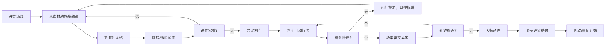

## 1. 产品概述
一款午夜地铁风格的轨道拼图解谜游戏，玩家通过拖拽和旋转轨道片段拼接路径，引导幽灵列车从起点站行驶到终点站，收集幽灵乘客并躲避障碍物。

- 核心玩法：拖拽轨道片段到12x12网格上，拼接完整路径让列车通行
- 目标用户：休闲解谜游戏爱好者，喜欢独特视觉风格的玩家
- 产品价值：提供沉浸式的午夜地铁氛围，结合策略性拼图和解谜元素

## 2. 核心功能

### 2.1 用户角色
| 角色 | 注册方式 | 核心权限 |
|------|----------|----------|
| 玩家 | 无需注册 | 进行游戏、查看评分、生成海报 |

### 2.2 功能模块
1. **游戏主界面**：左右控制面板、中央12x12游戏网格、底部轨道素材池
2. **轨道拼接系统**：拖拽放置、旋转、连接判定、障碍物处理
3. **列车行驶系统**：自动寻路、动画效果、障碍物碰撞检测
4. **评分系统**：计时、收集乘客统计、星级评定、结果展示
5. **视觉特效**：午夜地铁风格UI、粒子效果、庆祝动画

### 2.3 页面详情
| 页面名称 | 模块名称 | 功能描述 |
|----------|----------|----------|
| 游戏主页面 | 左侧控制面板 | 显示关卡、轨道数、乘客数、计时器 |
| 游戏主页面 | 右侧控制面板 | 方向按钮微调轨道位置 |
| 游戏主页面 | 游戏网格区域 | 12x12网格、轨道放置、列车行驶 |
| 游戏主页面 | 轨道素材池 | 横向滚动的轨道片段选择区 |
| 结果弹窗 | 评分展示 | 星级、乘客数、用时、回放按钮 |

## 3. 核心流程
玩家从素材池拖拽轨道片段到网格，通过旋转和微调拼接出完整路径，避开障碍物。启动列车后，列车沿轨道自动行驶，收集幽灵乘客。到达终点后显示评分，可选择回放或重新开始。

## 4. 用户界面设计

### 4.1 设计风格
- 主色调：深灰蓝#1A1D2E背景，深紫#2A1D3E控制面板
- 轨道颜色：直轨#4FC3F7、弯轨#81C784、三岔轨#FFB74D、交叉轨#E57373
- 强调色：金色#FFD700（选中、终点、评分星）、绿色#4CAF50（起点）、红色#FF0000（警告）
- 字体：数字使用Mono字体，幽灵图标#A0D8EF色
- 按钮风格：圆角设计，悬停变色过渡0.2s
- 桌布质感：细微网格线背景

### 4.2 页面设计概述
| 页面名称 | 模块名称 | UI元素 |
|----------|----------|--------|
| 游戏主页面 | 左侧面板 | 220px宽、半透明深紫、圆角12px、关卡/轨道/乘客/计时信息 |
| 游戏主页面 | 右侧面板 | 180px宽、半透明深紫、圆角12px、上下左右方向按钮 |
| 游戏主页面 | 游戏区域 | 70%视口宽、12x12网格60px格、#2A2D3E网格线 |
| 游戏主页面 | 素材池 | 800x120px横向滚动、80x80px圆形轨道缩略图 |
| 结果弹窗 | 评分面板 | 400x320px居中、白底圆角16px、星级/统计/按钮 |

### 4.3 响应性
- 桌面端优先设计，中央游戏区域占视口宽度70%
- 控制面板固定宽度，游戏网格自适应缩放
- 素材池固定宽度800px，水平居中

### 4.4 动画效果
- 起点站绿色闪烁动画（1.5s周期）
- 终点站金色旋转光圈（2s周期，半径10-20px）
- 黄色信号灯闪烁（0.8s周期）
- 列车行驶粒子效果（烟囱飘出）
- 到达终点白色光点飘散（30个粒子，持续3s）
- 轨道选中金色描边过渡（0.3s）
- 跨越障碍物上浮动画（0.3s）
