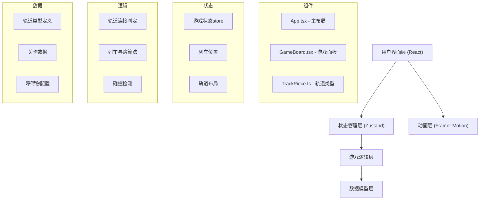
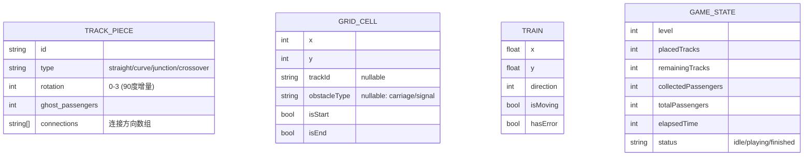

## 1. 架构设计



## 2. 技术描述
- 前端：React@18 + TypeScript + Vite
- 状态管理：Zustand
- 动画库：Framer Motion
- 工具库：uuid
- 无后端，纯前端游戏
- 初始化工具：Vite

## 3. 路由定义
| 路由 | 用途 |
|------|------|
| / | 游戏主页面 |

## 4. 数据模型

### 4.1 数据模型定义



### 4.2 轨道类型定义
- 直轨（straight）：水平或垂直连接
- 弯轨（curve）：90度转弯连接
- 三岔轨（junction）：三方向连接
- 交叉轨（crossover）：十字交叉连接

### 4.3 连接方向编码
- 上: 0
- 右: 1
- 下: 2
- 左: 3

## 5. 核心算法

### 5.1 轨道连接判定
- 每个轨道片段根据类型和旋转角度计算连接方向
- 相邻格子的连接方向必须匹配（如A的右连接必须对应B的左连接）
- 使用位运算快速判定连接状态

### 5.2 列车寻路
- BFS算法从起点到终点寻找完整路径
- 实时检测路径完整性，断头路触发红色警告
- 列车沿路径平滑移动，使用requestAnimationFrame保证60FPS

### 5.3 碰撞检测
- 每帧检测列车位置与障碍物的关系
- 障碍物类型：废弃车厢（阻挡）、信号灯（可跨越但需动画）
- 跨越障碍物时触发上浮动画

## 6. 性能优化
- 使用CSS transform和opacity实现硬件加速动画
- 轨道拼接判定逻辑优化到一帧内完成（<16ms）
- 列车行驶使用requestAnimationFrame，帧率不低于30FPS
- 拖拽预览使用半透明定位元素，避免重排
- 状态更新批量处理，减少不必要的重渲染
- 粒子效果使用对象池复用，避免频繁GC

## 7. 文件结构
```
src/
├── main.tsx              # React入口
├── App.tsx               # 主布局组件
├── game/
│   ├── GameBoard.tsx     # 游戏逻辑核心
│   └── TrackPiece.ts     # 轨道类型定义
├── store/
│   └── useGameStore.ts   # Zustand状态管理
├── utils/
│   ├── pathfinding.ts    # 寻路算法
│   └── trackUtils.ts     # 轨道工具函数
└── types/
    └── index.ts          # 全局类型定义
```
