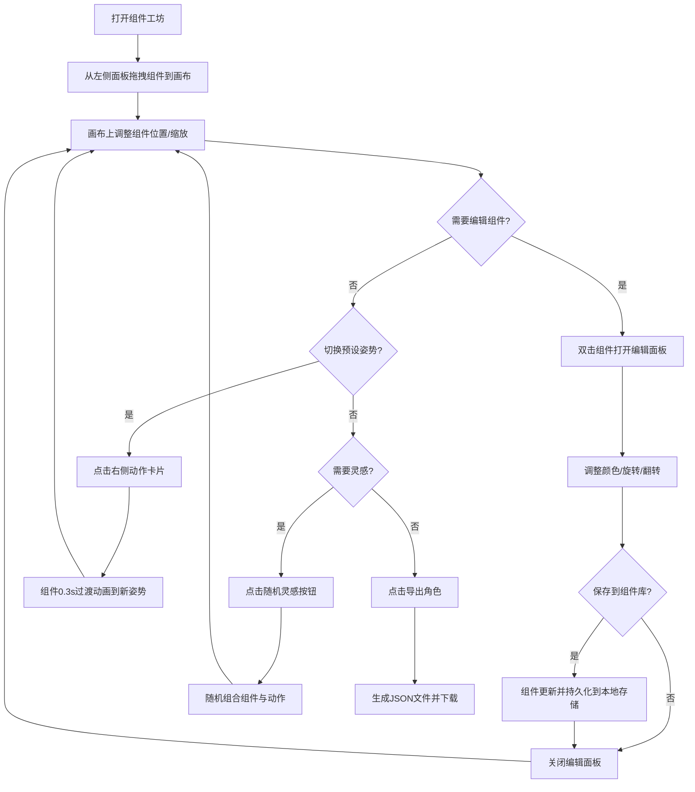

## 1. 产品概述

组件工坊是一款面向独立漫画创作者与插画师的角色设计管理工具，解决创作者在构思新漫画时角色形象容易偏离原设、重复绘制相似姿势耗时费力的问题。通过将角色拆解为可复用的组件（头部、躯干、四肢、配件），并提供表情/动作预设与自由组装画布，帮助创作者快速生成一致的角色姿势，同时随机灵感模式打破创作瓶颈。

- 目标用户：独立漫画创作者、插画师、角色设计师
- 核心价值：保持角色形象一致性，减少重复绘制成本，提供灵感激发

## 2. 核心功能

### 2.1 功能模块

1. **主工作台页面**：角色组件面板 + 画布组装 + 动作面板 + 编辑弹窗，一站式完成角色组装与编辑

### 2.2 页面详情

| 页面名称 | 模块名称 | 功能描述 |
|----------|----------|----------|
| 主工作台 | 顶部导航栏 | 品牌名称"组件工坊"，"导入角色"和"关于"按钮 |
| 主工作台 | 左侧组件面板 | 按"头部"、"躯干"、"四肢"、"配件"四个分类折叠显示组件卡片，支持拖拽到画布 |
| 主工作台 | 中央画布区 | 390x600白色画布，浅灰网格背景，接收拖拽组件，支持二次拖拽与缩放 |
| 主工作台 | 右侧动作面板 | 表情/动作卡片列表，点击切换姿势，带0.3s过渡动画 |
| 主工作台 | 模态编辑面板 | 双击组件弹出，包含颜色选择器、旋转滑块、翻转按钮，支持保存到组件库 |
| 主工作台 | 导出功能 | 画布右上角"导出角色"按钮，生成JSON文件并触发下载 |
| 主工作台 | 随机灵感 | 画布左上角骰子按钮，随机选择组件与动作生成全新角色姿势 |

## 3. 核心流程

用户从左侧组件面板拖拽角色部件到中央画布 → 在画布上调整组件位置与大小 → 双击组件编辑颜色/旋转/翻转 → 点击右侧动作卡片切换预设姿势 → 完成后导出角色JSON数据。也可使用"随机灵感"一键生成随机角色姿势作为起点。

## 4. 用户界面设计

### 4.1 设计风格

- 整体风格：深色调赛博画室风格
- 主背景色：#1E1E28
- 导航栏背景：#2A2A38
- 主题强调色：#FF6B6B（悬停变暗 #E55A5A）
- 按钮样式：圆角6-8px，悬停变色过渡0.2s
- 字体：品牌名16px白色，动作名称12px灰色#888
- 布局：三栏式（左侧面板280px + 中央画布flex-grow + 右侧面板240px）
- 过渡动画：统一0.2s（transform、opacity、background-color），动作切换0.3s ease-out

### 4.2 页面设计概览

| 页面名称 | 模块名称 | UI元素 |
|----------|----------|--------|
| 主工作台 | 顶部导航栏 | 高56px，背景#2A2A38，品牌名16px白色居中，左右按钮圆角8px悬停变色 |
| 主工作台 | 左侧组件面板 | 宽280px（<1200px时200px），背景rgba(30,30,40,0.5)圆角12px，组件卡片高90px圆角8px边框#3A3A4A，悬停边框#FF6B6B |
| 主工作台 | 中央画布 | 390x600px白色，浅灰网格#E0E0E0间隔10px，组件拖拽预览半透明 |
| 主工作台 | 右侧动作面板 | 宽240px（<1200px时200px），动作卡片120x160px圆角10px白底，名称12px#888 |
| 主工作台 | 模态编辑面板 | 宽400px居中，背景#282830圆角16px，0.3s淡入，色块20px圆角正方形，旋转滑块-180~180步进5 |
| 主工作台 | 随机灵感按钮 | 骰子图标，透明背景悬停#FF6B6B33圆角6px |
| 主工作台 | 导出按钮 | 画布右上角，#FF6B6B背景白色文字圆角6px |

### 4.3 响应式

- 桌面优先设计，适配1024px~1920px宽度
- 小于1200px时左右面板宽度缩减至200px，画布区域等比缩放
- 页面最大宽度1280px居中排列

### 4.4 动效设计

- 所有交互元素统一0.2s过渡（transform、opacity、background-color）
- 组件拖拽时跟随光标带减速效果
- 动作切换时组件位置与缩放0.3s ease-out平滑过渡
- 模态面板0.3s透明度从0到1淡入
- 组件卡片悬停0.15s边框色过渡
