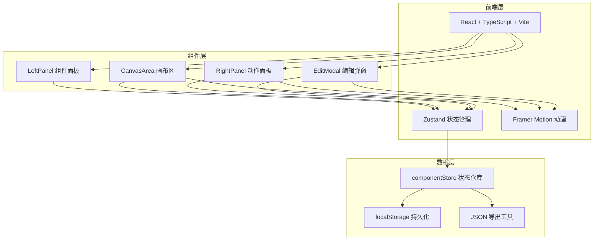
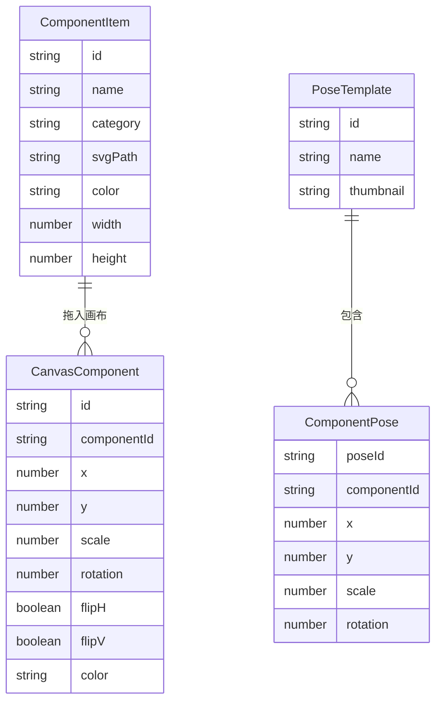

## 1. 架构设计



## 2. 技术说明

- 前端：React 18 + TypeScript + Vite
- 状态管理：Zustand（轻量级全局状态，支持持久化中间件）
- 动画：Framer Motion（组件过渡、拖拽、模态动画）
- 初始化工具：vite-init（react-ts 模板）
- 后端：无（纯前端应用）
- 数据存储：localStorage（组件库持久化）
- 依赖：react、react-dom、vite、@vitejs/plugin-react、typescript、@types/react、@types/react-dom、zustand、framer-motion、uuid

## 3. 路由定义

| 路由 | 用途 |
|------|------|
| / | 主工作台页面，包含组件面板、画布、动作面板 |

## 4. 数据模型

### 4.1 数据模型定义



### 4.2 数据定义

```typescript
interface ComponentItem {
  id: string;
  name: string;
  category: 'head' | 'torso' | 'limbs' | 'accessories';
  svgPath: string;
  color: string;
  width: number;
  height: number;
}

interface CanvasComponent {
  id: string;
  componentId: string;
  x: number;
  y: number;
  scale: number;
  rotation: number;
  flipH: boolean;
  flipV: boolean;
  color: string;
}

interface PoseTemplate {
  id: string;
  name: string;
  thumbnail: string;
  components: ComponentPose[];
}

interface ComponentPose {
  canvasComponentId: string;
  x: number;
  y: number;
  scale: number;
  rotation: number;
}
```

## 5. 文件结构

```
├── package.json
├── vite.config.js
├── tsconfig.json
├── index.html
└── src/
    ├── App.tsx                    # 主布局与三栏面板
    ├── main.tsx                   # 入口文件
    ├── store/
    │   └── componentStore.ts      # Zustand 状态管理
    ├── components/
    │   ├── LeftPanel.tsx          # 组件分类面板与拖拽初始化
    │   ├── CanvasArea.tsx         # 画布渲染、拖拽与缩放、动作过渡
    │   ├── RightPanel.tsx         # 动作卡片列表
    │   └── EditModal.tsx          # 模态编辑面板
    └── utils/
        └── export.ts              # 导出JSON逻辑
```
