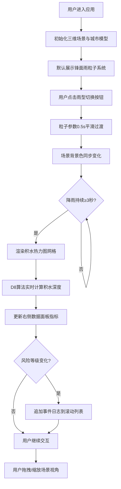

## 1. 产品概述

微型城市降雨类型模拟与内涝风险可视化应用，面向气象学者、城市规划者和公众，在三维城市模型上动态展示锋面雨、对流雨、台风雨三种雨型的降水过程，并实时计算各区域积水深度，通过热力图叠加和数据面板直观呈现内涝风险。

- 目标用户：气象学者、城市规划者、灾害预警人员、公众科普
- 核心价值：通过沉浸式三维可视化帮助用户理解不同雨型的降水特征与城市内涝风险分布

## 2. 核心特性

### 2.2 功能模块

1. **降雨模拟模块**：三种雨型粒子系统渲染，支持平滑参数过渡动画
2. **三维城市模块**：50座建筑立方体、地面网格、边缘树木、阴影投射
3. **内涝风险模块**：D8流向算法计算积水深度，热力图网格叠加显示
4. **UI控制面板**：雨型切换按钮、雨量强度滑块
5. **数据信息面板**：实时降雨量、平均积水深度、高风险区域数、风险事件日志

### 2.3 页面详情

| 页面名称 | 模块名称 | 功能描述 |
|-----------|-------------|---------------------|
| 主场景 | 降雨粒子系统 | 800~6000粒子BufferGeometry优化渲染，随雨型平滑过渡 |
| 主场景 | 三维城市模型 | 50座随机高度建筑（10~80单位），随机窗格纹理，地面灰蓝色网格，边缘深绿色低多边形树木 |
| 主场景 | 积水热力图 | 降雨3秒后出现，颜色从浅蓝#87CEEB渐变到深红#8B0000，alpha随深度0.2~0.9 |
| 左侧UI | 雨型切换按钮 | 三个圆形按钮（44px），各雨型专属渐变色，0.5s平滑过渡 |
| 左侧UI | 雨量强度滑块 | 控制降雨强度，影响粒子速度与密度 |
| 右侧面板 | 数据指标卡 | 当前降雨量mm/h（整数计数动画）、平均积水深度cm（变红警示）、高风险区域数（红色标签） |
| 右侧面板 | 事件日志 | 最多10条时间戳滚动列表，记录风险等级变化，底部弹入动画 |

## 3. 核心流程

用户进入应用 → 默认俯视45度视角展示三维城市 → 点击左侧雨型按钮切换降水类型 → 粒子系统0.5s平滑过渡到新参数 → 场景背景色随雨型变化 → 降雨持续3秒后地面开始渲染积水热力图 → 右侧面板实时更新积水数据 → 风险等级变化时追加事件日志 → 用户可拖拽旋转/缩放场景查看不同角度

## 4. 用户界面设计

### 4.1 设计风格

- 主色调：冷色科幻风，深蓝黑#0B132B渐变到#1C2541
- 玻璃拟态UI控件：背景rgba(255,255,255,0.08)，backdrop-filter blur 8px，边框1px solid rgba(255,255,255,0.15)
- 按钮风格：圆形渐变，按下scale(0.95)缩放0.1s反馈
- 字体：monospace数字字体，白色主体文字
- 视觉层次：场景3D主体居中，左侧控制按钮组垂直排列，右侧信息面板固定宽度

### 4.2 页面设计概览

| 页面名称 | 模块名称 | UI元素 |
|-----------|-------------|-------------|
| 主场景 | 背景层 | 深蓝黑径向渐变，跟随雨型调整明度与色相 |
| 主场景 | 3D渲染层 | Canvas全屏，ShadowMap阴影，OrbitControls交互 |
| 左侧UI | 雨型按钮组 | 垂直排列三个44px圆形按钮，各带渐变色背景与暗色图标，选中态有发光描边 |
| 左侧UI | 强度滑块 | 玻璃拟态轨道，渐变填充条，圆形拖拽手柄 |
| 右侧面板 | 信息卡 | 280px宽半透明深蓝rgba(10,30,50,0.85)，12px圆角，20px顶部内边距 |
| 右侧面板 | 指标区 | 三行数据，24px monospace数字，红色警示色#FF4444，高风险标签圆角#FF3333 |
| 右侧面板 | 日志区 | 时间戳滚动列表，最多10条，新条目从底部弹入 |

### 4.3 响应式设计

- 桌面端（≥768px）：右侧面板固定右侧280px宽，左侧按钮组垂直排列44px圆形
- 移动端（<768px）：右侧面板折叠为底部抽屉式浮层（高度180px，上滑动画0.3s ease-out），左侧按钮组移至左上角缩小为32px圆形

### 4.4 3D场景指导

- 环境与氛围：冷色调雾化大气，方向光+环境光组合，雨型对应背景色（锋面雨灰白#D3D3D3、对流雨暗黄#A09B6F、台风雨墨绿#2F4F4F）
- 光照设置：平行光投射阴影（ShadowMap），环境光提供基础照明，颜色随雨型微调
- 摄像机：默认俯视45度，OrbitControls支持拖拽旋转与滚轮缩放
- 构图与焦点：城市模型居中，建筑高低错落形成天际线，树木环绕边缘
- 交互与动画：雨滴粒子下落动画，积水热力图每帧更新透明度，雨型切换时粒子参数插值过渡
- 性能预算：粒子≥45fps（BufferGeometry+Points优化），热力图更新≤2ms/帧，UI节流10fps
